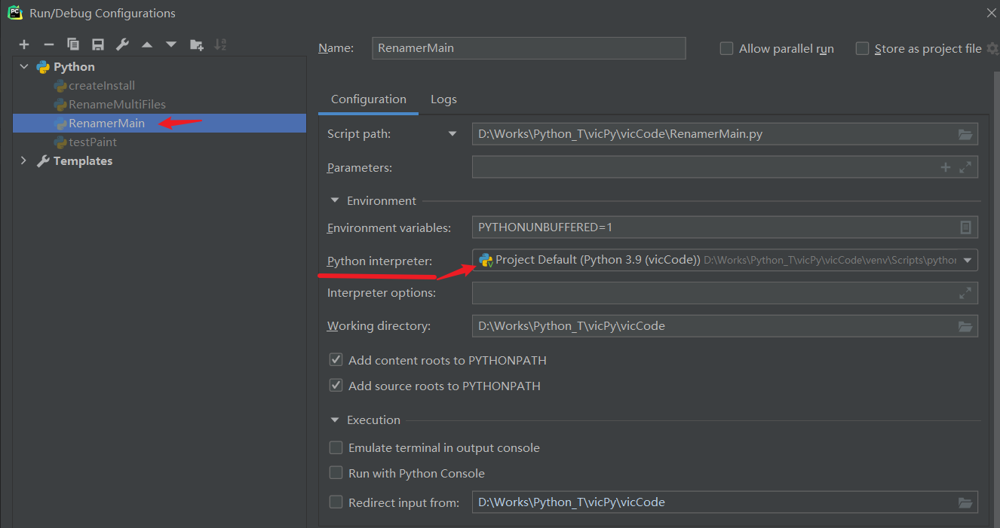

# Pycharm

### 初始配置

1. File > Settings...（搜：Interpreter）
   
   点选项图标选择Add..菜单，在现有python环境 Existing environment 指定python.exe路径
   
2. 项目设置
   Run > Edit Configurations...（如下图指定 Python interpreter:）
   

### 关闭拼写检查

Settings > Editor > Inspections > `PEP...`  ; `Typo` ; `Spelling`（取消兩項勾選）


# Python

* 模块总目录
  c:\Users\Administrator\AppData\Local\Programs\Python\Python39\Lib\site-packages\
* 代码验证网站

#### [try:异常处理](https://www.w3school.com.cn/python/python_try_except.asp)

> http://www.pythontutor.com/visualize.html#mode=edit

* w3school学习网站

> https://www.w3school.com.cn/python/python_mongodb_sort.asp

* IDLE执行程序

> C:\Users\yuhuizeng\AppData\Local\Programs\Python\Python39\pythonw.exe "C:\Users\yuhuizeng\AppData\Local\Programs\Python\Python39\Lib\idlelib\idle.pyw"

---

```python
#如果 try 块引发 NameError，则打印一条消息，如果是其他错误则打印另一条消息：
try:
  print(x)
except NameError:
  print("Variable x is not defined")
except:
  print("Something else went wrong")
finally:    # 不管有没有出错最后都会执行
```

#### [Python集合](https://www.w3school.com.cn/python/python_sets.asp)

#### [Python字典](https://www.w3school.com.cn/python/python_dictionaries.asp)

#### [Python Lambda](https://www.w3school.com.cn/python/python_lambda.asp)

当您把 lambda 用作另一个函数内的匿名函数时，会更好地展现 lambda 的强大能力。

假设您有一个带一个参数的函数定义，并且该参数将乘以未知数字：

```python
def myfunc(n):
  return lambda a : a * n
#使用该函数定义来创建一个总是使所发送数字加倍的函数：
mydoubler = myfunc(2)
print(mydoubler(11))
#返回：
22
```

如果在短时间内需要匿名函数，请使用 lambda 函数。

#### [类和对象](https://www.w3school.com.cn/python/python_classes.asp)

#### [Python继承](https://www.w3school.com.cn/python/python_inheritance.asp)

#### NumPy数组

* 安装NumPy
  pip3 install numpy

* 导入NumPy
  
  用一个短别名引用方便调用
  
  ```python
  import numpy as np
  arr = np.array([1,2,3,4,5])
  #查看版本
  print(np.__version__)
  ```

* 2-D、3-D 等多维数组（多维数组间逗号后面一定要有空格！）
  
  ```python
  #零维数组 0-D
  x = np.array(43)
  #一维数组 1-D
  a = np.array([1, 2, 3, 4, 5])
  #二维数组 2-D
  b = np.array([[1, 2, 3], [4, 5, 6]])
  #三维数组 3-D
  c = np.array([[[1, 2, 3], [4, 5, 6]], [[1, 2, 3], [4, 5, 6]]])
  #创建更高维度5维数组
  arr = np.array([1, 2, 3, 4], ndmin=5)
  ```

* NumPy数组的属性
  
  ```python
  #返回数组的维数
  arr.ndim
  #返回数组的形状，既几维几个元素，需要各成员数相同，否则只显示第一维数
  arr.shape    #返回：(2, 4) 2维，4个成员
  #返回对象类型
  arr.dtype
  #重塑数组维度成员，可以重塑成任何形状，只要重塑所需的元素在两种形状中均相等
  arr.reshape(3, 4)
      #未知维度使用不必在 reshape 方法中为维度之一指定确切的数字，传递-1作为值
    arr.reshape(2, 2, -1)    #将 8 个元素的 1D 数组转换为 2x2 元素的 3D 数组
    #展平数组，将多维数组转换为 1D 数组
    arr.reshape(-1)
  ```

* 使用 nditer() 迭代数组（跨维数遍历成员）
  在基本的 for 循环中，迭代遍历数组的每个标量，我们需要使用 n 个 for 循环，对于具有高维数的数组可能很难编写
  
  ```python
  arr = np.array([[[1, 2], [3, 4]], [[5, 6], [7, 8]]])
  for x in np.nditer(arr):
    print(x)
  #返回：
  1
  2
  3
  4
  5
  6
  7
  8
  ```
  


迭代不同数据类型的数组

```python
#我们可以使用 op_dtypes 参数，并传递期望的数据类型，以在迭代时更改元素的数据类型
for x in np.nditer(arr, flags=['buffered'], op_dtypes=['S']):
  print(x)
```

  以不同步长迭代，过滤迭代

```python
#每遍历 2D 数组的一个标量元素，跳过 1 个元素：
arr = np.array([[1, 2, 3, 4], [5, 6, 7, 8]])
for x in np.nditer(arr[:, ::2]):
print(x)
#返回：
1
3
5
7
```

  使用 ndenumerate() 进行枚举迭代

```python
#枚举是指逐一提及事物的序号。有时，我们在迭代时需要元素的相应索引，对于这些用例，可以使用 ndenumerate() 方法。
#枚举以下 1D 数组元素：
arr = np.array([1, 2, 3])
for idx, x in np.ndenumerate(arr):
  print(idx, x)
#返回：
(0,) 1
(1,) 2
(2,) 3

#枚举以下 2D 数组元素：
arr = np.array([[1, 2, 3, 4], [5, 6, 7, 8]])
for idx, x in np.ndenumerate(arr):
  print(idx, x)
#返回：
(0, 0) 1
(0, 1) 2
(0, 2) 3
(0, 3) 4
(1, 0) 5
(1, 1) 6
(1, 2) 7
(1, 3) 8
```

* 连接 NumPy 数组 concatenate()
  
  ```python
  #连接两个数组
    arr1 = np.array([1, 2, 3])
    arr2 = np.array([4, 5, 6])
    arr = np.concatenate((arr1, arr2))
  #返回：
  [1 2 3 4 5 6]
  
  #沿着竖行 (axis=1) 连接两个 2-D 数组：
    arr1 = np.array([[1, 2], [3, 4]])
    arr2 = np.array([[5, 6], [7, 8]])
    arr = np.concatenate((arr1, arr2), axis=1)
  #返回：
  [[1 2 5 6]
   [3 4 7 8]]
  ```

* 使用堆栈函数连接数组 stack()
  
  ```python
  arr1 = np.array([1, 2, 3])
  arr2 = np.array([4, 5, 6])
  arr = np.stack((arr1, arr2), axis=1)
  #返回：
  [[1 4]
   [2 5]
   [3 6]]
  ```

* 沿行堆叠 hstack()
  
  ```python
  arr1 = np.array([1, 2, 3])
  arr2 = np.array([4, 5, 6])
  arr = np.hstack((arr1, arr2))
  #返回：
  [1 2 3 4 5 6]
  ```

* 沿列堆叠 vstack()
  
  ```python
  arr1 = np.array([1, 2, 3])
  arr2 = np.array([4, 5, 6])
  arr = np.vstack((arr1, arr2))
  #返回：
  [[1 2 3]
   [4 5 6]]
  ```

* 沿高度堆叠（深度）dstack()
  
  ```python
  arr1 = np.array([1, 2, 3])
  arr2 = np.array([4, 5, 6])
  arr = np.dstack((arr1, arr2))
  #返回：
  [[[1 4]
    [2 5]
    [3 6]]]
  ```

* 拆分 NumPy 数组 array_split()
  
  ```python
  #将数组分为3部分：
  arr = np.array([1, 2, 3, 4, 5, 6])
  newarr = np.array_split(arr, 3)
  #返回：
  [array([1, 2]), array([3, 4]), array([5, 6])]
  # newarr[0] 返回：
  [array([1, 2])
  ```

* 另一种解决方案是使用与 hstack() 相反的 hsplit()
  
  ```python
  #使用 hsplit() 方法将 2-D 数组沿着行分成三个 2-D 数组：
  arr = np.array([[1, 2, 3], [4, 5, 6], [7, 8, 9], [10, 11, 12], [13, 14, 15], [16, 17, 18]])
  newarr = np.hsplit(arr, 3)
  #返回：
  [array([[ 1],
         [ 4],
         [ 7],
         [10],
         [13],
         [16]]), array([[ 2],
         [ 5],
         [ 8],
         [11],
         [14],
         [17]]), array([[ 3],
         [ 6],
         [ 9],
         [12],
         [15],
         [18]])]
  ```

* 使用负索引从尾部开始访问数组
  
  ```python
  #访问第二维里最后一个元素
  arr[1,-1]
  ```

* 裁切数组方法
  
  [start :]        指定位置到结尾
  [: end]        从头到指定结束
  [start : end]    指定裁切起始结尾
  [start : end : step]    指定起始结尾和间隔
  [:: 2]        返回间隔的元素

##### 操作数组（numpy）

###### 定位数组成员

```python
#查找成员，返回成员所在位置编号
arr = ['1','2','3','2','3','AB','3']
arr.index('2')  #返回：1
```

###### 搜索数组

```python
import numpy as np
#查找值为 4 的索引：
arr = np.array([1, 2, 3, 4, 5, 4, 4])
x = np.where(arr == 4)
#返回：4出现在数组中的索引编号数组
(array([3, 5, 6], dtype=int64),)

#查找值为偶数的索引：
arr = np.array([1, 2, 3, 4, 5, 6, 7, 8])
x = np.where(arr%2 == 0)
#返回：索引
(array([1, 3, 5, 7], dtype=int64),)

#查找奇数的索引：
x = np.where(arr%2 == 1)
#返回：索引
(array([0, 2, 4, 6], dtype=int64),)
=========================================================
#搜索排序 searchsorted()
#从右边开始查找应该插入值 7 的索引：side='right'
arr = np.array([6, 7, 8, 9])
x = np.searchsorted(arr, 7, side='right')
#返回：
2

#查找应在其中插入值 2、4 和 6 的索引：
arr = np.array([1, 3, 5, 7])
x = np.searchsorted(arr, [2, 4, 6])
#返回：值为2，4，6所该插入的索引位置，以维持顺序
[1 2 3]
```

###### 数组排序 sort()

```python
#按数字顺序排序
arr = np.array([3, 2, 0, 1])
print(np.sort(arr))

#按子母顺序排序
arr = np.array(['banana', 'cherry', 'apple'])
print(np.sort(arr))

#对布尔数组排序
arr = np.array([True, False, True])
print(np.sort(arr))
#返回：
[False  True  True]

#对 2-D 数组排序
arr = np.array([[3, 2, 4], [5, 0, 1]])
print(np.sort(arr))
#返回：
[[2 3 4]
 [0 1 5]]
```

###### 数组过滤

```python
#用索引 0 和 2、4 上的元素创建一个数组：
  arr = np.array([61, 62, 63, 64, 65])
  x = [True, False, True, False, True]
  newarr = arr[x]
  #返回：过滤True所在索引编号
  [61 63 65]

#直接从数组创建过滤器
  arr = np.array([61, 62, 63, 64, 65])
  filter_arr = arr > 62
  newarr = arr[filter_arr]
  #返回：大于62的值
  [63 64 65]

  #过滤出偶数
  arr = np.array([1, 2, 3, 4, 5, 6, 7])
  filter_arr = arr % 2 == 0
  newarr = arr[filter_arr]
  #返回：
  [2 4 6]
```

###### 随机数

```python
from numpy import random
#在100中随机出一个值
random.randint(100)

#返回0到1间的随机值
random.rand()
#允许指定数组形状，生成包含 5 个随机浮点数的 1-D 数组
random.rand(5)
#生成有 3 行的 2-D 数组，每行包含 5 个随机数
random.rand(3,5)

#生成随机数组，包含 5 个从 0 到 100 之间的随机整数（随机值会重复！）
random.randint(100, size=(5))
#生成有 3 行的 2-D 数组，每行包含 5 个从 0 到 100 之间的随机整数
random.randint(100, size=(3, 5))

#从数组生成随机数 choice()
random.choice([3, 5, 7, 9])
#指定数组形状（随机值会重复）
random.choice([3, 5, 7, 9], size=(3, 5))

#创建一个包含 12 个介于 0 到 5 之间的随机浮点数的数组：
random.uniform(0.0,5.0,12)
```

###### 直方图

```python
#安装绘制直方图模块 matplotlib（需要安装约5个进度条）
pip3 install matplotlib
#创建一个包含 200 个介于 0 到 8 之间的随机浮点数的数组：
x = numpy.random.uniform(0.0, 8.0, 200)
plt.hist(x, 5)    #绘制5栏
plt.show()    #显示图表
```


###### 散点图

```python
x = [5,7,8,7,2,17,2,9,4,11,12,9,6]
y = [99,86,87,88,111,86,103,87,94,78,77,85,86]
plt.scatter(x, y)
plt.show()
```


###### 什么是 ufuncs？

  ufuncs 指的是“通用函数”（Universal Functions），它们是对 ndarray 对象进行操作的 NumPy 函数。

```python
对两个列表的元素进行相加：
#如果没有 ufunc，我们可以使用 Python 的内置 zip() 方法：
x = [1, 2, 3, 4]
y = [4, 5, 6, 7]
z = []
for i, j in zip(x, y):
  z.append(i + j)
#返回：
[5, 7, 9, 11]

#通过 ufunc，我们可以使用 add() 函数：
import numpy as np
x = [1, 2, 3, 4]
y = [4, 5, 6, 7]
z = np.add(x, y)
```

#### NumPy的类型

> - i - 整数（i4 表示4字节整数类型，返回：int32，默认int64）
> - b - 布尔
> - u - 无符号整数
> - f - 浮点
> - c - 复合浮点数
> - m - timedelta
> - M - datetime
> - O - 对象
> - S - 数据类型字符串
> - U - unicode 字符串（普通字符串）
> - V - 固定的其他类型的内存块 ( void )

（对于 i、u、f、S 和 U，都可以定义大小。）

* NnmPy数组返回对象类型属性
  
  ```python
  arr.dtype
  ```

* 可以使用可选参数：*dtype*，它允许我们定义数组元素的预期数据类型
  
  ```python
  arr = np.array([1, 2, 3, 4], dtype='U')
  ```

* 转换已有数组的数据类型
  
  ```python
  arr = np.array([1.1, 2.1, 3.1])
  newarr = arr.astype('i')    #转换为整数
  newarr = arr.astype(int)    #也可使用int
  #可以将整数改为布尔值
  arr = np.array([1, 0, 3])
  newarr = arr.astype(bool)    #返回：[ True, False,  True]
  ```

* 复制一个数组副本copy与镜像view
  
  ```python
  arr = np.array([1, 2, 3, 4, 5])
  x = arr.copy()    #x保留原始数组原样，即使改变arr成员x不变
  y = arr.view()    #镜像受原始数组影响，修改y同样也会改变arr
  # NumPy数组都有base属性用于查看数组是否拥有数据，副本拥有数据，而镜像不拥有数据
  x # 有数据返回：None
  y # 没数据返回：原始对象数组
  ```

### 变量

* 函数外面定义的变量为全局变量，函数内定义的为局部变量。
  
  ```python
  #函数内使用全局变量，在函数内对变量加 global
  s = 0
  def test():
      global s
      s +=2
      print(s)
  ```

#### 字符串

https://www.runoob.com/python/python-strings.html

##### 字符串运算

```python
#下表实例变量 a 值为字符串 "Hello"，b 变量值为 "Python"：
a = 'Hello'
b = 'Python'
+    #字符串连接    
>>>a + b
'HelloPython'
*    #多次重复输出字符串
>>>a * 2
'HelloHello'
[]    #通过索引获取字符串中字符    
>>>a[1]
'e'
[ : ]    #截取字符串中的一部分    
>>>a[1:4]
'ell'
in    #成员运算符 - 如果字符串中包含给定的字符返回 True    
>>>"H" in a
True
not in    #成员运算符 - 如果字符串中不包含给定的字符返回 True    
>>>"M" not in a
True
r/R    #原始字符串 - 原始字符串：所有的字符串都是直接按照字面的意思来使用，没有转义特殊或不能打印的字符。 原始字符串除在字符串的第一个引号前加上字母"r"（可以大小写）以外，与普通字符串有着几乎完全相同的语法。    
>>>print r'\n'
\n
>>> print R'\n'
\n
```

##### 替换字符(replace)

```python
#把 string 中的 str1 替换成 str2,如果 num 指定，则替换不超过 num 次.
string.replace(str1, str2,  num=string.count(str1))
```

##### 向多个变量赋值

```python
x, y, z = "Orange", "Banana", "Cherry"
x = y = z = "Orange"
```

##### 获取字符串长度 len()

```python
a = "abcde"
len(a)
```

##### startswith('') 判断起始字符

判断起始字符是否存在指定字符

```python
a='↑  >>> 上文件夹独有的文件： >>> 20个'
a.startswith('↑')    #返回：True
```

##### strip() 方法

自会删除括号中包含开头与结尾的字符

```python
a = " abcde "
a.strip()    #删除开头和结尾的空白字符 返回："abcde"

a='abcdef'
print(a.strip('abf')) #删除开头和结尾的字符 返回：cde

line.strip('\n')  #去掉列表中每一个元素的换行符
```

##### 大小写转换

```python
a.lower()    #小写
a.upper()    #大写
```

split() 方法在找到分隔符的实例时将字符串拆分为子字符串

```python
# str -- 分隔符，默认为所有的空字符，包括空格、换行(\n)、制表符(\t)等。
# num -- 分割次数。默认为 -1, 即分隔所有
str.split(str="", num=string.count(str))
# 第二个参数为 1，只切割第一个分割符
txt = "Google#Runoob#Taobao#Facebook"
x = txt.split("#", 1) # ['Google', 'Runoob#Taobao#Facebook']
a = "Hello, World!"
print(a.split(",")) # returns ['Hello', ' World!']
```

##### 提取部分字符，类似数组方式

```python
string = 'abc'
# 提取范围
string[1:2]    # b
# 从第2个字符提取后面所有字符
string[1:]    # bc
# 获取倒数第一个字符
string[-1]
# 剔除倒数第一个字符
string[0:-1]
```

##### 定义字符格式' '.format( , , )

```python
#大括号中按顺序放入.format中的变量
'{}-{}{}'.format(f1, f2, f3)
#f1-f2f3
```

##### 控制编号位数.zfill( )

```python
a='3'
a.zfill(3)    #'003'
```

##### 检查字符串

检查字符串包含

```python
txt = "China is a great country"
x = "ina" in txt    #返回：true
x = "ain" not in txt    #返回：true
```

##### find 查找字符

```python
a = 'abcde'
a.find('')    #空字符返回：0
a.find('a')    #第一个也返回：0
a.find('g')    #查找不到返回：-1
```

##### format() 方法

接受传递的参数，格式化它们，并将它们放在占位符 {} 所在的字符串中

```python
age = 63
txt = "My name is Bill, and I am {}"
print(txt.format(age))
#返回：My name is Bill, and I am 63

接受不限数量的参数，并放在各自的占位符中：
quantity = 3
itemno = 567
price = 49.95
myorder = "I want {} pieces of item {} for {} dollars."
print(myorder.format(quantity, itemno, price))

可以使用索引号 {0} 来确保参数被放在正确的占位符中：
quantity = 3
itemno = 567
price = 49.95
myorder = "I want to pay {2} dollars for {0} pieces of item {1}."
print(myorder.format(quantity, itemno, price))
#例：
print('{}{}-{}'.format('a','b','c'))
```

| 方法                                                                               | 描述                          |
| -------------------------------------------------------------------------------- | --------------------------- |
| [capitalize()](https://www.w3school.com.cn/python/ref_string_capitalize.asp)     | 把首字符转换为大写。                  |
| [casefold()](https://www.w3school.com.cn/python/ref_string_casefold.asp)         | 把字符串转换为小写。                  |
| [center()](https://www.w3school.com.cn/python/ref_string_center.asp)             | 返回居中的字符串。                   |
| [count()](https://www.w3school.com.cn/python/ref_string_count.asp)               | 返回指定值在字符串中出现的次数。            |
| [encode()](https://www.w3school.com.cn/python/ref_string_encode.asp)             | 返回字符串的编码版本。                 |
| [endswith()](https://www.w3school.com.cn/python/ref_string_endswith.asp)         | 如果字符串以指定值结尾，则返回 true。       |
| [expandtabs()](https://www.w3school.com.cn/python/ref_string_expandtabs.asp)     | 设置字符串的 tab 尺寸。              |
| [find()](https://www.w3school.com.cn/python/ref_string_find.asp)                 | 在字符串中搜索指定的值并返回它被找到的位置。      |
| [format()](https://www.w3school.com.cn/python/ref_string_format.asp)             | 格式化字符串中的指定值。                |
| format_map()                                                                     | 格式化字符串中的指定值。                |
| [index()](https://www.w3school.com.cn/python/ref_string_index.asp)               | 在字符串中搜索指定的值并返回它被找到的位置。      |
| [isalnum()](https://www.w3school.com.cn/python/ref_string_isalnum.asp)           | 如果字符串中的所有字符都是字母数字，则返回 True。 |
| [isalpha()](https://www.w3school.com.cn/python/ref_string_isalpha.asp)           | 如果字符串中的所有字符都在字母表中，则返回 True。 |
| [isdecimal()](https://www.w3school.com.cn/python/ref_string_isdecimal.asp)       | 如果字符串中的所有字符都是小数，则返回 True。   |
| [isdigit()](https://www.w3school.com.cn/python/ref_string_isdigit.asp)           | 如果字符串中的所有字符都是数字，则返回 True。   |
| [isidentifier()](https://www.w3school.com.cn/python/ref_string_isidentifier.asp) | 如果字符串是标识符，则返回 True。         |
| [islower()](https://www.w3school.com.cn/python/ref_string_islower.asp)           | 如果字符串中的所有字符都是小写，则返回 True。   |
| [isnumeric()](https://www.w3school.com.cn/python/ref_string_isnumeric.asp)       | 如果字符串中的所有字符都是数，则返回 True。    |
| [isprintable()](https://www.w3school.com.cn/python/ref_string_isprintable.asp)   | 如果字符串中的所有字符都是可打印的，则返回 True。 |
| [isspace()](https://www.w3school.com.cn/python/ref_string_isspace.asp)           | 如果字符串中的所有字符都是空白字符，则返回 True。 |
| [istitle()](https://www.w3school.com.cn/python/ref_string_istitle.asp)           | 如果字符串遵循标题规则，则返回 True。       |
| [isupper()](https://www.w3school.com.cn/python/ref_string_isupper.asp)           | 如果字符串中的所有字符都是大写，则返回 True。   |
| [join()](https://www.w3school.com.cn/python/ref_string_join.asp)                 | 把可迭代对象的元素连接到字符串的末尾。         |
| [ljust()](https://www.w3school.com.cn/python/ref_string_ljust.asp)               | 返回字符串的左对齐版本。                |
| [lower()](https://www.w3school.com.cn/python/ref_string_lower.asp)               | 把字符串转换为小写。                  |
| [lstrip()](https://www.w3school.com.cn/python/ref_string_lstrip.asp)             | 返回字符串的左修剪版本。                |
| maketrans()                                                                      | 返回在转换中使用的转换表。               |
| [partition()](https://www.w3school.com.cn/python/ref_string_partition.asp)       | 返回元组，其中的字符串被分为三部分。          |
| [replace()](https://www.w3school.com.cn/python/ref_string_replace.asp)           | 返回字符串，其中指定的值被替换为指定的值。       |
| [rfind()](https://www.w3school.com.cn/python/ref_string_rfind.asp)               | 在字符串中搜索指定的值，并返回它被找到的最后位置。   |
| [rindex()](https://www.w3school.com.cn/python/ref_string_rindex.asp)             | 在字符串中搜索指定的值，并返回它被找到的最后位置。   |
| [rjust()](https://www.w3school.com.cn/python/ref_string_rjust.asp)               | 返回字符串的右对齐版本。                |
| [rpartition()](https://www.w3school.com.cn/python/ref_string_rpartition.asp)     | 返回元组，其中字符串分为三部分。            |
| [rsplit()](https://www.w3school.com.cn/python/ref_string_rsplit.asp)             | 在指定的分隔符处拆分字符串，并返回列表。        |
| [rstrip()](https://www.w3school.com.cn/python/ref_string_rstrip.asp)             | 返回字符串的右边修剪版本。               |
| [split()](https://www.w3school.com.cn/python/ref_string_split.asp)               | 在指定的分隔符处拆分字符串，并返回列表。        |
| [splitlines()](https://www.w3school.com.cn/python/ref_string_splitlines.asp)     | 在换行符处拆分字符串并返回列表。            |
| [startswith()](https://www.w3school.com.cn/python/ref_string_startswith.asp)     | 如果以指定值开头的字符串，则返回 true。      |
| [strip()](https://www.w3school.com.cn/python/ref_string_strip.asp)               | 返回字符串的剪裁版本。                 |
| [swapcase()](https://www.w3school.com.cn/python/ref_string_swapcase.asp)         | 切换大小写，小写成为大写，反之亦然。          |
| [title()](https://www.w3school.com.cn/python/ref_string_title.asp)               | 把每个单词的首字符转换为大写。             |
| translate()                                                                      | 返回被转换的字符串。                  |
| [upper()](https://www.w3school.com.cn/python/ref_string_upper.asp)               | 把字符串转换为大写。                  |
| [zfill()](https://www.w3school.com.cn/python/ref_string_zfill.asp)               | 在字符串的开头填充指定数量的 0 值。         |

### 元组（Tuple）

元组是有序且不可更改的集合。在 Python 中，元组是用圆括号编写的。

```python
thistuple = ("apple", "banana", "cherry")
print(thistuple)
#返回：
('apple', 'banana', 'cherry')
```

### 数组

数组的起始编号是0

```python
#添加数组成员
a = []
a.append('member')
#删除第二个数组成员
a.pop(1)
#删除值为“temp”的数组成员（仅删除首次出现的指定值）
a.remove("temp")
#数组成员数量
len(a)
```

| 方法                                                                            | 描述                         |
|:----------------------------------------------------------------------------- |:-------------------------- |
| [append()](https://www.w3school.com.cn/python/ref_list_append.asp)            | 在列表的末尾添加一个元素               |
| [clear()](https://www.w3school.com.cn/python/ref_list_clear.asp)              | 删除列表中的所有元素                 |
| [copy()](https://www.w3school.com.cn/python/ref_list_copy.asp)                | 返回列表的副本                    |
| [count()](https://www.w3school.com.cn/python/ref_list_count.asp)              | 返回具有指定值的元素数量。              |
| [extend()](https://www.w3school.com.cn/python/ref_list_extend.asp)            | 将列表元素（或任何可迭代的元素）添加到当前列表的末尾 |
| [index()](https://www.w3school.com.cn/python/ref_list_index.asp)              | 返回具有指定值的第一个元素的索引           |
| [insert(1, "member")](https://www.w3school.com.cn/python/ref_list_insert.asp) | 在指定位置添加元素                  |
| [pop()](https://www.w3school.com.cn/python/ref_list_pop.asp)                  | 删除指定位置的元素                  |
| [remove()](https://www.w3school.com.cn/python/ref_list_remove.asp)            | 删除具有指定值的项目                 |
| [reverse()](https://www.w3school.com.cn/python/ref_list_reverse.asp)          | 颠倒列表的顺序                    |
| [sort()](https://www.w3school.com.cn/python/ref_list_sort.asp)                | 对列表进行排序                    |

#### 查找数组中包含某值

```python
Arr=['A','B','C']
if 'B' in Arr: print('Have B')
```

#### 字典，key 与 value

[Python 字典(Dictionary) | 菜鸟教程](https://www.runoob.com/python/python-dictionary.html)

```python
dicts = dict()    #初始化字典 dicts = {}
dicts['a'] = 123    #创建字典成员元素
type(dicts)    <class 'dict'>
dicts.items()  #返回（键,值）元组数组：dict_items([('a', 123), ('b', 'abc')])
dicts.clear()  #清空字典数组
dicts.keys()   #返回字典所有的键，可以对此进行set()
dicts.get('a') #返回指定键的值
dicts.get('other', 0.0) #字典里没有other键，输出指定默认值0.0
dicts.setdefault(key, default=None) #与get类似，如果键不存在将会添加键与默认值。
dicts.update(dicts2)    #将dicts2中的键值添加到dicts，重复的替换为dicts2的

tinydict = {'Name': 'Zara', 'Age': 7}
print "Value : %s" %  tinydict.keys()
#输出：
Value : ['Age', 'Name']

del tinydict  #删除字典
del tinydict['Name']  #删除键条目

#循环获取每个字典的键、值
for k, v in dicts.items():
    print('key:{},velue:{}')
```

循环输出字典的键与值

```python
for k, v in dicts.items():
    print(k,v)
```

#### 数组间的成员对比(set函数)

通过set函数创建一个无序不重复元素集，可进行关系测试，删除重复数据，还可以计算交集、差集、并集等。

```python
>>> x = set('eleven')
>>> y = set('twelve')
>>> x,y
({'l', 'e', 'n', 'v'}, {'e', 'v', 'l', 't', 'w'})
>>> x & y  #交集
{'l', 'e', 'v'}
>>> x | y  #并集
{'e', 'v', 'n', 'l', 't', 'w'}
>>> x - y  #差集
{'n'}
>>> y -x   #差集
{'t', 'w'}
>>> x ^ y  #补集
{'t', 'n', 'w'}
>>> y ^ x  #补集
{'w', 'n', 't'}

交集 & : x&y，返回一个新的集合，包括同时在集合 x 和y中的共同元素。
并集 | : x|y，返回一个新的集合，包括集合 x 和 y 中所有元素。
差集 - : x-y，返回一个新的集合,包括在集合 x 中但不在集合 y 中的元素。
补集 ^ : x^y，返回一个新的集合，包括集合 x 和 y 的独有元素。
```

#### sorted 排序

```python
list = [1, 5, 7, 2, 4]
print(sorted(list))

Output：
[1, 2, 4, 5, 7]

list = ['d', 'c', 'f', 'a', 'z']
print(sorted(list))

Output：
['a', 'c', 'd', 'f', 'z']
```

高级用法：[Python之排序函数sorted()详解_阿怪呢的博客-CSDN博客_python的sorted函数是什么排序](https://blog.csdn.net/weixin_41998772/article/details/113427691)

---

### 类型转换

```python
str(77)  #转换为字符类型 '77'
int('666')    #转换为整数类型 666
float(7)    #转换为浮点类型 7.0
```

complex - 用于表示复平面中的数字。例如 1.0 + 2.0j，1.5 + 2.5j。

#### type()

​    获取对象类型

---

### 常用函数

```python
len('abc')  #获取字符长度 3
range(1, 8, 2) # (start, end, step)
range(13) #区域：0~12
range(5, 13) #区域：5~12
range(5, 1, -1) #倒数 5~1
```

#### 限制小数位数

```python
round(Float, 2)
```

#### sqrt平方根

```python
import math
math.sqrt(25)    #返回：5
```

#### 奇数 n % 2 != 0

```python
#求n的奇数
n % 2 != 0
```

#### 取模：%

> 用于在循环中做阶段限制，如每5个换行
> 
> ```python
> #对于整数，是取余运算
> c = 0
> for n in a:
>    c += 1
>    if c % 5 == 0:            #模5，每隔5个数换行
>        print(n, end='\n')    #\n换行
>    else:
>        print(n, end='\t')    #\t缩进
> 8    23    1    16    13
> 19    20    18    15    6
> 17    7    25    3    12
> 
> #对于字符串，是c风格的字符串格式化运算
> "%s %d %f"%("abc",123,3.21)    #多个值：字符，整数，浮点
> 'abc 123 3.210000'
> ```

#### print函数的一些用法

> ```python
> #传入end值可以把第二条字符打印在第一条后面
> print('Hello', end=' ')
> print('World')
> #返回：Hello World
> ```
> 
> ```python
> #将要打印的字符段分开，打印结果以空格分隔
> print('cat', 'dog', 'mouse')    #返回：cat dog mouse
> #添加sep分隔字符传入参数，则以传入的字符进行分隔
> print('cat', 'dog', 'mouse', sep='-')    #返回：cat-dog-mouse
> ```

#### input

> ```python
> nn = input('请输入网格横纵数：')
> GridNum(int(nn))
> ```

---

### 判断

> * 如果name有内容判断为true，没有输入内容为false
> 
> ```python
> name = input()
> if name:    #等同于：name != ''
>  print('Thank you for entering name.')
> else:
>  print('You dit not enter a name.')
> ```
> 
> 如下图，通过bool()函数返回示例：
> 
> 
> 
> * if  elif
> 
> ```python
> if T == 1:
>  return 'One'
> elif T == 2:
>  return 'Two'
> ```

---

### 运算符

#### 算术运算符

| 运算符 | 名称       | 实例     | 试一试                                                                 |
|:--- |:-------- |:------ |:------------------------------------------------------------------- |
| +   | 加        | x + y  | [试一试](https://www.w3school.com.cn/tiy/t.asp?f=python_oper_add)      |
| -   | 减        | x - y  | [试一试](https://www.w3school.com.cn/tiy/t.asp?f=python_oper_sub)      |
| *   | 乘        | x * y  | [试一试](https://www.w3school.com.cn/tiy/t.asp?f=python_oper_mult)     |
| /   | 除        | x / y  | [试一试](https://www.w3school.com.cn/tiy/t.asp?f=python_oper_div)      |
| %   | 取模       | x % y  | [试一试](https://www.w3school.com.cn/tiy/t.asp?f=python_oper_mod)      |
| **  | 幂        | x ** y | [试一试](https://www.w3school.com.cn/tiy/t.asp?f=python_oper_exp)      |
| //  | 地板除（取整除） | x // y | [试一试](https://www.w3school.com.cn/tiy/t.asp?f=python_oper_floordiv) |

#### 赋值运算符

| 运算符 | 实例      | 等同于        | 试一试                                                               |
|:--- |:------- |:---------- |:----------------------------------------------------------------- |
| =   | x = 5   | x = 5      | [试一试](https://www.w3school.com.cn/tiy/t.asp?f=python_oper_ass_1)  |
| +=  | x += 3  | x = x + 3  | [试一试](https://www.w3school.com.cn/tiy/t.asp?f=python_oper_ass_2)  |
| -=  | x -= 3  | x = x - 3  | [试一试](https://www.w3school.com.cn/tiy/t.asp?f=python_oper_ass_3)  |
| *=  | x *= 3  | x = x * 3  | [试一试](https://www.w3school.com.cn/tiy/t.asp?f=python_oper_ass_4)  |
| /=  | x /= 3  | x = x / 3  | [试一试](https://www.w3school.com.cn/tiy/t.asp?f=python_oper_ass_5)  |
| %=  | x %= 3  | x = x % 3  | [试一试](https://www.w3school.com.cn/tiy/t.asp?f=python_oper_ass_6)  |
| //= | x //= 3 | x = x // 3 | [试一试](https://www.w3school.com.cn/tiy/t.asp?f=python_oper_ass_7)  |
| **= | x **= 3 | x = x ** 3 | [试一试](https://www.w3school.com.cn/tiy/t.asp?f=python_oper_ass_8)  |
| &=  | x &= 3  | x = x & 3  | [试一试](https://www.w3school.com.cn/tiy/t.asp?f=python_oper_ass_9)  |
| \|= | x \|= 3 | x = x \| 3 | [试一试](https://www.w3school.com.cn/tiy/t.asp?f=python_oper_ass_10) |
| ^=  | x ^= 3  | x = x ^ 3  | [试一试](https://www.w3school.com.cn/tiy/t.asp?f=python_oper_ass_11) |
| >>= | x >>= 3 | x = x >> 3 | [试一试](https://www.w3school.com.cn/tiy/t.asp?f=python_oper_ass_12) |
| <<= | x <<= 3 | x = x << 3 | [试一试](https://www.w3school.com.cn/tiy/t.asp?f=python_oper_ass_13) |

#### 比较运算符

| 运算符 | 名称    | 实例     | 试一试                                                                  |
|:--- |:----- |:------ |:-------------------------------------------------------------------- |
| ==  | 等于    | x == y | [试一试](https://www.w3school.com.cn/tiy/t.asp?f=python_oper_compare_1) |
| !=  | 不等于   | x != y | [试一试](https://www.w3school.com.cn/tiy/t.asp?f=python_oper_compare_2) |
| >   | 大于    | x > y  | [试一试](https://www.w3school.com.cn/tiy/t.asp?f=python_oper_compare_3) |
| <   | 小于    | x < y  | [试一试](https://www.w3school.com.cn/tiy/t.asp?f=python_oper_compare_4) |
| >=  | 大于或等于 | x >= y | [试一试](https://www.w3school.com.cn/tiy/t.asp?f=python_oper_compare_5) |
| <=  | 小于或等于 | x <= y | [试一试](https://www.w3school.com.cn/tiy/t.asp?f=python_oper_compare_6) |

#### 逻辑运算符

| 运算符 | 描述                        | 实例                    | 试一试                                                                  |
|:--- |:------------------------- |:--------------------- |:-------------------------------------------------------------------- |
| and | 如果两个语句都为真，则返回 True。       | x > 3 and x < 10      | [试一试](https://www.w3school.com.cn/tiy/t.asp?f=python_oper_logical_1) |
| or  | 如果其中一个语句为真，则返回 True。      | x > 3 or x < 4        | [试一试](https://www.w3school.com.cn/tiy/t.asp?f=python_oper_logical_2) |
| not | 反转结果，如果结果为 true，则返回 False | not(x > 3 and x < 10) | [试一试](https://www.w3school.com.cn/tiy/t.asp?f=python_oper_logical_3) |

#### 身份运算符

| 运算符    | 描述                      | 实例         | 试一试                                                                   |
|:------ |:----------------------- |:---------- |:--------------------------------------------------------------------- |
| is     | 如果两个变量是同一个对象，则返回 true。  | x is y     | [试一试](https://www.w3school.com.cn/tiy/t.asp?f=python_oper_identity_1) |
| is not | 如果两个变量不是同一个对象，则返回 true。 | x is not y | [试一试](https://www.w3school.com.cn/tiy/t.asp?f=python_oper_identity_2) |

#### 成员运算符

| 运算符    | 描述                         | 实例         | 试一试                                                                     |
|:------ |:-------------------------- |:---------- |:----------------------------------------------------------------------- |
| in     | 如果对象中存在具有指定值的序列，则返回 True。  | x in y     | [试一试](https://www.w3school.com.cn/tiy/t.asp?f=python_oper_membership_1) |
| not in | 如果对象中不存在具有指定值的序列，则返回 True。 | x not in y | [试一试](https://www.w3school.com.cn/tiy/t.asp?f=python_oper_membership_2) |

#### 位运算符

| 运算符 | 描述                   | 实例                           |
|:--- |:-------------------- |:---------------------------- |
| &   | AND                  | 如果两个位均为 1，则将每个位设为 1。         |
| \|  | OR                   | 如果两位中的一位为 1，则将每个位设为 1。       |
| ^   | XOR                  | 如果两个位中只有一位为 1，则将每个位设为 1。     |
| ~   | NOT                  | 反转所有位。                       |
| <<  | Zero fill left shift | 通过从右侧推入零来向左移动，推掉最左边的位。       |
| >>  | Signed right shift   | 通过从左侧推入最左边的位的副本向右移动，推掉最右边的位。 |

---

### 循环

> * while循环，直到用户输入对应的名字，否则循环输入操作。
> 
> ```python
> name = ''
> while name != 'your name':
>  print('Please type your name.')
>  name = input()
> print('Thank you!')
> ```
> 
> * continue 跳过循环
> 
> ```python
> spam = 0
> while spam < 5:
>  spam += 1
>  if spam == 3:
>    continue
>  print('spam is ' + str(spam))
> ```
> 
> * for 循环示例：通过循环实现 0+1+2+3+...+100 = ?  （5050）实现公式：R/2*R+R/2
> 
> ```python
> total = 0
> for num in range(101):
>  total = total + num
> print(total)
> ```

---

#### 跳出循环

```python
break    #跳出循环，不再执行
continue    #跳出本次循环，执行下一次
exit()    #结束整个程序
pass    #不做任何事情，只起到占位的作用
```

---

### 枚举

```c
//枚举
typedef enum Flag {
    account_ver = 0x1 << 0,    //用户 0001 = 1
    password_ver = 0x1 << 1,//密码 0010 = 2
    payment_ver = 0x1 << 2,    //支付 0100 = 4
};
char User = 0;
// 符号：| 增加属性，验证成功增加属性，最终值是各属性相加
User = account_ver | password_ver | payment_ver;
printf("%d\n", User);    //= 7 = 0111
// 清除属性
User &= ~password_ver
```

### switch语法结构

```python
def case1(somearg):
    pass
def case2(somearg):
    pass
def case3(somearg):
    pass

switch={
1: case1,
2: case2,
3: case3
}

switch[case](arg)
```

### 随机值

> * random
> 
> ```python
> import random    #导入随机函数模块
> random.randint(1, 10)
> 
> from random import *    #导入模块的所有函数，下面不需要加引用模块名
> randint(1, 10)
> ```

---

### 函数

> * 传参函数格式
> 
> ```python
> def hello(name):
>   print('Hello '+name)
> #函数调用
> hello('vic')    #返回：Hello vic
> ```
> 
> * 导入其它 .py 文件模块
> 
> 例如 md.py 文件中包含有某些函数，要在其他文件中调用这些函数
> 
> ```python
> #直接导入函数文件，在调用函数时需要引用模块名
> import md
> md.fun()
> #导入模块的所有函数，调用时不需要加引用模块名
> from md import*
> fun()
> #导入模块的个别函数
> from md import fun, fun2
> fun()
> fun2()
> ```

#### 实例：跨文件函数调用

> * 文件一声明函数（RenameMultiFiles.py）
>   
>   ```python
>   class RenameC(QMainWindow):    # 传入ui
>      def __init__(self):
>          super().__init__()
>          self.ui = Ui_MainWindow()
>          self.PPf = 0
>   
>      def mp3InfoEdit(self, oldN, newN):
>          try:
>              f = EasyID3(oldN)  # 如果有ID信息直接获取
>              print(f)
>          except id3.ID3NoHeaderError:  # 如获取失败ID3没有信息时用add_tags添加标签
>              f = File(oldN, easy=True)  # 获取文件
>              f.add_tags()
>          f["title"] = newN
>          f.save()
>   ```
> 
> * 文件二调用函数
>   
>   ```python
>   import RenameMultiFiles as RM
>   # class类前需要加括号
>   RM.RenameC().mp3InfoEdit(f, endN)
>   ```

---

### python / os / sys

#### 获取文件的完整路径名

```python
os.path.dirname(cpf)
```

#### 创建文件夹

```python
os.mkdir('F')  #创建单文件夹（上级目录必须存在）
os.makedirs('F//f')  #创建多级目录
```

参考：

#### 复制文件 (os.popen)

（该方法较快，但不保险，大文件或Thumbs.db出现复制不成功）

目标文件路径如果没有需要创建：os.mkdir('目标目录')

```python
os.popen('copy 来源文件目录\\file.ext 目标目录\\file.ext')
```

#### 复制文件 (shutil)

（较保险，上面popen方法不成功的文件此方法可以复制成功）

```python
from shutil import copyfile
copyfile(源文件完整路径, 目标文件完整路径)
```

#### 获取文件大小(os.path.getsize)

```python
# 获取文件大小，返回的是字节大小
os.path.getsize('filePath')
```

#### 获取文件修改时间(os.path.getmtime)

```python
for o in Same:
    LT = os.path.getmtime(self.UPf[o][0])
    RT = os.path.getmtime(self.DNf[o][0])
    if RT > LT:
        self.DnNews.append(o)

os.path.getatime(path)    #获取最近访问时间
os.path.getctime(path)    #返回文件创建时间
```

#### 判断文件是否存在，创建文件

```python
import os

if not os.path.exists('setting.ini'):
    os.mkdir('setting')    # 创建文件夹
    INIF = open('setting.ini','w')    # 创建文件
    INIF.close()
```

#### 获取路径（MAC、Win）

```python
# 获取默认路径用户目录
import os
print (os.path.abspath('.'))  #MAC >>> '/Users/vic'
# 同样获取用户目录
os.getcwd()  #MAC >>> '/Users/vic'

# 获取系统路径
import sys
PP = sys.path
PP[2]
#>>> '/opt/homebrew/Cellar/python@3.9/3.9.12/Frameworks/Python.framework/Versions/3.9/lib/python3.9'
```

```python
#获取系统默认编码：
import sys
print(sys.getdefaultencoding())
#解码
import numpy as np
data_file=pd.read_csv('rawdata.csv',encoding='gb2312')
print (data_file[0:3])
```

#### 暂停dos窗口

```python
os.system("pause")
```

#### 获取文件夹中的所有文件名

```python
if os.path.exists(path):        # 判断路径文件夹是否存在
for file_name in os.listdir("."):    # 获取py所在文件夹中的所有文件名
    if file_name.endswith('doc')    # 判断扩展名
    if not os.path.isdir(file_name):    # 排除文件夹
```

使用 os.walk 获取子文件夹的文件

```python
import os

for root, dirs, files in os.walk(pp):   #这里的dirs是空的
    for file in files:  #files里的文件名带后缀名
        fff = os.path.join(root, file) #合并root根文件夹与文件名
        if not os.path.isdir(fff):     #判断排除文件夹
            fiNa,ex = os.path.splitext(file)
            if fiNa.find(self.ui.copy_filter_le.text()) >= 0 and fiNa.find('--ok') < 0:
                 if file.endswith('docx') or file.endswith('doc'):
                    if fiNa.find('~$')!=0:
                        PPC+=1
```

ShellExecute(hwnd, op , file , params , dir , bShow )

其参数含义如下所示。

hwnd：父窗口的句柄，如果没有父窗口，则为0。

op：要进行的操作，为“open”、“print”或者为空。

file：要运行的程序，或者打开的脚本。

params：要向程序传递的参数，如果打开的为文件，则为空。

dir：程序初始化的目录。

bShow：是否显示窗口。

```python
>>> import win32api
# 打开记事本程序，在后台运行，即显示记事本程序的窗口
>>> win32api.ShellExecute(0, 'open', 'notepad.exe', '','',0)

# 打开记事本程序，在前台运行
>>> win32api.ShellExecute(0, 'open', 'notepad.exe', '','',1)

# 向记事本传递参数，打开python.txt
>>> win32api.ShellExecute(0, 'open', 'notepad.exe', 'python.txt','',1)

# 在默认浏览器中打开http://www.python.org网站
>>> win32api.ShellExecute(0, 'open', 'http://www.python.org', '','',1)

# 在默认的媒体播放器中播放E:\song.wma
>>> win32api.ShellExecute(0, 'open', 'E:\\song.wma', '','',1)

# 运行位于E:\book\code目录中的MessageBox.py脚本
>>> win32api.ShellExecute(0, 'open', 'E:\\book\\code\\MessageBox.py', '','',1)
```

### 文件读写

`注意：文本编码使用ANSI`

#### file 对象方法

- **file.read([size])**：size 未指定则返回整个文件，如果文件大小 >2 倍内存则有问题，f.read()读到文件尾时返回""(空字串)。
- **file.readline()**：返回一行。
- file.readlines()   #读取所有行，可以用 len() 获取行数
- **file.readlines([size])** ：返回包含size行的列表, size 未指定则返回全部行。
- **for line in f: print line** ：通过迭代器访问。
- **f.write("hello\n")**：如果要写入字符串以外的数据,先将他转换为字符串。
- **f.tell()**：返回一个整数,表示当前文件指针的位置(就是到文件头的字节数)。
- **f.seek(偏移量,[起始位置])**：用来移动文件指针。
  - 偏移量: 单位为字节，可正可负
  - 起始位置: 0 - 文件头, 默认值; 1 - 当前位置; 2 - 文件尾
- **f.close()** 关闭文件

```python
#读取全部内容
with open('read.txt', 'r', encoding='utf-8') as f:
    print(f.read(), end='')
f.close()

#读取全部内容另一种方法
for line2 in open("version.txt"):
    line += line2
# 读取行，去除换行符
with open("test.txt", "r") as f:
    for line in f.readlines():
        line = line.strip('\n')  #去掉列表中每一个元素的换行符
        print(line)
# 批量收集每行（很有用）
Lines = []
ff = open("test.txt", "r", encoding='utf-8')
for line in ff:
    Lines.append(line)
```

#### 使用utf-8编码

可以批量逐行读取添加到变量，再对变量批量写入。修改编码在open时加入, encoding='utf-8'，在写入中文外的文本时才不会出错。

```python
f1 = open('test.txt','w', encoding='utf-8')
for j in s:
    f1.write(j+'\n')
f1.close()
```

#### 成功读取utf-8实例

```python
# 读取每一行，并收集到 Lines = []
    Lines = []
    try:
        f = open(ff, 'r', encoding='utf-8')
        OF = iter(f)    # 必须
        for l in OF:
            if l.find('.gif') >= 0 and l.find('\n'.format(ns))  # 去掉的换行符这里加上
                haveEdit = True
            else:
                Lines.append(l)
    finally:    # 不管有没有出错都会执行
        if f:
            f.close()

# 批量写入行
    f1 = open(ff, 'w', encoding='utf-8')
    for l in Lines:
        f1.write(l)
    f1.close()
```

#### os.path 文件名称获取

```python
import os
path="C:\\Users\\wuyanzu\\x1.jpg"
os.path.dirname(path)
#输出路径：C:\Users\wuyanzu
os.path.basename(path)
#输出文件名含扩展名：x1.jpg
dir,ext=os.path.splitext(path)
#拆分扩展名，输出：dir路径、ext扩展名
```

#### explorer.exe打开系统文件

```python
os.system('explorer.exe "setting.ini"')
```

#### ini文件读写

```python
from configparser import ConfigParser
# 全局定义conf
conf = ConfigParser()
# 写入ini文件
    conf.add_section('TAB1')    #如果原来有section不能多次添加（打包后会出现运行出错）
    conf.set('TAB1','PATH',self.ui.lineEdit.text())
    ## 注意：后面使用'w+'替换所有内容写入
    conf.write(open('setting.ini','w+',encoding="utf-8"))
# 读取ini
    conf.read("setting.ini")
    self.ui.lineEdit.setText(conf.get('TAB1','PATH'))    #值读取到lineEdit控件中
    conf.clear()    #最后一定要释放，否则在写入时会出错
    config.readfp(open('update.ini',encoding="utf-8"))    #也可使用readfp(open('.ini'))不用clear
# 改写ini，这里需要readfp以utf-8格式打开，改写后再以utf-8写入
    conf.readfp(open('setting.ini',encoding='utf-8'))
    ！## readfp 在未来版本中将会由 read_file 取代
    conf.read_file(open('setting.ini',encoding='utf-8'))
    ## 注意写入新key前需要确保section ‘TAB1’存在
    conf.set('TAB1','text2','(ccc)')
    conf.write(open('setting.ini', 'w+', encoding="utf-8"))    #这里使用‘w+’改写
# 获取所有的Section
    conf.sections()
    # 获取该Section下的所有key
    conf.options("TAB1")
    # 获取该Section下的所有key及对应的value值
    conf.items("TAB1")
#移除设置项
    conf.remove_option('section','option')
#移除设置
    conf.remove_section('section')

# 如果需要把items的返回结果以字典类型返回，那么需使用dict()方法
from configparser import ConfigParser
cf=ConfigParser()
cf.read("test.ini")
print(dict(cf.items("peizhi")))
#返回：{‘a':'Hello', 'b':'Word'}

# 判断section是否存在，不存在则创建
    haveS = True
    for s in conf.sections():
        if s == 'PATH1':
            haveS = False
            break
            if haveS:
                conf.add_section('PATH1')
```

configobj 函数方式：

```python
    pip install configobj
# configobj函数方式，需要安装Packages: configobj
from configobj import ConfigObj
# *** 配置文件预处理 *** #
config = ConfigObj("setting.ini",encoding='UTF8')

# *** 读配置文件 *** #
print(config['txtB'])
print(config['txtB']['name'])

# *** 修改配置文件 *** #
config['txtB']['comma'] = "Mufasa"
config.write()

# *** 添加section *** #
config['txtC'] = {}
config['txtC']['index0'] = "wanyu00"
config.write()
```

open函数第二传入模式表

| t   | 文本模式 (默认)。                                                                        |
| --- | --------------------------------------------------------------------------------- |
| x   | 写模式，新建一个文件，如果该文件已存在则会报错。                                                          |
| b   | 二进制模式。                                                                            |
| +   | 打开一个文件进行更新(可读可写)。                                                                 |
| U   | 通用换行模式（不推荐）。                                                                      |
| r   | 以只读方式打开文件。文件的指针将会放在文件的开头。这是默认模式。                                                  |
| rb  | 以二进制格式打开一个文件用于只读。文件指针将会放在文件的开头。这是默认模式。一般用于非文本文件如图片等。                              |
| r+  | 打开一个文件用于读写。文件指针将会放在文件的开头。                                                         |
| rb+ | 以二进制格式打开一个文件用于读写。文件指针将会放在文件的开头。一般用于非文本文件如图片等。                                     |
| w   | 打开一个文件只用于写入。如果该文件已存在则打开文件，并从开头开始编辑，即原有内容会被删除。如果该文件不存在，创建新文件。                      |
| wb  | 以二进制格式打开一个文件只用于写入。如果该文件已存在则打开文件，并从开头开始编辑，即原有内容会被删除。如果该文件不存在，创建新文件。一般用于非文本文件如图片等。  |
| w+  | 打开一个文件用于读写。如果该文件已存在则打开文件，并从开头开始编辑，即原有内容会被删除。如果该文件不存在，创建新文件。                       |
| wb+ | 以二进制格式打开一个文件用于读写。如果该文件已存在则打开文件，并从开头开始编辑，即原有内容会被删除。如果该文件不存在，创建新文件。一般用于非文本文件如图片等。   |
| a   | 打开一个文件用于追加。如果该文件已存在，文件指针将会放在文件的结尾。也就是说，新的内容将会被写入到已有内容之后。如果该文件不存在，创建新文件进行写入。       |
| ab  | 以二进制格式打开一个文件用于追加。如果该文件已存在，文件指针将会放在文件的结尾。也就是说，新的内容将会被写入到已有内容之后。如果该文件不存在，创建新文件进行写入。 |
| a+  | 打开一个文件用于读写。如果该文件已存在，文件指针将会放在文件的结尾。文件打开时会是追加模式。如果该文件不存在，创建新文件用于读写。                 |
| ab+ | 以二进制格式打开一个文件用于追加。如果该文件已存在，文件指针将会放在文件的结尾。如果该文件不存在，创建新文件用于读写。                       |

#### Excel文件

```python
import xlsxwriter

workbook = xlsxwriter.Workbook('G:\\xx\\103.xlsx')
        #在G盘xx文件下创建103的excel
worksheet = workbook.add_worksheet('s001')
        #103的excel的sheet页名称为s001
worksheet.write(0,0,123456)
worksheet.write(2,1,664)
worksheet.write(1,5,250)
        #写入信息
workbook.close()
```

#### Word 文件

docx文件读取

```python
# 安装docx读取模块
pip3 install python-docx

from docx import Document

path = r"E:\docx.docx"
document = Document(path)
for paragraph in document.paragraphs:
    print(paragraph.text)
```

doc转docx

```python
# 安装模块，如不成功需要升级pip版本（python.exe -m pip install --upgrade pip）
python -m pip install pypiwin32

import win32com.client as wc

def doSaveAs():
    word = wc.Dispatch('Word.Application')
    doc = word.Documents.Open(r'E:\s25\torn_test\doc.doc')  # 目标路径下的文件
    doc.SaveAs(r'E:\s25\torn_test\a\b.docx', 12, False, "", True, "", False, False, False, False)  # 转化后路径下的文件
    doc.Close()
    word.Quit()
doSaveAs()
```

### Others

#### MAC中pip3路径

/opt/homebrew

#### 安装出现运行不了，指定环境路径，在导入pyqt5包之前加上如代码。

```python
if hasattr(sys, 'frozen'):
    os.environ['PATH'] = sys._MEIPASS + ";" + os.environ['PATH']
```

#### Pyinstaller打包为可执行文件编码错误的问题

命令行中先输入chcp 65001
再输入打包命令。

```shell
chcp 65001
```

#### 安装pyperclip剪贴板工具

* 在MAC中安装，打开MAC终端，输入如下代码

> sudo pip3 install pyperclip

* 在Windows中安装，打开cmd，进入安装目录Scripts

> cd "\Program Files\Python 3.x\Scripts"
> 
> ...\Scripts\>pip3.exe install pyperclip

```python
import pyperclip
pyperclip.copy('Cici')
pyperclip.paste()    # Cici
```

#### 空值，声明的变量如果没有赋予值，则该变量==None

> None

#### 例：通过函数传入格子纵数，输出该数的平方格随机分布数字

```python
#GridNum(格子纵数）
import random,math,pyperclip
def GridNum(Num):
    a = []
    over = ''
    rn = Num*Num
    for i in range(rn):
        a.append(i+1)
    for o in range(5):    #随机操作次数
        random.shuffle(a)
    c = 0
    for n in a:
        c += 1
        if c % math.sqrt(rn) == 0:
            over+=str(n)+'\n'
            print(n, end='\n')
        else:
            over+=str(n)+'\t'
            print(n, end='\t')
    return over

qu='y'
while qu=='y':
    nn = input('请输入网格横纵数：')
    pyperclip.copy(GridNum(int(nn)))
    print('已复制到剪贴板')
```

#### 打包exe执行文件

[打包问题参考](https://www.jb51.net/article/207782.htm)

包体下载安装路径：

> C:\Users\yuhuizeng\AppData\Local\Programs\Python\Python39\Scripts>

1. 安装pip，这里还是在cmd中进入到pip3.r所在目录Scripts里，执行下面命令
   
   > pip3.x install pyinstaller

2. 安装windows拓展——pypiwin32
   
   （如遇安装错误，在Python39目录执行：python.exe -m pip install --upgrade pip）
   
   > pip3.x install pypiwin32
   > 
   > python -m pip install pypiwin32    （在Python39目录下再尝试安装）

3. 执行如下命令开始打包（另一打包方式）
   
   > Python39\Scripts>pyinstaller j:\\py\T1.py

4. 进入到py文件所在目录中 j:\\py\ 执行如下命令，即可生成exe在dist目录中（修改源文件后重复执行该命令重新生成）
   
   ```shell
   C:\>j:
   J:\>cd py
   J:\py>pyinstaller -F T1.py
   #如不进入项目目录则需要写完整.py文件的目录结构，包括图标文件也要路径
   ```

5. 其它
   
   * 更换exe程序图标
     
     ```shell
     pyinstaller -F -i T1.ico T1.py
     ```
   
   * 去掉dos窗口，因为我打包的是一个图形界面，发现每次运行程序的时候，都会显示dos窗口，想取消掉，就执行-w命令。
     
     ```shell
     pyinstaller -F -w -i T1.ico T1.py
     #注意，需要移动下生成可执行程序的位置才可显示图标！
     # 完成后会在执行目录生成dist目录
     完整实例：
     Scripts>pyinstaller e:\PyEXE\victool\RenamerMain.py -w -F -i e:\PyEXE\victool\victools.ico
     ```
     
     最后较好的方式，命名新名方式
     
     ```python
     pyinstaller -F -w snake.py -i snake.ico -n 新名
     ```
     
     | 参数       | 含义                                                 |
     | -------- | -------------------------------------------------- |
     | -F       | 打包单个文件，生成结果是一个exe文件，如果代码都写在一个.py文件时使用，项目有多个文件时不要使用 |
     | -i       | 指定程序的图标                                            |
     | -w       | 不显示dos窗口（命令行）                                      |
     | -c       | 显示dos窗口（命令行）                                       |
     | -h       | 显示帮助                                               |
     | -v       | 显示版本号                                              |
     | --key=密码 | 加密打包                                               |

**使用 Pyqt5 UI需要在主程序中pyqt5库import之前就对系统变量进行手动设置**

https://blog.csdn.net/zwyact/article/details/99778898

```python
import sys,os
if hasattr(sys, 'frozen'):
    os.environ['PATH'] = sys._MEIPASS + ";" + os.environ['PATH']
```

* **如图标显示丢失，则需要在使用图标的地方加入图标所在完整路径，使用正斜杠或双反斜杠**
  
   QtDesigner中:hover{}引用图标是加入完整路径，使用 / 斜杠


##### 图标资源打包问题(qrc生成)

https://blog.csdn.net/CAIJINZHI/article/details/90768972

设置了绝对路径，把程序拷贝到其他电脑，图标也就没了。

* 解决办法
  
  1. 创建.qrc文件，写入以下内容：(包含全部图标资源)
     
     ```python
     <RCC>
       <qresource prefix="/">
         <file>favicon.ico</file>
         <file>B_exit1.png</file>
         <file>B_exit1_h.png</file>
         <file>B_exit_h.png</file>
       </qresource>
     </RCC>
     ```
  
  2. 生成py文件，这个py文件把图片保存成二进制：(注意在Scripts目录中执行，文件用绝对路径，当图标资源修改时还需要再次执行一遍以更新二进制.py文件)
     
     ```shell
     pyrcc5 -o images_qrc.py images.qrc
     ```
  
  3. 导入模块，设置图标
     
     ```python
     import images_qrc
     MainWindow.setWindowIcon(QIcon(':/favicon.ico'))
     ```

#### python在MAC中的路径

/Library/Frameworks/Python.framework/Versions/3.9

pip在bin文件夹里。

#### MAC中打包成app

1. 配置virtualenv python虚拟环境（Terminal打开时默认目录下执行以下命令）
   
   ```shell
   #升级pip3
   sudo pip3 install --upgrade pip
   #安装 virtualenv
   sudo pip3 install virtualenv
   #安装 virtualenvwrapper， Virtaulenvwrapper是virtualenv的扩展包，可以更方便地新增，删除，复制，切换虚拟环境（此处不能用pip3）
   sudo pip install virtualenvwrapper
   #创建文件夹用来存放所有虚拟环境
   mkdir ~/.virtualenvs
   cd .virtualenvs
   #查找python3和virtualenvwrapper.sh的安装位置  ，用which命令查找
   which virtualenvwrapper.sh
   which python3
   #打开环境变量文本
   open ~/.bash_profile
   #在最后面添加如下：虚拟环境路径、python3路径、virtualenvwrapper.sh路径，保存文档
   export WORKON_HOME='~/.virtualenvs'
   export VIRTUALENVWRAPPER_PYTHON='/Library/Frameworks/Python.framework/Versions/3.9/bin/python3'
   source /Library/Frameworks/Python.framework/Versions/3.9/bin/virtualenvwrapper.sh
   #然后输入命令
   source ~/.bash_profile
   #接下来创建python3的虚拟环境
   virtualenv -p /Library/Frameworks/Python.framework/Versions/3.9/bin/python3 py3
   #创建python2的虚拟环境
   virtualenv -p /usr/bin/python py2
   ```

2. 安装py2app
   pip3 install py2app

3. 进入.py文件工程目录，生成setup.py文件
   
   ```shell
   py2applet --make-setup T1.py（主要步骤1）
   #清空以前生成的编译文件
   rm -rf build dist
   ```

4. 生成app应用
   
   ```shell
   python3 setup.py py2app（主要步骤2）
   ```

5. 创建可执行终端文件快捷方式
   
   > 如果打开app文件失败，进行此操作
   > 
   > 在app上右键，显示包内容，进入目录Contents>MacOS>T1与源py文件同名文件上右键“制作替身“
   > 
   > 即可创建一个“T1的替身“快捷方式，把快捷方式放倒桌面执行即可。

#### MAC打包文件过大方案

一、pycharm新建项目时选择一个全新环境，根据自己需要的库安装

二、方法二
安装pipenv： pip install pipenv
创建虚拟环境，切换到目标项目目录，把需要打包的文件放到该目录下，命令行输入如下命令：pipenv --three，three为自己起的名称
cd 目标目录
pipenv --three
激活虚拟环境  pipenv shell
安装三方库 pipenv install [三方库名]  例如：pipenv install pyinstaller
打包命令：pyinstaller 主程序.py -p 依赖程序.py --noconsole -i 图标.ico

```python
pyinstaller okTools.py -p bug_counts.py -p function.py --noconsole -i ic.ico
```

#### pycharm设置自动换行

pycharm设置自动换行
1.代码编辑区自动换行
对所有文件有效：
(1) File-> Settings-> Editor-> General
(2) 找到Soft Wraps，勾选Soft-wrap files
(3) 在输入框中添加;*.py，如下图所示


