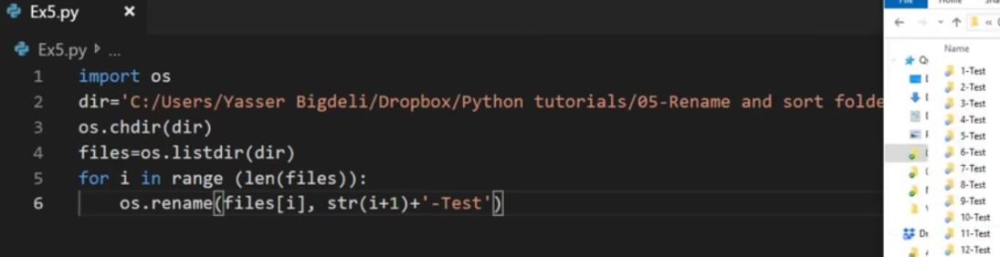

# 文件处理

## 获取文件MD5

```python
import os
import hashlib
def getFileMd5(FILENAME):
    if os.path.isfile(FILENAME):
        myhash = hashlib.md5()
        f = open(FILENAME,'rb')
        while True:
            b = f.read(8096)
            if not b:
                break
            myhash.update(b)
        f.close()
        return myhash.hexdigest()
```

## 跨文件全局变量

在一文件中定义全局变量

```python
# 在最外层定义全局变量
OLDNAME = []
# 自身函数中使用
    global OLDNAME    # 必须global才可以
    OLDNAME = []
```

其他文件中使用变量

```python
import RenameMultiFiles as RM

RM.RenameC.SubFloder(self, self.getFileNum())
RM.OLDNAME
```

## 遍历文件

```python
import os
os.chdir('i:\\Downloads\\renameTest')
for f in os.listdir():    #列出目录中所有文件及子目录名（不含完整目录）
    if not os.path.isdir(f):    #排除路径中的目录
        file_name, file_ext = os.path.splitext(f)    #拆分文件名与扩展名，file_name不带路径

os.path.isdir('') #判断目录是否存在，是否是目录（必须传入完整路径）
os.rmdir('') #删除目录（只能删除空目录）
os.mkdir('') #创建目录
file_path = os.listdir('') #获取路径中所有文件夹和文件
file_path.exists(): #判断文件或目录是否存在
```

```python
# 功能说明：复制指定文件夹里的所有文件名。
import os
import pyperclip
def CopyName():
    pp = input('输入复制路径：')
    os.chdir(pp)
    fName = ''
    for f in os.listdir():
      f_name, f_ext = os.path.splitext(f)
      if f_ext == ".pdf":
        fName += f_name+'\n'
    return fName
q='y'
while q=='y':
    pyperclip.copy(CopyName())
    print('文件名已复制到剪贴板')
```

### 遍历子文件夹、排除子目录

包含：排除子目录；截取子目录部分的路径

```python
import os
def SubFloder():
    pp = input('输入复制路径：')
    if pp=='exit':
        exit()
    IGNORE = ('.git','.idea')
    for root, dirs, files in os.walk(pp):    #os.walk()循环路径中的文件夹及文件
        #获取子目录根名，排除变数组中的目录，直接跳过循环该子目录目录循环
        if os.path.basename(root) in IGNORE: continue
        for f in files:    #循环获取的所有文件
            if f.endswith('.jpg') or f.endswith('JPG'): #endswith()过滤后缀名，扩展名前可不用加点
                fullPath = os.path.join(root, f)    #join()合并路径与文件
                #输出路径和文件名g:\renametest\testSubFolder\flower_1.JPG
                #截取除根目录外包含子目录路径，剔除pp传入的主路径：
                subPath = fullPath[len(pp):]
```

### 判断元素是否包含在数组中

```python
ignore = ('A', 'B', 'C')
if 'B' in ignore: continue
```

*实例：copyFilesName.py*

## yes no 确认窗口（QMessageBox)

```python
from PyQt5.QtWidgets import QMessageBox
yn = QMessageBox.question(self, "批量打印", "是否开始批量打印？")
if yn == 16384:
    self.goPrintDocx()
else:
    self.ui.lbl_output.setText('操作取消')
```

## 批量命名文件夹



*实例：renameMultiFilesSub.py*

## 修改mp3属性

cmd安装：pip3 install mutagen

```python
import mutagen
# from mutagen.id3 import ID3, APIC, TIT2, TPE1, TALB
from mutagen.easyid3 import EasyID3
import os

def EditMp3(pic):
    pp = input('输入路径：')
    if pp == 'exit':
        exit()
    ext = ['.mp3', '.MP3']
    count = 0
    if pic != '':
        picPath = picData
        with open(picPath, 'rb') as f:
            picData = f.read()
    else:
        picData = ''
    for e in ext:
        for root, dirs, files in os.walk(pp):
            for file in files:  # file文件名带后缀名
                if file.endswith(e):
                    oldNs = (os.path.join(root, file))
                    til = file.split('.')[0]
                    # info = {'picData': picData, 'title': til,
                    #         'artist': 'art', 'album': 'Oxford'}
                    print(oldNs)
                    try:
                        f = EasyID3(oldNs)                # 如果有ID信息直接获取
                    except mutagen.id3.ID3NoHeaderError:  # 如获取失败ID3没有信息时用add_tags添加标签
                        f = mutagen.File(oldNs, easy=True)# 获取文件
                        f.add_tags()
                    f["title"] = til
                    f.save()
                    count += 1
    print('共{}个文件'.format(count))
```

## 复制文件

使用 os.popen('copy source.txt taget.txt')

```python
os.popen('copy 来源文件目录\\file.ext 目标目录\\file.ext')
```

复制文件 (shutil)

（较保险，上面popen方法不成功的文件此方法可以复制成功）

```python
from shutil import copyfile
copyfile('源文件完整路径.ext', '目标文件完整路径.ext')
```

读写方式(供参考)

```python
import os#调出os库
#文件的复制
def mycopy(file1,file2):#定义一个mycopy函数用于复制文件
    f1=open(file1,"rb")#以读取模式打开file1
    f2=open(file2,"wb")#以清空写模式打开file2
    content = f1.readline()#将第一行数据赋给content
    while len(content)>0:#如果读取到的数据长度不为0则循环执行
        f2.write(content)#在file2里写下content
        content=f1.readline()#再读一行赋给content
    f1.close()#关闭file1
    f2.close()

mycopy(源完整路径文件名, 复制目的路径文件名)    #g:\renametest\copyFile.JPG
#========================================
#自定义目录复制函数
def copydd(dir1,dir2):#定义复制文件夹函数coppydd
    #获取被复制目录中的所有文件信息
    dlist = os.listdir(dir1)#以列表模式赋给dlist
    #创建新目录
    os.mkdir(dir2)#创建新文件夹dir2
    #遍历所有文件并执行文件复制
    for f in dlist:#让f在dlist中遍历
        #为遍历的文件添加目录路径
        file1 = os.path.join(dir1,f)#将f遍历出的文件名给file1（dir1+f即路径+文件名）
        file2 = os.path.join(dir2,f)#同样也给file2
        #判断是否是文件
        if os.path.isfile(file1):#判断是否为文件的方式为os库中的函数 os.path.isfile(文件名)
            mycopy(file1,file2)#调用自定义的mycopy函数复制文件  
        if os.path.isdir(file1):#如果是文件夹的话 那就调用自身(自身就是复制文件夹嘛)而处理的不是dir1，dir2，是file1，file2，因为此时文件夹同文件一起被f遍历，此处判断的就是f遍历出的是文件还是文件夹
            coppydd(file1,file2)    #调用自身 递归思想

#测试
copydd("./aa","./bb")#当前文件夹中的aa文件夹复制到bb文件夹 没有会自动创建
```

## 发送邮件

```python
import smtplib
from email.mime.text import MIMEText
from email.mime.multipart import MIMEMultipart # 一封邮件
def sendMail(msg):

sender = '发件人'
to_list = [
'收件人'
]
subject = '视频制作情况'
# 创建邮箱
em = MIMEMultipart
em['subject'] = subject
em['From'] = sender
em['To'] = 
```

## QComboBox下拉文本编辑框运用（路径历史记录）


读取ini记录

```python
IGFO=0    #历史条目数量
try:
    IGFO=int(conf.get('TAB3','ignoreFocount'))
except:
    try:
        conf.add_section('TAB3')
    except:
        print('TAB3 Error')
    conf.set('TAB3','ignoreFocount','0')    #初始设置记录数为0
    conf.add_section('ignoreFoList')
    IGFO=0
if IGFO > 0:
    for i in range(IGFO):
        pp = conf.get('ignoreFoList',str(i))
        self.ui.compFloderIgnore.addItem(pp)    #读取所有记录放入控件
    self.ui.compFloderIgnore.setCurrentIndex(int(conf.get('TAB3','ignoreFo-sel')))
```

控件回车事件函数（用于判断无重复并写入新记录）

```python
#将函数挂到控件事件：
self.ui.compFloderIgnore.currentIndexChanged.connect(self.compIgnoreFoChange)
#回车事件函数：
def compIgnoreFoChange(self):
    text=self.ui.compFloderIgnore.currentText()
    PL=int(conf.get('TAB3','ignoreFocount'))
    same=True
    if PL>0:
        for i in range(PL):
            his=conf.get('ignoreFoList',str(i))
            if text==his: same=False
        if same:
            conf.set('ignoreFoList',str(PL),text)
            conf.set('TAB3','ignoreFocount',str(PL+1))
    else:
        conf.set('TAB3','ignoreFocount','1')
        conf.set('ignoreFoList','0',text)
    conf.set('TAB3','ignoreFosel',str(self.ui.compFloderIgnore.currentIndex()))
    conf.write(open(setPath, 'w+', encoding="utf-8"))
```

## QCheckBox打钩选项记录设置

读取记录：

```python
try:
    folderNchk = int(conf.get('TAB1','folder_name'))
    self.ui.folderName_chk.setCheckState(folderNchk)
except:
    print('Not TAB1 folder_name set.')
```

选项事件函数：

```python
def boxChanged(self,state):
    try:
        conf.read_file(open(setPath,encoding='utf-8'))
        if state == 0:
            conf.set('TAB1', 'folder_name', '0')
            y = 'False'
        else:
            conf.set('TAB1', 'folder_name', '2')
            y = 'True'
        conf.write(open(setPath, 'w+', encoding="utf-8"))
    except:
        print('<UI记录写入错误>')
```

选项操作事件函数绑定

```python
self.ui.folderName_chk.stateChanged.connect(self.boxChanged)
```
