# 可视化编程 pyQt5 designer

https://blog.csdn.net/qq_37974048/article/details/104295967

## pyQT安装配置

* 安装pyQT5和QT Designer（安装失败可能需要到python.exe目录下更新pip）
    注意：MAC要在pip前加sudo，如果找不到pip则用pip3
  
  ```python
  pip -version    #查看pip版本
  python -m pip install --upgrage pip    #更新pip，python.exe目录下执行
  python.exe -m pip install --upgrade pip #经测试成功
  # 进入Scripts目录
  pip install pyqt5
  pip install pyqt5-tools
  # MAC安装前加sudo
  sudo pip install pyqt5-tools
  # 查看安装的版本
  pip freeze
  ```
  
  *想要英文版删除该目录：d:\Program Files (x86)\Microsoft Visual Studio\Shared\Python36_64\Lib\site-packages\qt5_applications\Qt\translations*

* 配置pyQT5打开designer.exe
  打开PyCharm，选择Settings -> Tools -> External Tools，点击左上角的加号
  
  c:\Users\Vicici\AppData\Local\Programs\Python\Python39\Lib\site-packages\qt5_applications\Qt\bin\designer.exe
  
  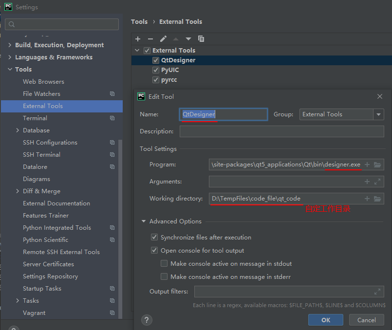
  *注意：所有需要转换的文件都需要放工作目录里*
  *工作目录Working directory:也可以填入变量：`$ProjectFileDir$`*
  
  （macOS）指定QtDesigner App路径
  
  `/Applications/Qt Designer.app`

* 添加PyUIC（.ui转换为.py工具）(注意：如果执行出错，尝试设置Program:目录c:\Users\Administrator\AppData\Local\Programs\Python\Python39\python.exe\)
  
  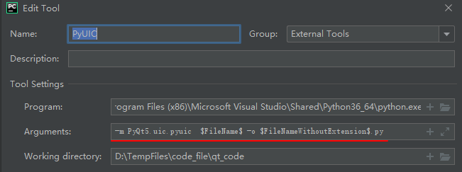
  
  （macOS）需指定Resources目录下的Python.app里的Python
  
  `/Library/Frameworks/Python.framework/Versions/3.9/Resources/Python.app/Contents/MacOS/Python`
  
  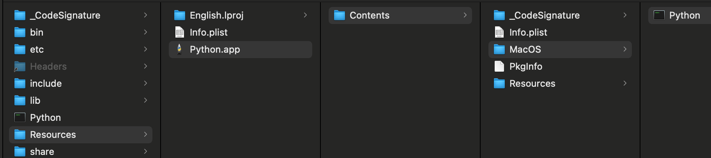
  
  Arguments则填入如下代码：(前面多加 -x 使生成的.py文件可以直接运行打开窗口，通常不用)
  `-m PyQt5.uic.pyuic -x $FileName$ -o $FileNameWithoutExtension$.py`
  
  `-m PyQt5.uic.pyuic $FileName$ -o $FileNameWithoutExtension$.py`
  
  控制台代码方式转换：(需要进到 pyuic5.exe 目录，.ui 文件和 .py 输出文件都要加完整路径)
  
  `d:\Program Files (x86)\Microsoft Visual Studio\Shared\Python36_64\Scripts>pyuic5 -x e:\testUI.ui -o e:\testUI.py`

* 添加pyrcc用于PyQt5的资源文件转码
  
  Arguments则填入如下代码：
  
  ` $FileName$ -o $FileNameWithoutExtension$_rc.py `
* QtDesigner中创建新的MainWindow
  注意要选择 MainWindow 项
  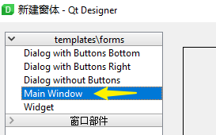
* 创建Win.py文件，添加如下代码运行调出界面

  实例: RenamerMain.py

  ```python
    from PyQt5.QtGui import QColor, QMouseEvent, QFont, QIcon, QPixmap
    from PyQt5.QtWidgets import QApplication, QMainWindow, QGraphicsDropShadowEffect, QToolTip,QMessageBox
    from tui import Ui_MainWindow    #这里导入通过PyUIC转换完的.py文件名，获取里面的类

    class MyWindow(QMainWindow):
        def __init__(self):
            super().__init__()
            # QMainWindow.__init__(self)
            self.ui = Ui_MainWindow()
            self.ui.setupUi(self)
            self.ui.title.setText('VicTools '+ver)
  # 程序图标======================================
    icon = QIcon()
    icon.addPixmap(QPixmap(":/B_exit1_h.png"))
    self.setWindowIcon(icon)
  # 退出窗口
    def exitWin(self):
        sys.exit(app.exec_())

    if __name__ == '__main__':
        app = QApplication(sys.argv)
        myWin = MyWindow()
        myWin.show()
        sys.exit(app.exec_())
  ```

也可以直接写在UI.py里面，◆import sys在 \_\_name\_\_ 里导入

```python
class MyWindow(QMainWindow, Ui_MainWindow):
    def __init__(self, parent=None):
        super(MyWindow, self).__init__(parent)
        self.setupUi(self)
    #定义槽函数，在testUI.py中调用
    def hello(self):
        self.lineEdit.setText("hello world!")

if __name__ == '__main__':
    import sys
    app = QApplication(sys.argv)
    myWin = MyWindow()
    myWin.show()
    sys.exit(app.exec_())
```

◆最上面添加导入 QApplication, QMainWindow

```python
from PyQt5.QtWidgets import QApplication, QMainWindow
```

## 设置字体

```python
from PyQt5.QtGui import QFont
from PyQt5.QtWidgets import QToolTip
# 设置字体和大小
QToolTip.setFont(QFont('Monaco',9))
```

## 按钮事件

### 不同文件下的按钮事件

1. UI.py 文件中添加按钮clicked连接事件调用事件槽函数

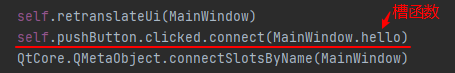

2. Win.py文件中添加按钮事件槽函数

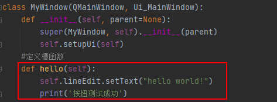

### 相同文件下的按钮事件

```python
    self.pushButton.clicked.connect(helloButtom)    #调用事件函数
    QtCore.QMetaObject.connectSlotsByName(MainWindow)    #在此上方添加按钮连接
#外面创建按钮事件函数
def helloButtom():
    print('Button Test.')
```

## Qt Designer 运用

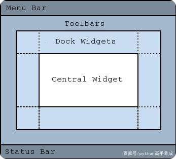

### 控件

#### 通用样式脚本

```python
border-radius:28px;
# QPushButton:hover必须在上面先写QPushButton{}
QPushButton{background-color:rgba(0,0,0,0);}
QPushButton:hover{icon:url(start_zi_h.png);}
```

#### Widget

主窗口下即是Widget，承载所有UI元素

#### Frame 框架

可以做形状背景承载UI控件，在Frame的样式中添加字体，放在该Frame上的Label等会使用该字体。

#### Label 标签文字

设置text右边的按钮可以打开类似Word的编辑字体界面，下方选项卡可以查看源码（Web代码）

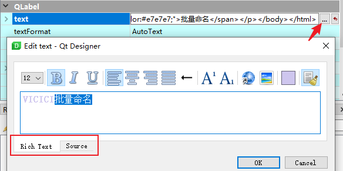

#### Button 按钮事件

```python
class MyWindow(QMainWindow):
   def __init__(self):
       # 按钮调用事件函数写在该函数里面
       self.ui.pushButton.clicked.connect(self.hello)    #注意hello函数后面不能加括号！

   #定义按钮事件槽函数
   def hello(self):
       sys.exit(app.exec_())    #关闭窗口
```

按钮鼠标悬浮事件，编辑按钮styleSheet

```python
QPushButton:hover{icon:url(B_exit_h.png);}

# 对于这种方法背景图片无法进行边框的自适应，
self.button.setStyleSheet("QPushButton{background-image: url(img/1.png)}")
# 可以使用下面的方法可以做到自适应边框
self.button.setStyleSheet("QPushButton{border-image: url(img/1.png)}")
```

#### TabWidget 标签控件

包含主控件体tabWidget，它的层级下面就是子标签控件

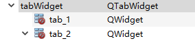

子标签名字在主标签体上修改，属性：currentTabText

```python
# 标签控件点击事件
self.ui.tabWidget.currentChanged['int'].connect(self.tabChangeBG)
## 事件槽函数，index收集点击返回的标签号
def tabChangeBG(self,index):
    if (index == 0):
       # do..
    else:
       # do..
```

#### LineEdit 单行文本

```python
# 回车事件，savePath为槽函数
self.ui.lineEdit.returnPressed.connect(self.savePath)
# 编辑过程中触发事件
self.ui.lineEdit.textChanged.connect(self.savePath)
## 输出文本内容
def savePath(self):
    print(self.ui.lineEdit.text())
```

#### TextEdit

```python
# 获取TextEdit文本内容
note = self.ui.textEdit.toPlainText()
```

#### CheckBox

激活三个状况：未勾选、勾选、中立

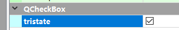

获取勾选状态返回值

```python
# 获取状态
self.ui.subDir_chk.checkState()
#>>勾选返回：2
#>>中立状态：1
#>>取消勾选：0
# 读取设置状态，赋予整数值
self.ui.subDir_chk.setCheckState(int(conf.get('TAB1','subdir')))
# 改变状态时槽函数调用
    self.ui.subDir_chk.stateChanged.connect(self.subDirChk)
# check写入ini槽函数
    def subDirChk(self, state):
        conf.readfp(open('setting.ini', encoding='utf-8'))
        if state == Qt.Unchecked:
            conf.set('TAB1', 'subdir', '0')
        else:
            conf.set('TAB1', 'subdir', '2')
        conf.write(open('setting.ini', 'r+', encoding="utf-8"))
```

#### QComboBox 下拉框

设置为可编辑,使其可以输入字符
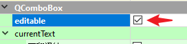
取消frame勾选使平面化
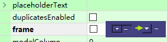

```python
# Qt样式设置
QComboBox{ min-height: 20px; min-width: 100px;background-color: rgb(67, 65, 127);}
# 控制操作
self.ui.separator_cb.addItems(['-','_','>','<','+','●','★','◎','※','→'])
self.ui.separator_cb.currentIndexChanged.connect(self.sepCB)    # 调用槽函数

self.ui.separator_cb.currentText()    # 获取当前选择的文字
self.ui.separator_cb.currentIndex()    # 获取当前选择编号，起始：0
def sepCB(self,i):    # ComboBox选择事件槽函数
    self.ui.separator_cb.setCurrentText(self.ui.separator_cb.itemText(i))
```

| 方法                               | 描述               |
| -------------------------------- | ---------------- |
| addItem()                        | 添加一个下拉选项         |
| addItems()                       | 从列表中添加下拉选项       |
| Clear()                          | 删除下拉选项集合中的所有选项   |
| count()                          | 返回下拉选项集合中的数目     |
| currentText()                    | 返回选中选项的文本        |
| itemText(i)                      | 获取索引为i的item的选项文本 |
| currentIndex()                   | 返回选中项的索引         |
| setItemText(int index,text)      | 改变序列号为index的文本   |
| editTextChanged.connect(def)     | 输出框发生修改时调用       |
| currentIndexChanged.connect(def) | 回车事件，挂载函数        |


```python
#读取记录添加列表内容
try:
    CL = int(conf.get('TAB3','plhiscount')) #获取成员数量
except:
    conf.set('TAB3','plhiscount','0')
    CL = 0
if CL > 0:
    for i in range(CL):
        pp = conf.get('compPL',str(i)) #保存成员在compPL段里
        if os.path.exists(pp):
            self.ui.comboBox_cL.addItem(pp)
    try:
        self.ui.comboBox_cL.setCurrentIndex(int(conf.get('TAB3','plsel'))) #获取选择的编号数记录
    except:
        conf.set('TAB3', 'plsel', '0')

#链接变更选项事件函数
self.ui.comboBox_cL.currentIndexChanged.connect(self.compLChange)
#选择内容事件函数
def compLChange(self):
    text=self.ui.comboBox_cL.currentText()
    if os.path.exists(text):
        PL=int(conf.get('TAB3','plhiscount'))
        same=True
        if PL>0:
            for i in range(PL):
                his=conf.get('compPL',str(i))
                if text==his: same=False
            if same:
                conf.set('compPL',str(PL),text)
                PL+=1
            conf.set('TAB3','plhiscount',str(PL))
        else:
            conf.set('TAB3','plhiscount','1')
            conf.set('compPL','0',text)
        conf.set('TAB3','plsel',str(self.ui.comboBox_cL.currentIndex()))
        conf.write(open(setPath, 'w+', encoding="utf-8"))
```

#### SpinBox 数字调制框

```python
self.ui.spinBox.value()    # 获取值
self.ui.spinBox.valueChanged.connect(self.numCount)    # 连接槽函数
```

#### ListWidget 列表

```python
AllPy = ['A','B']    # 可作为全局变量以便下面通过id号获取值
self.ui.listWidget.addItems(AllPy)    # 添加数组列表

self.ui.listWidget.clear()    # 清除全部内容

self.ui.listWidget.currentRow()    # 返回当前列表选择位置id，起始：0，未选：-1
AllPy[self.ui.listWidget.currentRow()]    # 获取列表值的方法

self.ui.listWidget.currentItem().text()    #获取所选条目文本
# 多项选择模式
from PyQt5 import QtWidgets
    #设置控件为多项选择类型
self.ui.listWidget.setSelectionMode(QtWidgets.QAbstractItemView.ExtendedSelection)
def test(self):    # 获取选择的列表文字信息
    X = []
    for i in range(len(self.ui.listWidget.selectedItems())):
        X.append(str(self.ui.listWidget.selectedItems()[i].text()))
    print(X)
```

ListWidget实例：
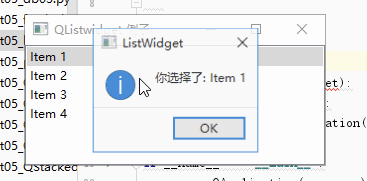

```python
import sys
from PyQt5.QtCore import *
from PyQt5.QtGui import *
from PyQt5.QtWidgets import *

class ListWidget(QListWidget):
    def clicked(self,item):
        QMessageBox.information(self, "ListWidget", "你选择了: "+item.text())# 显示出消息提示框

if __name__ == '__main__':
    app = QApplication(sys.argv)
    listWidget  = ListWidget()  #创建一个listWidget  实例
    listWidget.resize(300,120)  #定义尺寸大小
    listWidget.addItem("Item 1"); #添加item
    listWidget.addItem("Item 2");
    listWidget.addItem("Item 3");
    listWidget.addItem("Item 4");
    listWidget.setWindowTitle('QListwidget 例子') #设置标题
    listWidget.itemClicked.connect(listWidget.clicked) #绑定点击事件
    listWidget.show() 
    sys.exit(app.exec_())
```

#### ListView

```python
self.itemmmodel = QStringListModel(self)    #新建list数据存储
self.itemmmodel.setStringList(AllPy)        #为数据设定值
self.ui.listView.setModel(self.itemmmodel)  #将控件与数据存储绑定
```

#### ProgressBar 进度条

```python
//进度条框样式
QProgressBar { border: 0px solid grey; border-style:none; border-radius:9px; background-color:rgba(15,16,63,128); text-align: center;}
//进度条块样式
QProgressBar::chunk {  border-radius:9px;background-color: qlineargradient(spread:pad, x1:0, y1:0, x2:1, y2:0, stop:0 rgba(232, 62, 62, 255), stop:1 rgba(37, 95, 255, 255));}
```


#### [Easy progress reporting for Python](https://pypi.org/project/progress/)

```python
from progress.bar import Bar
bar = Bar('Processing', max=20)
for i in range(20):
    # Do some work
    bar.next()
bar.finish()

from progress.bar import Bar
with Bar('Processing', max=20) as bar:
    for i in range(20):
        # Do some work
        bar.next()
```


#### QMenuBar菜单 与 statusBar状态栏
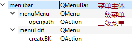

菜单命令对象为 QAction 用于绑定事件,使用triggered.connect(self.openBKpath)
```python
    def initUI(self):
        self.ui.actionaa.triggered.connect(self.openBKpath) #绑定事件函数

    def openBKpath(self):
        self.statusBar().show() #这里调用statusBar()需要加括号, 而且直接在self里无需self.ui
        self.statusBar().showMessage("信息: test")  #设置状态栏的文本信息
```

#### QMessageBox提示窗口

```python
from PyQt5.QtWidgets import QMessageBox
# 信息提示窗口
QMessageBox.information(self, "ListWidget", "你选择了: " + item.text())
        # 确认操作对话框事件
            yn = QMessageBox.question(self, "删除左部", "确认要删除关键字左部分命名？")
            if yn == 16384:    # 点Yes按钮返回该整数
                print('YES')
            else:
                print('NO')
```

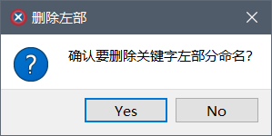

### 设置程序图标

```python
from PyQt5.QtGui import QIcon, QPixmap
# 程序图标=(png/ico格式都可以)=====================================
        icon = QIcon()
        icon.addPixmap(QPixmap(":/B_exit1_h.ico"))
        self.setWindowIcon(icon)
```

### 对打包资源需要通过 qrc 文件处理
此操作使图片按钮能在打包成exe后不会丢失.包括程序标题栏图标ico
> 注意: 主.py文件文件名来命名qrc和ico文件
> 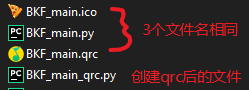

1. 创建qrc文件，写入以下内容：(包含全部图标资源)
   
   ```python
   <RCC>
     <qresource prefix="/">
       <file>B_exit1_h.ico</file>
       <file>B_exit1.png</file>
       <file>B_exit1_h.png</file>
       <file>B_exit_h.png</file>
     </qresource>
   </RCC>
   ```

2. 生成py文件，这个py文件把图片保存成二进制：(注意在Scripts目录中执行，文件用绝对路径，当图标资源修改时还需要再次执行一遍以更新二进制.py文件)
   
   ```shell
   pyrcc5 -o 绝对路径\test.py 绝对路径\images.qrc
   # Windows 完整写法：
   C:\Users\Administrator\AppData\Local\Programs\Python\Python39\Scripts\pyrcc5 -o D:\Works\Python_T\vicPy\vicCode\resource.py D:\Works\Python_T\vicPy\vicCode\resource.qrc
   pause
   
   # MACos 写法：
   pyrcc5 -o /Users/vic/Documents/Project/Git/pyCode_git/vicCode/resource.py /Users/vic/Documents/Project/Git/pyCode_git/vicCode/resource.qrc
   ```

3. 导入生成的带_qrc.py文件模块，设置图标
   
   ```python
   import test_qrc.py
   MainWindow.setWindowIcon(QIcon(':/favicon.ico'))
   ```

### 窗口透明背景界面、置顶设置

配置Frame作为界面的背景承载形状

* QtDesigner中拖入一个Frame右键菜单编辑样式，添加背景色，设置倒角半径
  
  ```python
  # Qt中设置Frame圆角半径，以便查看边角透明
  QFrame{
      border-radius:12px;
      background-color: rgb(83, 66, 115);
  }
  # py代码中加入如下，设置透明背景
  self.setAttribute(QtCore.Qt.WA_TranslucentBackground)
  
  # 置顶选项槽函数，需要分别同时设置去标题栏和背景透明，最后加上self.show()
  def topWin(self, state):
      if state == Qt.Checked:
          self.setWindowFlags(Qt.WindowStaysOnTopHint | Qt.FramelessWindowHint | Qt.WA_TranslucentBackground)
          else:    # Qt.Widget取消置顶
              self.setWindowFlags(Qt.Widget | Qt.FramelessWindowHint | Qt.WA_TranslucentBackground)
              self.show()
  ```
  
  #### 设置父控件样式不影响子控件

在类控件后添加控件的对象名#ObjectName

```python
QTextEdit#textEdit{
color: rgb(186, 186, 186);
background-color: rgb(31, 34, 44);
}
```

修改右键菜单样式无效，尝试继承其它控件：

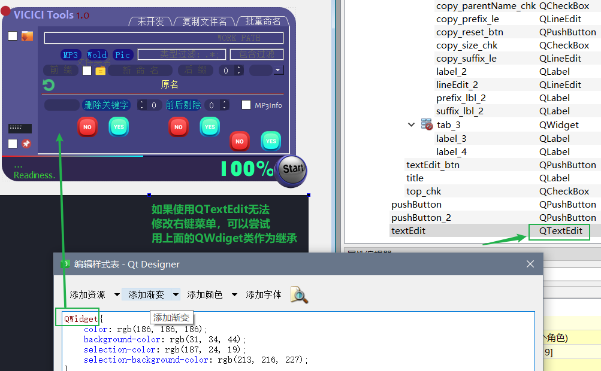

## 相关知识

### 在Qt Designer中的信号与槽

signal 信号（对象或控件发射出去的消息，这些消息需要代码来拦截，这些代码就是槽）

slot 槽（一个函数或方法）

### Qt中去除下方的定位栏Status Bar

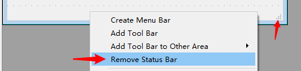

*如主界面上方阴影有剪切，在Qt制作时把窗口位置往中间移动，然后在Main.py代码中添加self.resize(xx,xx)，重置窗口大小大于阴影范围即可。*

### 设置控件窗口位置和大小

```python
self.setGeometry(300, 300, 400, 300)    #前两值是位置坐标，后两个宽高
```

### 控件的显示隐藏

```python
self.ui.frame_4.hide()
# 只有父控件显示，子控件才能显示
setVisible(bool)     # 设置控件是否可见
button.setVisible(True)    # True 可见
setHidden(bool)    # 设置控件是否隐藏，Ture 隐藏
show()   显示控件
hide()   隐藏控件
isHidden()      # 判定控件是否隐藏
isVisible()     # 判定控件是否显示
isVisibleTo(widget)    # 如果能随着widget控件的显示和隐藏, 而同步变化, 则返回True
# 注意：
isVisible()  # 代表控件最终的状态, 是否被我们所见(被其他控件遮挡也属于可见)
isHidden()   # 只有控件设置了隐藏才返回True,否则返回False.(比例父控件没有显示，子控件是不可能显示，返回的是False)
```

### 时间事件QBasiTimer

```python
class MyWindow(QMainWindow):
    def __init__(self):
        super().__init__()
        self.ui = Ui_MainWindow()
        self.ui.setupUi(self)
        self.timerl = QBasicTimer()   #声明时间控件
        self.pv = 0        # 声明递增变量
    def timeState(self):
        self.timerl.start(100, self)    # 开始计时，timerEvent里开始每100毫秒执行一次

    def timerEvent(self, e):    # 固定时间事件函数
        if self.pv >= 1:
            self.timerl.stop()    # 停止timerEvent继续执行
        else:
            self.pv+=0.01
            self.ui.progressBar.setStyleSheet("QFrame{    border-radius:80px;    background-color: qconicalgradient(cx:0.5, cy:0.5, angle:90, stop:"+str(self.pv)+" rgba(255, 255, 255, 0), stop:"+str(self.pv-0.005)+" rgb(250, 204, 41));}")
```

## 例：无边框拖放窗口

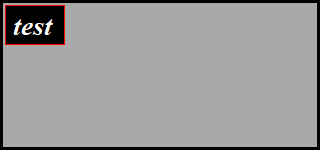

```python
from PyQt5.QtWidgets import (QMessageBox,QApplication, QWidget, QToolTip, QPushButton,
                             QDesktopWidget, QMainWindow, QAction, qApp, QToolBar, QVBoxLayout,
                             QComboBox,QLabel,QLineEdit,QGridLayout,QMenuBar,QMenu,QStatusBar,
                             QTextEdit,QDialog,QFrame,QProgressBar
                             )
from PyQt5 import QtCore, QtWidgets, QtGui
from PyQt5.QtCore import QCoreApplication, Qt,QBasicTimer, QPoint
import sys

class cssden(QMainWindow):
    def __init__(self):
        super().__init__()

        self.mwidget = QMainWindow(self)
        self.setWindowFlags(QtCore.Qt.FramelessWindowHint)   # Remove title bar

        #size
        self.setFixedSize(320, 150)    #如果出现右下角有个拖放大小的三角形
        self.center()

        #label
        self.lbl = QLabel(self)
        self.lbl.setText("test")
        self.lbl.setStyleSheet("background-color: rgb(0,0,0);"
                               "border: 1px solid red;"
                               "color: rgb(255,255,255);"
                               "font: bold italic 20pt 'Times New Roman';")
        self.lbl.setGeometry(5,5,60,40)
        self.oldPos = self.pos()
        self.show()

    #center
    def center(self):
        qr = self.frameGeometry()
        cp = QDesktopWidget().availableGeometry().center()
        qr.moveCenter(cp)
        self.move(qr.topLeft())

    def mousePressEvent(self, event):
        self.oldPos = event.globalPos()
        self.setCursor(QCursor(Qt.OpenHandCursor))  # 更改鼠标图标

    def mouseMoveEvent(self, event):
        delta = QPoint(event.globalPos() - self.oldPos)
        #print(delta)
        self.move(self.x() + delta.x(), self.y() + delta.y())
        self.oldPos = event.globalPos()

    def mouseReleaseEvent(self, e):
        self.__dragWin = False
        self.setCursor(QCursor(Qt.ArrowCursor))

app = QApplication(sys.argv)
app.setStyleSheet("QMainWindow{background-color: darkgray;border: 3px solid black}")

ex = cssden()
sys.exit(app.exec_())
```

```python
#==========窗口拖动鼠标事件==============================================
    def mouseMoveEvent(self, e: QMouseEvent):  # 重写移动事件
        if self._tracking:
            self._endPos = e.pos() - self._startPos
            self.move(self.pos() + self._endPos)

    def mousePressEvent(self, e: QMouseEvent):
        if e.button() == QtCore.Qt.LeftButton:
            self._startPos = QPoint(e.x(), e.y())
            self._tracking = True

    def mouseReleaseEvent(self, e: QMouseEvent):
        if e.button() == QtCore.Qt.LeftButton:
            self._tracking = False
            self._startPos = None
            self._endPos = None
```

## 问题笔记

### toolTip控件悬浮汽包显示

注意：控件必须设置color为可见，避免全透明而导致提示气泡看不到文字，或在Qt中设置如下提示文字格式：

<html><head/><body><p><span style=" color:#594275;">搜索子目录</span></p></body></html>

### ui控件添加阴影相互剪切问题

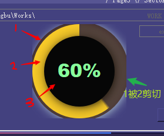

如图所示，1号Frame被2号剪切，解决办法是对2号也单独添加阴影，如不想2号有阴影可增加阴影透明度。

```python
self.shadow2 = QGraphicsDropShadowEffect(self)
self.shadow2.setBlurRadius(36)    # 羽化半径必须大于1号羽化半径，否则还会剪切
self.shadow2.setColor(QColor(0, 0, 0, 0))    # 透明度0
self.ui.progressBar_2.setGraphicsEffect(self.shadow2)
```

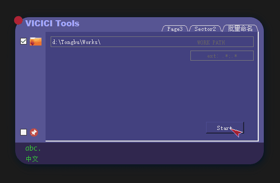

```python
# Designer:进度环样式
QFrame{    border-radius:80px;    background-color: qconicalgradient(cx:0.5, cy:0.5, angle:90, stop:0.002 rgba(22, 22, 22, 100), stop:0.001 rgba(255, 180, 11,222));}
```

py文件中设置进度

```python
# 控件添加阴影
        self.shadow1 = QGraphicsDropShadowEffect(self)
        self.shadow1.setBlurRadius(38)
        self.shadow1.setXOffset(2)
        self.shadow1.setYOffset(2)
        self.shadow1.setColor(QColor(255, 235, 190, 220))
        self.ui.frame_4.setGraphicsEffect(self.shadow1)

# 放在循环里面
val = 进程数/总数    # 计算当前进度值
self.ui.percent_lbl_2.setText(str(int(val*100))+'%')    # 百分比计算
self.ui.complete_lbl.setText(str(self.PPf))
# 圆形进度条两个渐变颜色位置计算，前面再加上0.005避免进度走的最后有缝隙
self.ui.progressBar_3.setStyleSheet("QFrame{    border-radius:80px;    background-color: qconicalgradient(cx:0.5, cy:0.5, angle:270, stop:" + str(val+0.005) + " rgba(22, 22, 22, 100), stop:" + str(val - 0.02) + " rgba(255, 180, 11,222));}")
```
