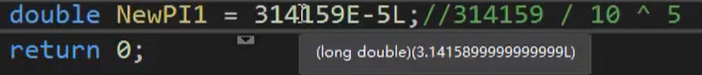
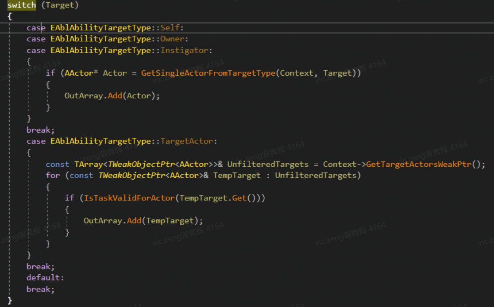

# C语言

## 引用

```c
#include ".h" //引用头文件
#include <stdio.h> //引用系统文件
```

```c
#pragma once //添加此行使只包含一次，避免被多个文件包含出错
void main(char* str){
    return str;
}
```

## 程序在内存的分布情况

### stack（栈）

变量过了作用域就会被释放

```c
int c = 0; //定义变量
```

### heap（堆）

放在堆里的变量需要释放

```c
int *aa = (int*)malloc(sizeof(int));	//通过malloc分配到堆
free(aa);	//释放堆
```

### static（静态）

DATA段：全局初始化区，储存初始化变量和静态变量

BSS段：全局未初始化的区域，程序运行结束会自动释放

```c
static int a = 0;	//静态区分DATA段和BSS段
```

## 符号优先级

```c
//后缀，按顺序
() [] -> . ++ --
```


## 变量类型

### 整数

```c
//整数常量
int D = 0001;//二进制
int A = 67;  //十进制
int B = 067; //八进制，前面加一个零
int C = 0x67;//十六进制，前面加 0x
//无符号
unsigned int TestA = 100u;	//无强转消耗
long int TestB = 100L;	//无强转消耗
unsigned long int TestC = 100uL;  //无强转消耗
强转
unsigned long int TestC = (unsigned long int)100;
```

```c++
int U = 100;	//范围：-21474836488 ~ 2147483648
printf("%i \n", sizeof(int));	//查看整数占用大小，4字节
long L = 100;	//取值范围与int一样
unsigned long UL = 100;	//取值范围舍去负值，正数值在int上加一倍 0 ~ 4294967295
long long LL = 100;	//更大取值范围8字节：-9223372036854775808 ~ 9223372036854775808
//打印long long类型
printf("%lld \n", LL);
short ss = 100;	//更小取值范围：-32768 ~ 32768	2字节
```

### 浮点类型

```c++
float ff = 1.001f;	//[-3.4E38, 3.4E38] 3.4+38个零
float dd = (float)1.001; //C风格强转
//高精度浮点
double dd = 1.0;	//[-1.79769313486232e308, 1.79769313486232e308]
//指数：E e
float PI = .314159e001f;  //3.1415926 x 10^1 （10的1次方）小数点向右移动一位
float PI = .314159e-1f;  //小数点向左移动一位
double PI = 314159e-5L;  //3.1415899999999L  长整形
```



### 字符

```c
char c = 'd';	//char是字节码，-128 ~ 127 占1字节 8位
unsigned char cc = 'd';	//0 ~ 255	可定义RGB颜色值
//在开头加入 uint8，char也可以初始化为整数的写法
typedef unsigned char uint8;
unsigned char ww = 0;	//值范围 0 ~ 255
//宽字符，占2字节 16位
wchar_t cc = 'd';
unsigned short wchar_t ccc = 'd';
printf("%s", "退格键 CCC\b");  //退格符，会删除一个字符，可用于去掉回车等
printf("%s", "警示声 \a");		//会发出系统警告声
printf("%s", "换页符 \f");
printf("%s", "回车 \r");		// \n\r 连着用
printf("%s", "水平制表符 \t"); // Tab
printf("%s", "垂直制表符 \v");
printf("%o", "八进制 \045");
printf("%x", "十六进制 \x45");
```

### 文字常量区

不修改，可作为全局ID

```c
const char kk[] = "hello";
```

### 程序代码区

```c
for (int i=0; i<10; i++)
{
    printf("%d", i);
}
```


### 修饰常量const

```c
//const常量不可修改
const int w = 0;
```

### typedef常量

```c
typedef int _1;
_1 o = 0;
```

### auto关键字

只能在函数内使用，普通局部栈变量，可用在循环上自动推导类型

```c
auto int a0 = 0;
```

### register关键字

寄存器，可用于循环内使用提高性能，即用即释放内存

```c
register int a1 = 0;
int *p = &a1;	// &取内存地址，在此取不到a1的值

for (;;)
{
    register int a1 = 0;
}
```

### static关键字

可做全局变量

```c
//指针相当于一个标签，指向了这个地址
int *GetInt() {
	static int o = 0;//储存在静态区，函数结束后会一直存在，在后续继续使用
	return &o;	// &取地址
}

	printf("%d\n", *GetInt());//调用时加*号解指针
	*GetInt() += 1;		//可以修改值
	printf("%d\n", *GetInt());
```

### 左移右移操作符

```c
//移动二进制数
int A = 1;	//0001 值为0时移动无效果
A = A << 1;	//0010 值向左移动一位，值为：2
A = A << 1;	//0100 值向左再  移动一位，值为：4
int B = 3;
B = B / 2;	//等于向右移动一位
B = B >> 1;	//向下取整（优于上面）也可以写成：B >>= 1;
```


## 与运算

所有结果为1，结果为1

```c
int A = 0x3;	//3 十六进制
int A = 0011;	//3 二进制
A &= 0x3;	//0010 & 0011 = 0010 每一位与每一位进行比较
printf("与运算：%i\n", A);	//3
```

## 或运算

其中一个结果为1，结果为1

```c
int B = 0011;
B |= 0x3;
```

## 位运算

```c
int A = 10;
int B = 11;
&A	// &（取地址）
A & B	// & 表示（与运算符）所有为真，结果才为真

//作用域
{
    ...
}
```

### 利用位运算

```c
//求奇偶，使用高效二进制运算
for (int i = 0; i < 10; i++)
{
    if (i & 0x1) //二进制计算 0011 & 0001 = 0001
    {
        printf("奇数：%d\r\n", i);
    }
    else{	//1110 & 0001 = 0000
        printf("偶数：%d\r\n", i);
    }
}
```


## 宏替换运用

```c
//宏定义============================
#define num(a,b) a+b
//宏调用------------------------
int a = num(1,2);

//高级宏定义============================
#define num1(FunName,a,b)\
	//用两个井号##合并名字，变量a,b必须一样（最后一行不用加\）
int FunName##_Hello(int a,int b)\
{\
	return a + b;\
}
num1(III, l, m);
//调用------------------------------
int a = III_Hello(8, 6);
printf("\n %i", a);

//运用结构体
#define num2(FunName,a)\
struct CCC##_FunName \
{\
	protected: \	#成员变量
	int a; \
};
```

### 宏替换运用做判断

例1：

```c
//创建宏：判断？前判断是否成立，true成立 : false不成立
#define BOL(A,F,B,...) (A F B) == 1 ?"true":"false"

//宏运用
	int A = 0;
	int B = 1;
	printf("%s\n", BOL(A, != , B));
```

例2：

```c
//创建宏：将
#define BOL(Code,...) (Code) == 1 ?"true":"false"

	int A = 0;
	int B = 1;
	printf("%s\n", BOL2(A != B));	//直接写运算，无需写逗号
```

## 条件语句（if switch case）

```c
if (0){	//0,1 为bool
    printf("true \n")
}else{
    printf("false \n")
}

int i = 0;
switch (i){
    case 0:
        printf("0 \n");
        break;
    case 1:
        printf("1 \n");
        break;
    default:	# 没有合适钥匙时执行该默认项
        break;
}
```



## 循环

### continue;

跳过：循环过程跳过某条件，会继续执行剩余循环。

### break;

跳出：终止所有循环。

### while

```c
while(0){	//当值为False时结束循环
    printf("Hello\n")
}
```

### for

```c
for (int i=0; i<100; i++){
    ...
}
```

### goto

跳到某点（不建议使用，容易混乱）

```c
goto F;
return 0;	//此行被跳过
F:
printf('目标')
```


----

## 十进制转二进制函数示例

```c
//十进制转二进制（函数放在main()外面）
long long binary_to_decimal(int v)
{
	long long binary = 0;
	int remainder = 0;	//余数
	int save_i = 1;		//储存,初始值为 1
	while (v != 0) {
		remainder = v % 2;	//值是 0 或 1 ；被整除余数为0
		v >>= 1;	//右移一位（相当于除2）
		binary += (remainder * save_i);
		save_i *= (0x5 << 1);	//10
	}
	return binary;
}

printf("十进制转二进制：%lld \n", binary_to_decimal(9));	// 1001
```


## 类型转换

### 字符转整数

```c
char *argc = "1";
int i = atoi(argc);
```

### 强制转换

```c++
int *aa = (int)Int;

int *aa = (int*)malloc(sizeof(int));	//通过malloc分配到堆
free(aa);	//释放堆
```


## 运算符

```c
%	//取模，整除后的余数
++	//+1, ++i, i++
--	//-1
```


## ●全局变量

变量只能被定义一次，可被多次声明。

```c++
//该全局变量定义在.c文件里
int aaa = 0;
static int a = 0;	//静态变量需要通过类获取，不可用extern声明

//调用前在只需要调用的c文件的头文件中声明
extern int aaa;
```


## 数组

```c
// 定义数组
int a[] = {1,2,3,4,5};
```


## VS常用操作

* 光标在引用函数位置，快速跳转到函数定义 `Alt+G`
* 查找定义的函数所有引用 `Shift+Alt+F`


## 程序调试

### 转到汇编

在函数上右键菜单：Go To Disassembly（Ctrl + K,G）

### 进入函数

（F11）
