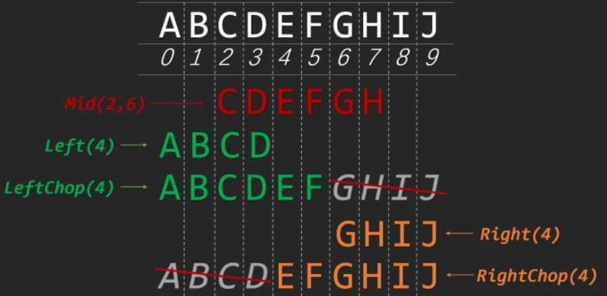

# 1>变量类型
## 1-1>文本类型运用
### 1-1-1>实例:修改TextRender组件文字


```cpp
float D_M;
float D_R;
FString BtName = "name";

TArray<UActorComponent*> comps; //定义组件数组
MyActor->GetComponents(comps);  //获取Actor中的所有组件放入该数组中
UTextRenderComponent* texComp = Cast<UTextRenderComponent>(comps[1]);   //获取第二个组件即文字渲染组件
FString MRV = FString::Printf(TEXT("R: %g\nM: %.g\n%s"), D_R, D_M, *BtName);    //获取数值类型放入字符串变量
texComp->SetText(FText::FromString(MRV));
texComp->bHiddenInGame = true;
```
### 1-1-2> 分割字符串
根據指定字符分割字符串，分割的字符串量存入變量，不需要存儲的部分用 nullptr 補全

```cpp
//左右切割
FString FileName = "name.ext";
FString Left;
FileName.Split(".", &Left, nullptr);    //提取左边的字符,右边不获取用nullptr替
matFile->SetText(FText::FromString(*Left));

//根据指定字符切割字符串
TArray < FString > StringArray;
MyString.ParseIntoArray(StringArray, TEXT(","), false);
```
### 1-1-3> 字符串分片

将字符串按下标拆解为我们需要的字符串称之为***分片(Silce)，\***常用分片函数包含如下几个***：\***

- **FString::Mid**[5]
- **FString::Left**[6]
- **FString::LeftChop**[7]
- **FString::Right**[8]
- **FString::RightChop**[9]

5个函数都接受一个 **Count** 参数，表明要操作的字符串长度，这个长度如果超过字符串本身长度，就会被默认处理为字符串本身长度。其中Left,LeftChop和Right,RightChop可以看做Mid的一种简便写法，具体样例如下：

```cpp
// 字符串分片
FString Str = FString(TEXT("ABCDEFGHIJ"));
// 字符串长度
int32 StringLength = Str.Len();
// 通过下标获取字符
TCHAR Char = Str[0]; // A
// 从左往右截取指定长度的字符串
FString LeftStr = Str.Left(4); // ABCD
// 去除字符串末尾指定的长度字符串
FString LeftChopStr = Str.LeftChop(4); // ABCDEF
// 从右往左截取指定长度的字符串
FString RightStr = Str.Right(4); // GHIJ
// 去除字符串开头指定长度的字符串
FString RightChopStr = Str.RightChop(4); // EFGHIJ
// 从字符串指定位置获取指定长度的字符串
FString MidStr = Str.Mid(2,6);// CDEFGH


//例：獲取最後一個字符，判斷最後一個字符是"/"就去除
    FString path = "abc/def/"
    int le = path.Len();
    FString en = path.Right(1);
    if (en == "/")
        path = path.LeftChop(1);
```



```cpp
// 按指定分割符号进行拆分
FString SplitStr = FString(TEXT("ABC,DEF,GHI,"));
// 保存拆分后的字符串数组
TArray<FString> SplitedStr;
// 切割字符串,最后一个参数 InCullEmtpy 表示是否剔除空字符串
SplitStr.ParseIntoArray(SplitedStr, TEXT(","), false); // ABC DEF GHI Empty
SplitStr.ParseIntoArray(SplitedStr, TEXT(","), true); // ABC DEF GHI
```

```cpp
//查找路径是否是反斜杠，如果是切割并替换成正斜杠
if (pp.Find(TEXT("\\"), ESearchCase::IgnoreCase, ESearchDir::FromStart, INDEX_NONE) != INDEX_NONE)
{
    FString newP = "";
    TArray<FString> SArr;
    pp.ParseIntoArray(SArr, TEXT("\\"), false);
    for (const FString sss : SArr)
    {
        newP += sss + "/";
    }
    pp = newP;
}
```

### 1-1-4> 字符串编辑方法

```cpp
// 逆序
FString MyString = FString(TEXT("123456"));
// 逆序并返回字符串副本
FString ReverseString = MyString.Reverse(); // 654321
// 直接逆序原始字符串
MyString.ReverseString();

// 字符串替换
FString SrcString = FString(TEXT("Apple Orange"));
// 返回替换后的字符串副本
FString ReplaceString = SrcString.Replace(TEXT("Apple"), TEXT("Coffee")); // Coffe Orange
// 直接替换原始字符串
SrcString.ReplaceInline(TEXT("Orange"), TEXT("Banana")); // Apple Banana

// 去除无用字符串
FString QuoteAndSpaceString = FString(TEXT("    "StringWithEmpty"  "));
// 返回剔除行首行末空白字符的字符串副本
FString WithoutSpace = QuoteAndSpaceString.TrimStartAndEnd(); // "StringWithEmpty"
// 直接剔除原始字符串的行首行末的空白字符
QuoteAndSpaceString.TrimStartAndEndInline(); // "StringWithEmpty"
// 返回剔除行首行末引号的字符串副本
FString WithoutQuotesString = QuoteAndSpaceString.TrimQuotes(); //StringWithEmpty
// 清空字符串
QuoteAndSpaceString.Empty();
```

另一分割成數組方法參看上面：讀取多行文檔

### 1-1-5> 格式化字符串

```cpp
TMap<FString, FStringFormatArg> FormatMap;
FormatMap.Add(TEXT("key1"), FStringFormatArg(1));
FormatMap.Add(TEXT("key2"), FStringFormatArg(2));
FString Text1 = FString::Format(TEXT("Text{key1}{key2}{key1}"), FormatMap);
```

## 1-2> 各类型转换
### 1-2-1> Lex -> FString (LexToString)

```cpp
FString aa = LexToString(*phComBox->GetSelectedItem());
```

### 1-2-2> int <-> string
```cpp
//★C++11  （推荐，如果支持的话）
#include <string>
std::string s = std::to_string(42);

//★int -> string
FString::FromInt(27)

//★string -> int
//这里调用控件传入的SEditableTextBox文本变量，注意：Atoi调用变量前面要加*指针（SlateMain.cpp）
MatObj->MaxTextureSize = FCString::Atoi(*SizeValue->GetText().ToString());
//★string -> int std方法
FString a= "2";
std::stoi(*a);
```

### 1-2-3> string -> FText
可编辑文本控件需要的格式
```cpp
SEditableTextBox->SetText(FText::FromString(*Item));

//中文需用TEXT()封装
FText::FromString(TEXT("中文"))
```
### 1-2-4> float -> int
```cpp

int (FF);
```


## 1-3> 基本数据类型


## 1-4> 字符串类型
原文链接：https://blog.csdn.net/m0_51819222/article/details/119783477
### 1-4-1> TCHAR：UE4通过对char和wchar_t的封装

TCHAR就是UE4通过对char和wchar_t的封装
char ANSI编码
wchar_t 宽字符的Unicode编码
使用 TEXT() 宏包裹作为字面值
```cpp
TCHAR* TCharString = TEXT("Hello, World!");
 
	// 引擎字符串(TCHAR*) -> ANSI字符串(char*)
	char* CharString = TCHAR_TO_ANSI(TCharString);
 
	// 引擎字符串(TCHAR*) -> std::string
	std::string str = TCHAR_TO_UTF8(TCharString);
 
	// 引擎字符串(TCHAR*) -> wchar_t*
	wchar_t* WCharString = TCHAR_TO_WCHAR(TCharString);
 
	// ANSI字符串(char*) -> 引擎字符串(TCHAR*)
	TCHAR* TCharString1 = ANSI_TO_TCHAR(CharString);
 
	// wchar_t* -> 引擎字符串(TCHAR*)
	TCHAR* TCharString2 = UTF8_TO_TCHAR(WCharString);
	TCHAR* TCharString3 = WCHAR_TO_TCHAR(WCharString);
```
### 1-4-2> 1.FString
与 FName 和 FText 不同，FString 可以与搜索、修改并且与其他字符串比较。不过，这些操作会导致 FString 的开销比不可变字符串类更大。这是因为 FString 对象保存自己的字符数组，而 FName 和 FText 对象保存共享字符数组的指针，并且可以完全根据索引值建立相等性。
类似 std::string 。使用宏 TEXT() 可以新建一个。
```cpp
//初始化
FString test = TEXT("hello world");
```
### 1-4-3> 2.FText
FText 类是文本本地化的主要类。如果想提供多语言支持，面向用户的所有文本都应使用此类。
和 FString 类似，使用宏 NSLOCTEXT() 可以新建一个。
```cpp
//参数分别是默认语言的: 命名空间，键，值。
FText test = NSLOCTEXT("Notification","PickMessage","you pick something.")。
```
### 1-4-4> 3.FNames
常用作标识符等不变的字符串（如：资源路径/资源文件类型/骨骼名称/表格行名等）
比较字符串操作非常快
即使多个相同的字符串，也只在内存存储一份副本，避免了冗余的内存分配操作
不区分大小写

```cpp
//初始化
FName test=FName(TEXT("hello world"));
```
### 返回字符串长度.Len()
```cpp
String.Len()
```

## 1-5> 主要容器
### 1-5-1> 1.TArray
虚幻引擎4（UE4）中最简单的容器类是 TArray。TArray 负责同类型对象（称为"元素"）序列的所有权和组织。由于 TArray 是一个序列，其元素的排序定义明确，其函数用于确定性地操纵此类对象及其顺序。
其所有元素均完全为相同类型，不能存储不同类型的元素。
TArray 被销毁时其中的元素也将被销毁，TArray的复制是值复制。
是对 std::vector 的增强。
### 1-5-2> 2.TMap
继 TArray 之后，虚幻引擎4（UE4）中最常用的容器是 TMap。TMap 与 TSet 类似，它们的结构均基于对键进行散列运算。但与 TSet 不同的是，此容器将数据存储为键值对（TPair<KeyType, ValueType>），只将键用于存储和获取。
和 TArray 一样，TMap 也是同质容器，就是说它所有元素的类型都应完全相同。TMap 也是值类型，支持通常的复制、赋值和析构函数运算，以及它的元素的强所有权。在映射被销毁时，它的元素都会被销毁。键和值也必须为值类型。
映射有两种类型：TMap 和 TMultiMap。两者之间的不同点是，TMap 中的键是唯一的，而TMultiMap 可存储多个相同的键。在 TMap 中添加新的键值时，若所用的键与原有的对相同，新对将替换原有的对。在 TMultiMap 中，容器可以同时存储新对和原有的对。
是对 std::map/ std::multimap 的增强。
### 1-5-3> 3.TSet
TSet 类似于 TMap 和 TMultiMap，但有一个重要区别：TSet 是通过对元素求值的可覆盖函数，使用数据值本身作为键，而不是将数据值与独立的键相关联。TSet 可以非常快速地添加、查找和删除元素（恒定时间）。默认情况下，TSet 不支持重复的键，但使用模板参数可激活此行为。
总之是一种快速容器类，用于在排序不重要的情况下存储唯一元素。
是对 std::set 的增强。
## 1-6> 整数
### 1-6-1> 获取整数位数log10(int)
```cpp
log10(777); //返回: 3
```

---

# 2> 编辑器中相关操作

## 2-1> 场景编辑相关操作
### 2-1-1> 遍历场景中的Actor
```cpp
TArray<AActor*> ActorsToFind;
if(UWorld* World = GetWorld())
{ // GetAllActorsOfClass(World, 类型的::StaticClass(), 定义的存放数组);
    UGameplayStatics::GetAllActorsOfClass(GetWorld(), AFireEffect::StaticClass(), ActorsToFind);
}
for (AActor* inActor: ActorsToFind){
    ...
}
```
实例: 选中场景中所有名字包含指定字符("STBox")的静态网格物体
```cpp
USelection* SelectionSet = GEditor->GetSelectedActors();

UWorld* World = GEditor->GetEditorWorldContext().World();

TArray<AActor*> ActorsToFind;
if(World)
{   //获取场景所有指定类型的对象,类型后需要获取静态类::StaticClass()  类型有AActor等
    UGameplayStatics::GetAllActorsOfClass(World, AStaticMeshActor::StaticClass(), ActorsToFind);
}
SelectionSet->DeselectAll();
for (AActor* inActor: ActorsToFind){
    //未找到返回:-1 , 找到返回字符串所在位置ID,起始:0 (不区分大小写)
    // auto aaa = inActor->GetName().Find("STBox");
    // GEngine->AddOnScreenDebugMessage(-1, 43.f, FColor::Black, FString::Printf(TEXT("< %i"),aaa));
    if(inActor->GetName().Find("STBox")>-1)
        SelectionSet->Select(inActor);
}
```

### 2-1-2> 获取场景中选中的物体,并遍历
```cpp
USelection* SelectionSet = GEditor->GetSelectedActors();  //先从编辑器获取选择的Actor
if (SelectionSet->Num() > 1)
{
    TArray<AActor*> SelectedActors;  //定义AActor类型数组存放获取的选择物体
    SelectedActors.Reserve(SelectionSet->Num());  //储备所有选择的物体
    SelectionSet->GetSelectedObjects(SelectedActors); //将储备的物体提取到选择组
    AActor* ppp = SelectedActors[SelectedActors.Num() - 1]; //获取最后一个选择的物体
    for (AActor* Actor : SelectedActors)
    {
        if (Actor->GetFName() != ppp->GetFName())
        {
            Actor->SetActorScale3D(ppp->GetActorScale3D()); //设置物体缩放值
            Actor->SetPivotOffset(FVector(0,0,0));      //设置物体轴心偏移
            GEngine->AddOnScreenDebugMessage(-1, 3.f, FColor::Green, Actor->GetFName().ToString());
        }
    }
}
```

### 2-1-3> 根据名字获取场景物体(FindObject)
使用**FindObject**来通过名称获取对象
```cpp
AActor* obj = FindObject<AActor>(ANY_PACKAGE,TEXT("test_Box"));  //第一个参数传入当前场景宏,第二传入查找对象名称
FString sn = "No Obj";
if (obj) sn = obj->GetActorLocation().ToString();
```
示例2:
函数参数outer应该传入那个actor所在的level。如果不清楚属于哪个level，可以遍历world中的所有level或者传入宏ANY_PACKAGE。
```cpp
for (ULevel *level : WorldContextObject->GetWorld()->GetLevels())
{
    AActor *actor = FindObject<AActor>(level, *actorName);
    if (actor != nullptr)
    return actor;
}
```

### 2-1-4> 在场景中放置AStaticMeshActor蓝图
Cast<>类问题()
>如何获取蓝图中所有不同类型的组件?
>使用GetClass获取各组件类型或使用GetName获取组件名称

```cpp
FReply SSlateMain::TTTButtom()
{
	FString boxname;
	UWorld* World = GEditor->GetEditorWorldContext().World();
	AStaticMeshActor* MyActor = World->SpawnActor<AStaticMeshActor>(bpZMaitrexClass, FVector(0,200,0), FRotator::ZeroRotator);
	boxname = "test_Box";
	MyActor->SetActorLabel(boxname);
	MyActor->SetFolderPath("STBox_F");
	TArray<UActorComponent*> comps;
	MyActor->GetComponents(comps);
	int cot = 0;
	GEngine->AddOnScreenDebugMessage(-1, 43.f, FColor::Black, FString::Printf(TEXT("<")));
	for(auto* comp:comps)
	{   //打印所有的组件编号,组件类型,组件名
		const auto* CCC = comp->GetClass(); //获取组件类型
		auto* Cmp = Cast<UChildActorComponent>(comp);
		GEngine->AddOnScreenDebugMessage(-1, 43.f, FColor::Black, FString::Printf(TEXT("%i : %s : %s"), cot, *CCC->GetName(), *comp->GetName()));
		cot += 1;
	}
	
	return FReply::Handled();
}
```
### 2-1-5> Component组件类及获取编辑
注意: 定义控件类型 UTextRenderComponent* 后面要加*号
```cpp
#include "Components/TextRenderComponent.h" //<UTextRenderComponent>需要包含该头文件

TArray<UActorComponent*> comps;     //定义组件类数组
MyActor->GetComponents(comps);      //获取创建的蓝图所有组件放入数组
UTextRenderComponent* textComp = Cast<UTextRenderComponent>(comps[1]);  //获取1号位置的TextRender组件

//上面的组件类型可以使用auto来定义所有类型,也要注意加*号,如下
auto* textComp = Cast<UTextRenderComponent>(comps[1]);

textComp->SetText(FText::FromString(boxname));  //设置Text参数修改文字
textComp->bHiddenInGame = true;     //设置游戏运行状态不可见
```
可以通过组件名来获取需要的 组件->GetName()
获取方法,取自SceneTools插件的SlateMain.cpp,批量创建蓝图对象并设置其组件参数
```cpp
FReply SSlateMain::CreateBoxs()
{
	FString boxname;
    	UWorld* World = GEditor->GetEditorWorldContext().World();
        for (int i = 1; i <= matrixNum->GetValue(); i++)
        {
        	AStaticMeshActor* MyActor = World->SpawnActor<AStaticMeshActor>(bpZMaitrexClass, FVector(0,i*200,0), FRotator::ZeroRotator);
        	boxname = "ST_Box" + FString::FromInt(i);
        	MyActor->SetActorLabel(boxname);
        	MyActor->SetFolderPath("STBox_F");
        	TArray<UActorComponent*> comps; //
        	MyActor->GetComponents(comps);
        	auto* textComp = Cast<UTextRenderComponent>(comps[comps.Num()-1]);
        	auto* boxmesh = Cast<UStaticMeshComponent>(comps[1]);
        	boxmesh->SetRelativeScale3D(FVector(2,3,1)); //设置物体组件物体缩放值(与设置物体缩放不同)
        	FString TTT = FString::Printf(TEXT("%s\nPosition: xxx"), *boxname);
        	textComp->SetText(FText::FromString(TTT));
        	textComp->bHiddenInGame = true;
        }
	return FReply::Handled();
}
```
打印所有的组件类及名称,参考(Q-2-2> 注意要点2)
.h 声明定义资源库中的AStaticMesh类蓝图对象
```cpp
private:
//注意:指定bp_Box文件必须存在,否则会出错*(FPaths::ProjectPluginsDir() + "
	UBlueprint* bp_Matrix = Cast<UBlueprint>(StaticLoadObject(UObject::StaticClass(), nullptr, TEXT("Blueprint'/Game/Developers/Vic/STcontent/bp_Box.bp_Box'")));
	TSubclassOf<class UObject> bpZMaitrexClass = (bp_Matrix)->GeneratedClass;
```
.cpp
```cpp
FReply SSlateMain::TTTButtom()
{
	FString boxname;
	UWorld* World = GEditor->GetEditorWorldContext().World();

	AStaticMeshActor* MyActor = World->SpawnActor<AStaticMeshActor>(bpZMaitrexClass, FVector::ZeroVector, FRotator::ZeroRotator);

	boxname = "tempBox";
	MyActor->SetActorLabel(boxname);
	MyActor->SetFolderPath("STBox_F");
	TArray<UActorComponent*> comps;
	MyActor->GetComponents(comps);
	int cot = 0;
	for(auto* comp:comps)
	{
		const auto CCC = comp->GetClass()->GetName();   //不能加*号
        //如果直接获取类:GetClass(),全面的类型声明需要加*号
		const auto* CCC = comp->GetClass();
		if (FString(comp->GetName())==TEXT("TextRender"))   //根据组件名称判断
		{
			UTextRenderComponent* tc = Cast<UTextRenderComponent>(comp);  //需要获取组件才可对其进行以下参数设置
			tc->SetVisibility(false);   //取消Visible选项使不可见
		}
			
		//auto* Cmp = Cast<UChildActorComponent>(comp);
		GEngine->AddOnScreenDebugMessage(-1, 43.f, FColor::Black, FString::Printf(TEXT("%i : %s : %s"), cot, *CCC, *comp->GetName()));
		cot += 1;
	}
	GEngine->AddOnScreenDebugMessage(-1, 43.f, FColor::Black, FString::Printf(TEXT("<")));
	
	return FReply::Handled();
}
```
### 2-1-6> 选择场景中的物体
```cpp
//定义UE的选择对象空间
USelection* SelectionSet = GEditor->GetSelectedActors();

FVector Cpos = FVector::ZeroVector;     //矢量零值
FVector Cscl = FVector(1,1,1);
FRotator Crot = FRotator::ZeroRotator;  //旋转零值
if (SelectionSet->Num() == 1)
{
TArray<AActor*> SelectedActors;
SelectedActors.Reserve(SelectionSet->Num());
SelectionSet->GetSelectedObjects(SelectedActors);
Cpos=SelectedActors[0]->GetActorLocation();
Crot=SelectedActors[0]->GetActorRotation();
Cscl=SelectedActors[0]->GetActorScale();
}
//场景中放置物体对象
AStaticMeshActor* MyActor = World->SpawnActor<AStaticMeshActor>(bpZMaitrexClass, (FVector(0,100,0)+Cpos), Crot);
    boxname = "STBox_" + FString::FromInt(i);
    MyActor->SetActorLabel(boxname);    //修改物体名
    MyActor->SetFolderPath("STBox_F");  //修改物体所在Outline文件夹
    SelectionSet->Select(MyActor);      //选中物体
    SelectionSet->ToggleSelect(MyActor);//反向选择,反向选择状态
    SelectionSet->Deselect(MyActor);    //取消物体选择
    //取消所有物体选择
    SelectionSet->DeselectAll();
```
### 2-1-7> 创建对象
创建资源库中的AStaticMeshActor类型蓝图(参考: 2-1-4)
#### 2-1-7-1> 创建AActor对象,并添加静态网格组件
```cpp
UWorld* World = GEditor->GetEditorWorldContext().World();
FActorSpawnParameters newcc = FActorSpawnParameters();
// newcc.Template = ;
auto* newaa = World->SpawnActor<AStaticMeshActor>(FVector::ZeroVector, FRotator::ZeroRotator, newcc);
UStaticMeshComponent* NewComp = NewObject<UStaticMeshComponent>(newaa);
NewComp->RegisterComponent();
NewComp->SetStaticMesh(meshload);
newaa->AddInstanceComponent(NewComp);
```
#### 2-1-7-2> 克隆场景中选中的对象
实践Cast\<class>()的使用方法,这里用于获取选择对象的StaticMesh (该实例只能复制AStaticMeshActor类型对象)
```cpp
FReply SSlateMain::CloneActor()
{
	USelection* SelectionSet = GEditor->GetSelectedActors();
 	
	if (SelectionSet->Num() == 1)
	{
		FVector Cscl;
		UWorld* World = GEditor->GetEditorWorldContext().World();
		TArray<AActor*> SelectedActors;
		SelectedActors.Reserve(SelectionSet->Num());
		SelectionSet->GetSelectedObjects(SelectedActors);
		AActor* ppp = SelectedActors[0];
		if (ppp->GetClass()->GetName()=="StaticMeshActor")
		{
			FVector Cpos=ppp->GetActorLocation();
			Cscl=ppp->GetActorScale();
        //★通过Cast获取选择的对象指定<中>的类型,才能提取StaticMesh
			AStaticMeshActor* selA = Cast<AStaticMeshActor>(ppp); 
        //★声明获取StaticMesh变量,从Cast拾取的对象中获取选择对象的StaticMesh
			UStaticMesh* meshload = selA->GetStaticMeshComponent()->GetStaticMesh();
     	
			SelectionSet->DeselectAll();
			FString boxname;
			FString levN = ppp->GetName();
			FString STLevel = "";
			CFN.ReadIniValue(FString("SceneTools"), levN, STLevel, IniPath);
			int STcunt;
			STcunt = FCString::Atoi(*STLevel);
			if (STcunt > 0)
			{
				int CEO=0; //计算同一对象克隆的数量
				TArray<AActor*> ActorsToFind;
				if(World)
				{ // 获取场景中所有的AStaticMeshActor类型对象,进行名称查找计算创建的克隆对象组数
					UGameplayStatics::GetAllActorsOfClass(World, AStaticMeshActor::StaticClass(), ActorsToFind);
				}
				for (int i = 1; i <= STcunt; i++)	//遍历场景中所有的StaticMeshActor物体,查找是否存在矩阵盒子,如果没有将记录归为1
					{
					for (AActor* inActor: ActorsToFind){
						//这里查找名字是否包含用Find,不能用GetName()==".." 否则在第二次创建物体时会误判为找不到名称
						if(inActor->GetName().Find(FString::Printf(TEXT("%s_%i"), *levN, i))>-1)
							CEO+=1;
					}
					}
				if (CEO > 0)
				{
					STcunt += 1;
					CFN.WriteIni(FString("SceneTools"), levN, FString::FromInt(STcunt), IniPath);
				}else
				{
					CFN.WriteIni(FString("SceneTools"), levN, "1", IniPath);
					STcunt = 1;
				}
			
			}else{
				CFN.WriteIni(FString("SceneTools"), levN, "1", IniPath);
				STcunt = 1;
			}
		//声明对象布置参数变量,用于World->SpawnActor的放置
			FActorSpawnParameters newcc = FActorSpawnParameters();
		//批量创建克隆对象
			for (int i = 1; i <= matrixNum->GetValue(); i++)
			{//放置对象到场景中
				AStaticMeshActor* MyActor = World->SpawnActor<AStaticMeshActor>(Cpos+FVector(100,100,0), FRotator::ZeroRotator, newcc);
            //放置的对象可以直接指定从选中对象获取的StaticMesh
				MyActor->GetStaticMeshComponent()->SetStaticMesh(meshload);
				boxname = levN+"_" +FString::FromInt(STcunt)+"_" + FString::FromInt(i);
				MyActor->SetActorLabel(boxname);
				MyActor->SetFolderPath("Clone_Folder");
				MyActor->SetActorScale3D(Cscl);
				SelectionSet->Select(MyActor);	//选中对象
				// if (i==1) SelectionSet->ToggleSelect(MyActor);
			}
			SSlateMain::XArray_slide(1.0);
		}else
		{
			GEngine->AddOnScreenDebugMessage(-1, 26.f, FColor::Blue, FString::Printf(TEXT("该类型是: %s"),*ppp->GetClass()->GetName()));
			GEngine->AddOnScreenDebugMessage(-1, 20.f, FColor::Red, TEXT("请选择AActorStaticMesh静态网格模型对象!"));
		}
	}
	return FReply::Handled();
}
```

---

# 3> 插件ChildSlot操作界面
## 3-1> UI控件:Runtime>Slate>Widgets>Input
### 3-1-1> SSpinBox 数值滑动控件
UI控件创建,注意数值类型,使用浮点类型只要所有数值指定带小数,函数传入值类型改为float
.SliderExponent(100)  设置滑动数值的指数,0~10000值参考指数的百分比:100(浮点值一格进1.0049)用于物体位移设置指数20左右适合,顺滑范围2000左右(指数越大顺滑范围越小,每格数值越细).(可以通过 arraySpace->SetSliderExponent(20) 来设置指数值)
.MinDesiredWidth(25)  设置数值框的最小宽度像素.
```cpp
+ SUniformGridPanel::Slot(2, 1)
    .HAlign(HAlign_Fill).VAlign(VAlign_Center)
[   //浮点类型
    SAssignNew(arraySpace, SSpinBox<float>).MaxValue(9000.0).MinValue(-9000.0).Value(0.0).SliderExponent(1)
    .OnValueChanged(this,&SSlateMain::XArray_slide)  //挂载事件函数
]

    //整数类型
    SAssignNew(matrixNum, SSpinBox<int>).MaxValue(10000).MinValue(2).Value(s_Matrix)
    .OnValueChanged(this, &SSlateMain::maixSave)  //挂载事件函数
```
拖动数值事件函数
```cpp
//浮点类型函数传入值类型
void SSlateMain::XArray_slide(float val)
{}

//整数类型函数传入值类型
void SSlateMain::maixSave(FPlatformTypes::int32 val)
{   //写入ini
    CFN.WriteIni(FString("SceneTools"), FString("Matrix"), FString::FromInt(val), IniPath);
}
```
.h 头文件声明承载控件数值的变量
```cpp
protected:
    TSharedPtr<SSpinBox<int>> matrixNum;  //整数
    TSharedPtr<SSpinBox<float>> arraySpace; //浮点
```
### 3-1-1> SEditableTextBox 可编辑文本框
读取INI函数在 CustomFN.cpp (参考5-1)
读取记录
```cpp
CFN.ReadIniValue(FString("SceneTools"), FString("SelText"), s_seltext, *IniPath);
```
控件主体
```cpp
SAssignNew(selText, SEditableTextBox).Text(FText::FromString(TEXT("STBox")))
	.BackgroundColor(FLinearColor(0.97f,0.77f,0.65f,1.0))
```
修改文本事件函数,保存文本内容
```cpp
void SSlateMain::OnSubfixText(const FText& Text)
{
	CFN.WriteIni(FString("SceneTools"), FString("SelText"), Text.ToString(), IniPath);
}
```
## 3-2> 创建面板多行排列

```cpp
//主垂直面板
+ SVerticalBox::Slot().AutoHeight()
    .Padding(2.0f)    //间距
    [
        SAssignNew(Expnv12,SExpandableArea)    //可折疊面板创建
       .AreaTitle(LOCTEXT("v12expn", "AlignParent"))
       .InitiallyCollapsed(true)
       .Padding(2.0f)
       .HeaderContent()[    //折叠面板抬头的本行控件内容
          SNew(SHorizontalBox)
          + SHorizontalBox::Slot()
          .HAlign(HAlign_Left).VAlign(VAlign_Center).FillWidth(30.0f)
          .Padding(2.0f)[
              SNew(STextBlock).Text(LOCTEXT("v12", "层级与对齐："))
            ]
        ].BodyContent()[    //折叠面板里面的控件内容
            SNew(SVerticalBox) //第一行控件内容(多行垂直控件,只有第一行需要加SNew)
            + SVerticalBox::Slot().AutoHeight()
            .Padding(2.0f)    //间距
            [
                SNew(SHorizontalBox)
                + SHorizontalBox::Slot()
                .HAlign(HAlign_Left).Padding(5.0f)
                [
                    SNew(SButton)
                    .Text(LOCTEXT("parent", "设置父子层级"))
                    .ToolTipText(LOCTEXT("parentTT", "选择要设置层级关系的物体，最后选择的为父物体"))
                    .OnClicked(this, &SSlateMain::ParentHelpClicked)
                ]
                + SHorizontalBox::Slot()
                .HAlign(HAlign_Right).VAlign(VAlign_Center).AutoWidth().Padding(2.0f)
                [
                    SNew(STextBlock).Text(LOCTEXT("align", "变换匹配:"))
                ]
            ]
             //第二行控件内容
            + SVerticalBox::Slot().AutoHeight()
            .Padding(2.0f)    //间距
            []
        ]
    ]
```


---

# 4> 基础知识

## 4-1> 打印文本
打印到3D视窗
```cpp
GEngine->AddOnScreenDebugMessage(-1, 3.f, FColor::Green, Actor->GetFName().ToString());
```
打印到OutputLog窗口

```cpp
#include "Logging/LogMacros.h"

UE_LOG(LogTemp, Warning, TEXT("共搜索 %i 个贴图文件"), AssetDatas.Num());
```

## 4-2> 在C++中打开txt文本文件
```cpp
FString FP = FString::Printf(TEXT("start %s"), *FileName);
system(TCHAR_TO_UTF8(*FP));
```
## 4-3> 场景物体变换参数类型
用于场景Actor的变换参数类型
```cpp
//位移参数:起始零位置
FVector::ZeroVector
FVector(X, Y, Z);

//旋转参数:起始零值
FRotator::ZeroRotator
```
## 4-4> 设置材质参数方法
参考 MCwindows 插件
```cpp
UMaterial* MatObj = Cast<UMaterial>(StaticLoadObject(UMaterial::StaticClass(), nullptr, TEXT("Material'/Game/Tools/Mats/BaseMat.BaseMat'")));
UMaterialInstanceDynamic* MatInstance;
MatInstance = UMaterialInstanceDynamic::Create(MatObj, NULL);
MatInstance->SetScalarParameterValue("R", pRow->R); //一维参数名称:"R"
//读取颜色参数,0~255转换为0~1值
TArray<FString> SP;
pRow->BC.ParseIntoArray(SP, TEXT("/"), true);   //以"/"切割字符串
float RC = 1.f;
float GC = 1.f;
float BC = 1.f;
if (SP.Num() > 0) {
    RC = FCString::Atof(*SP[0]);
    GC = FCString::Atof(*SP[1]);
    BC = FCString::Atof(*SP[2]);
    if (RC > 1.0) {
        RC = RC / 255;
        GC = GC / 255;
        BC = BC / 255;
    }
}
MatInstance->SetVectorParameterValue("Color", FLinearColor(RC, GC, BC, 1.0));   //矢量参数:"Color"
```

## 4-5> 循环
### 4-5-1> for循环数组中的成员
遍历数组ActorsArray中的成员
```cpp
for (AActor* Actor: ActorsArray){...}

//示例:
FString newP = "";
TArray<FString> SArr; 
for (const FString sss : SArr)
{
   newP += sss + "/";
}
```
### 4-5-2> for循环指定数量
```cpp
for (int32 i = 1; i <= 9; i++)
{...}
```

### 4-5-3> switch(exp){case val:}
一个switch语句允许测试一个变量等于多个值时的情况。每个值称为一个case，且被测试的变量会对每个 switch case进行检查。
```cpp
//语法格式：
switch(expression){
    case 常量表达式1:
        语句1;
        ...
        语句n;
        break;  // 可选
    case 常量表达式2:
        语句1;
        ...
        语句n;
        break;  // 可选
    ...
    case 常量表达式n:
        语句1;
        ...
        语句n;
        break;  // 可选
    default:  // 可选
        语句1;
        ...
        语句n;
        break;  // 可选
}

```
## 4-6> std 相关操作
### 使用std打开文件
```cpp
using namespace std;
//定义std可执行std字符串变量,转换FString变量加入std字符串
std::string const& test = std::string("start ") + std::string(TCHAR_TO_UTF8(*FileName));
//调用执行
system(test.c_str());
```
### 调用system打开文件
通过 system("start D:\\filename.txt") 方法打开文件
```cpp
//获取文件路径FString变量,使用指针
FString FP = FString::Printf(TEXT("start %s"), *FileName);
system(TCHAR_TO_UTF8(*FP));    //字符转为UTF8
```
---

# 5> 自定义函数集
## 5-1> 读写INI文件
[参考网址](https://blog.csdn.net/weixin_46840974/article/details/126182948)

### 5-1-1> .h文件创建新类
```cpp
#pragma once

class CustomFN
{
public:
   void ReadIniValue(FString Section, FString inKey, FString& outValue, FString IniFile);
   bool WriteIni(FString newSection, FString newKey, FString newValue, FString IniFile);
};
```
### 5-1-2> .cpp写实现
```cpp
#include "CustomFN.h"
#include "Misc/FileHelper.h"
//读取INI
void CustomFN::ReadIniValue(FString Section, FString inKey, FString& outValue, FString IniFile)
{
   if (!GConfig)
      return;
   GConfig->GetString(*Section, *inKey, outValue, IniFile);
}
//写入INI
bool CustomFN::WriteIni(FString newSection, FString newKey, FString newValue, FString IniFile)
{
   if(!GConfig)
      return false;
   GConfig->SetString(*newSection, *newKey, *newValue, IniFile);
   GConfig->Flush(true);  //即时刷新写入文件
   return true;
}
```
### 5-1-3> 其他文件中调用函数
```cpp
//ini文件路径可以统一使用全局变量
FString IniPath = (FPaths::ProjectPluginsDir() + "SceneTools_W_P/settings.ini");
//创建一个继承自定义类的全局类名CFN来调用里面的函数
CustomFN CFN;
//写入ini
CFN.WriteIni(FString("SceneTools"), FString("Path"), *(texPath->GetText().ToString()), *IniPath);
//读取ini到变量运用
FString rval;
CFN.ReadIniValue(FString("SecneTools"), FString("Path"), rval, *IniPath);
suffixSeach->SetText(FText::FromString(rval));
```
## 5-2> ★INI记录读写实例:
```cpp
//定义全局变量接收读取值,用到UI的初始值设置
FString s_equal="";
int s_searchV=1024;
//定义INI文件变量,读写函数中传入
FString IniPath☆ = (FPaths::ProjectPluginsDir() + "SceneTools_W_P/settings.ini");
//记录读取给全局变量赋值,整数类型需要通过FCString::Atoi将整数转换为FString
if (FPaths::FileExists(*(FPaths::ProjectPluginsDir() + "SceneTools_W_P/settings.ini")))
{
 ★CFN.ReadIniValue(FString("SceneTools"), FString("Equal"), s_equal★, *IniPath☆); 
   FString s_SV;
 ★CFN.ReadIniValue(FString("SceneTools"), FString("SearchV"), s_SV, *IniPath);
   s_searchV★ = FCString::Atoi(*s_SV); 
}
//Slate控件赋值,字符串变量需要加*指针
SAssignNew(equalText,SEditableTextBox).Text(FText::FromString(*s_equal★)).MinDesiredWidth(10)
//整数变量不用加*指针
SAssignNew(searchSize, SSpinBox<int>).MaxValue(4096).MinValue(32).Value(s_searchV★).ToolTipText(FText::FromString(TEXT("拖动")))
.OnEndSliderMovement(this,&SSlateMain::SearchSizeValueSet)
//控件事件函数写入INI
void SSlateMain::SearchSizeValueSet(FPlatformTypes::int32 val)
{
   for (int i=5; i <= 11;i++)
   {
      int sss =pow(2,i);
      if (val >= sss && val < pow(2,(i+1)))
      {
         searchSize->SetValue(sss);
          ★CFN.WriteIni(FString("SceneTools"), FString("SearchV"), FString::FromInt(sss), IniPath☆);
      }
   }
}
```

# 6> 各种获取
## 6-1> 获取当前关卡信息
```cpp
UWorld* World = GEditor->GetEditorWorldContext().World();
FString lll = World->GetCurrentLevel()->GetName();      //返回一个不是关卡文件名的名字
FString ppp = World->GetCurrentLevel()->GetPathName();  //返回关卡完整路径名与文件名包括GetName获取的名字
```
实例: 获取当前关卡名
```cpp
UWorld* World = GEditor->GetEditorWorldContext().World();
FString levN;
FString LLL = World->GetCurrentLevel()->GetPathName(); //获取关卡完整路径及名字
LLL.Split(".",nullptr,&levN);   //先以"."分割
levN.Split(":", &levN, nullptr); //再以":"分割得到关卡名
```
## 6-2> 获取选择对象静态模型网格
获取选择(AStaticMeshActor)对象静态模型网格(参考实例:2-1-7-2)
```cpp
UWorld* World = GEditor->GetEditorWorldContext().World();
TArray<AActor*> SelectedActors;
SelectedActors.Reserve(SelectionSet->Num());
SelectionSet->GetSelectedObjects(SelectedActors);
AActor* ppp = SelectedActors[0];
auto* clas = Cast<UClass>(ppp);

if (ppp->GetClass()->GetName()=="StaticMeshActor"){
	FVector Cpos=ppp->GetActorLocation();
	Cscl=ppp->GetActorScale();

	auto* selA = Cast<AStaticMeshActor>(ppp);	//★通过Cast获取选择的对象指定<中>的类型,才能提取StaticMesh
	UStaticMesh* meshload = selA->GetStaticMeshComponent()->GetStaticMesh();  //★获取StaticMesh

	FActorSpawnParameters newcc = FActorSpawnParameters();
	for (int i = 1; i <= matrixNum->GetValue(); i++)
	{
		auto* MyActor = World->SpawnActor<AStaticMeshActor>(Cpos+FVector(0,100,0), ppp->GetActorRotation(), newcc);
		MyActor->SetFolderPath("Clone_Folder");
		MyActor->GetStaticMeshComponent()->SetStaticMesh(meshload);  //修改设置静态网格对象的StaticMesh
	}
}
```
## 6-3> 获取项目路径 FPaths

```cpp
FPaths::ProjectContentDir()    //可以拿到Content目录的绝对路径

FPaths::ProjectPluginsDir()    //获取Plugins目录
FPaths::FileExists(*(FPaths::ProjectPluginsDir() + "SceneTools_W_P/ST.txt"))
```

## 获取资源管理器(Asset)资源
获取资产管理窗中贴图尺寸 GitImportedSize()
需要用UTexture2D才能获取到贴图的导入尺寸，包括LOD Bias等参数
```cpp
FARFilter Filter;
//设置资源路径,需要FName類型字符 *FString 前面加星號解引出來使用
Filter.PackagePaths.Add(*FString::Printf(TEXT("/Game/%s"), *pp)); 
AssetRegistryModule.Get().GetAssets(Filter, AssetDatas);
UTexture2D* MatObj = Cast<UTexture2D>(StaticLoadObject(UTexture2D::StaticClass(), nullptr, (TEXT("Texture'%s'"), *AssetData.ObjectPath.ToString())));
for (const FAssetData& AssetData : AssetDatas)
{
	UTexture2D* MatObj = Cast<UTexture2D>(StaticLoadObject(UTexture2D::StaticClass(), nullptr,
														(TEXT("Texture'%s'"), *AssetData.ObjectPath.ToString())));
	if (MatObj->GetName().Right(suffixSeach->GetText().ToString().Len()) == suffixSeach->GetText().ToString())
	{
		if (absd == TEXT("等于"))
		{
			if ( MatObj->GetImportedSize().Y == searchSize->GetValue()) {  //★获取贴图导入原尺寸
				MatObj->MaxTextureSize = FCString::Atoi(*SizeValue->GetText().ToString());
				//標記未保存星號
				MatObj->AddToRoot();
				MatObj->UpdateResource();
				MatObj->MarkPackageDirty();
				cou += 1;
				//文件路径写入文本
				FString MatPath = *MatObj->GetPathName();
				FString MatLeft;
				MatPath.Split(".", &MatLeft, nullptr);
				Content += FString::Printf(TEXT("%s\n"), *MatLeft);
			}
		}
	}
}
```
## 获取目录下的所有资源
### 硬获取
```cpp
UObjectLibrary* ObjectLibrary = UObjectLibrary::CreateLibrary(UUserDefinedStruct::StaticClass(), false, GIsEditor);

ObjectLibrary->LoadAssetDataFromPath(TEXT("/Game"));
TArray<FAssetData> AssetDatas;
ObjectLibrary->GetAssetDataList(AssetDatas);

for (const FAssetData& AssetData : AssetDatas)
{
    UE_LOG(LogTemp, Error, TEXT("%s"), *AssetData.GetFullName());
}
```
### 软获取
```cpp
TArray<FAssetData> AssetDatas;
FAssetRegistryModule& AssetRegistryModule = FModuleManager::GetModuleChecked<FAssetRegistryModule>("AssetRegistry");
FARFilter Filter;
Filter.PackagePaths.Add("/Game");
Filter.ClassNames.Add(UUserDefinedStruct::StaticClass()->GetFName());
Filter.bRecursivePaths = true;
Filter.bRecursiveClasses = true;
AssetRegistryModule.Get().GetAssets(Filter, AssetDatas);

for (const FAssetData& AssetData : AssetDatas)
{
    UE_LOG(LogTemp, Error, TEXT("%s"), *AssetData.GetFullName());
}
```
## 根据名字获取场景物体(FindObject)参考:2-1-3

---
# 7> 常用资源
## 7-1> 确认弹窗
```cpp
FText const Title = FText::FromString(TEXT("添加前缀命名"));
FText const DialogText = FText::FromString(TEXT("确认选择的物体添加前缀命名吗?"));
EAppReturnType::Type const ReturnType = FMessageDialog::Open(EAppMsgType::OkCancel, DialogText, &Title);
if (ReturnType == EAppReturnType::Type::Ok)
{
    doing...
}else
{
    GEditor->AddOnScreenDebugMessage(-1, 10.f, FColor::Red, TEXT("取消"));
}
```
## 7-2> 数学函数
### 随机数 FMath::RandRange(Min:, Max:)
```cpp
FMath::RandRange(-int(randomAngle->GetValue()), int(randomAngle->GetValue()))
```
### 开次方函数pow()
```cpp
//对2进行开方，后面为开方次数
int vvv = pow(2,setMapSize->GetValue());
//转换整数为FText字符,运用到滑动数值框SSpinBox中
SizeValue->SetValue (FText::FromString(FString::FromInt(vvv)));
```

# Q> 问 题 坑

## Q-1> 整数控件.OnValueChanged()事件不能即时生效
SceneTools插件arrayRowSp SSpinBox控件事件无法实时生效! **(未找到问题)** 只在cross项目出现,默认UE项目正常
拖动SpinBox数值实时执行相同事件函数(XArray_slide),只有一个控件生效,其他控件操作不能实时更新
>设置了最小值为-200.0 又导致无法实时生效(指数值:22)
修改为最小值-100.0 恢复了左边一个控件实时生效(指数值:26)
>> ◎在默认引擎重启插件后就可以修改参数实时生效
>>> 关闭工具再打开后即时更新就失效了.

```cpp
+ SUniformGridPanel::Slot(0, 1)
.HAlign(HAlign_Fill).VAlign(VAlign_Center)
[
SAssignNew(arraySpace, SSpinBox<int>).MaxValue(900).MinValue(-900).Value(0)
.OnValueChanged(this,&SSlateMain::XArray_slide)
]
+ SUniformGridPanel::Slot(1, 1)
.HAlign(HAlign_Fill).VAlign(VAlign_Center)
[
SAssignNew(arrayRow, SSpinBox<int>).MaxValue(10).MinValue(1).Value(s_rowNum)
.OnValueChanged(this,&SSlateMain::RowNumSave)
]
+ SUniformGridPanel::Slot(2, 1)
.HAlign(HAlign_Fill).VAlign(VAlign_Center)
[
SAssignNew(arrayRowSp, SSpinBox<int>).MaxValue(900).MinValue(-900).Value(0)
.OnValueChanged(this,&SSlateMain::XArray_slide)
]
```
XArray_slide函数
```cpp
void SSlateMain::XArray_slide(FPlatformTypes::int32 val)
{
	USelection* SelectionSet = GEditor->GetSelectedActors();
    if (SelectionSet->Num() > 1)
    {
    	TArray<AActor*> SelectedActors;
    	SelectedActors.Reserve(SelectionSet->Num());
    	SelectionSet->GetSelectedObjects(SelectedActors);
    	AActor* ppp = SelectedActors[SelectedActors.Num() - 1];
    	FVector pO, pE;
    	ppp->GetActorBounds(true, pO, pE);
    	float SpAdd = pO.Y;
    	float RowSpAdd = 0.f;
    	float RowSp = pO.X;
    	int CN = 0;
    	int Rows = arrayRow->GetValue();
    	for (AActor* Actor : SelectedActors)
    	{
    		if (Actor->GetFName() != ppp->GetFName())
    		{
    			FVector Origin, Extent;
    			Actor->GetActorBounds(true, Origin, Extent);
    			CN++;
    			SpAdd += pE.X + Extent.X + float(arrayRowSp->GetValue());
    			if (CN % Rows == 0)
    			{
    				SpAdd = pO.Y;
    				RowSp += float(arraySpace->GetValue()) + pE.Y * 2;
    			}
    			FVector newp = FVector(RowSp, SpAdd, pO.Z - pE.Z);
    			Actor->SetActorLocation(newp);
    		}
    	}
    }
}
```
---
## Q-2> 调用资源蓝图类不匹配定义的类型
在SceneTools插件中,创建与MCwindow相同是批量创建蓝图资源
定义StaticMeshActor类型,
```cpp
AStaticMeshActor* MyActor = World->SpawnActor<AStaticMeshActor>(bpZMaitrexClass, FVector::ZeroVector, FRotator::ZeroRotator);
```
bp_Matrix
```cpp
private:
    UBlueprint* bp_Matrix = Cast<UBlueprint>(StaticLoadObject(UObject::StaticClass(), nullptr, 
        TEXT("Blueprint'/Game/Developers/Vic/bp_Box.bp_Box'")));
    TSubclassOf<class UObject> bpZMaitrexClass = (bp_Matrix)->GeneratedClass;
```
### Q-2-1> 注意要点1
注意检查蓝图右上角继承的蓝图类型,创建蓝图资源必须设置为定义类型相同的AStaticMesh

点击ClassSettings按钮进行设置

修改为**StaticMeshActor**类型


### Q-2-2> 注意要点2
在设置蓝图TextRender组件名字时,TextRender组件的位置(这里是1号位置)

再添加了一个Cube组件后,编号如下图,TextRender变成2号了,经过测试每加一个组件上面都会增加一个编号


注意: 定义控件类型 UTextRenderComponent* 后面要加*号  参考2-1-5
```cpp
#include "Components/TextRenderComponent.h" //<UTextRenderComponent>需要包含该头文件

TArray<UActorComponent*> comps;     //定义组件类数组
MyActor->GetComponents(comps);      //获取创建的蓝图所有组件放入数组
UTextRenderComponent* textComp = Cast<UTextRenderComponent>(comps[1]);  //获取1号位置的TextRender组件

//上面的组件类型可以使用auto来定义所有类型,也要注意加*号,如下
auto* textComp = Cast<UTextRenderComponent>(comps[1]);

textComp->SetText(FText::FromString(boxname));  //设置Text参数修改文字
textComp->bHiddenInGame = true;     //设置游戏运行状态不可见
```
---
## Q-3> 自定义ActorComponent
[参考链接](https://blog.csdn.net/brzzuibang/article/details/107985859)
在VS里 生成 成功，而在引擎里点击Compile（编译）时直接崩溃。
```cpp
UMyActorComponent::UMyActorComponent()
{
	...
	ThisActor = Cast<AMyActor>(GetOwner());
	FVector ActorLoc = ThisActor->GetActorLocation();//此处不崩溃
	Size = ThisActor->ActorSize; //此处崩溃;Size为头文件已声明的变量
	...
	//函数体
	...
};
```

如果改为 int Size = 4000;就没事；
最后将崩溃的这句写成单独小函数，
```cpp
void MyActorComponent::SetSize(){
    Size = ThisActor->ActorSize;
}
```
在MyActor.cpp中调用
```cpp
UMyActorComponent::UMyActorComponent()
{
	...
	MyComponent = CreateDefalutSubobject<UMyActorComponent>(TEXT("MyComponent"));
	MyComponent->SetSize();
	...
	//函数体
	...
};
```
编译通过不崩溃了，功能实现了。
继续优化，构造函数将Size初始化为常量100，将SetSize()函数在MyActorComponent.cpp的BeginPlay()中调用进行赋值最好。
>出现这种问题的原因：
Component的构造是在Actor的构造函数中通过CreateDefalutSubobject函数实现的，所以Component实现构造时Actor构造未完成，所以调用Actor的变量可能会造成意想不到的结果，造成程序的崩溃。
所以构造函数最好仅仅实现变量的初始简单赋值，调用等其他功能写成小函数，在合适的地方调用。

## 引用其他项目的头文件
在UE插件引用项目中的头文件,需要在.cs文件中的PrivateDependencyModuleNames加入项目依赖模块
```cpp
    PrivateDependencyModuleNames.AddRange(
    new string[]
    {
        "Projects",
        "InputCore",
        "UnrealEd",
        "LevelEditor",
        "CoreUObject",
        "Engine",
        "Slate",
        "SlateCore",
        "ToolMenus",
        "ProjectN", //加入项目
    }
    );
```

---
