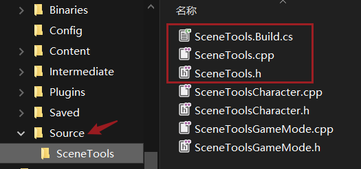
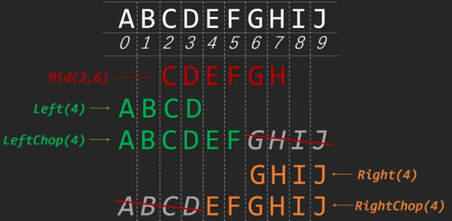

# UE插件

模块写逻辑，插件写底层，模块引用插件底层做上层业务

## 1 创建插件

1. 创建UE项目
2. 打开 Plugins 创建新插件，选择 Blank 空插件

### 1.1 .uplugin（插件信息）

记录了插件的基本信息及包含模块（Modules）名字、类型（Type:Developer 该模式只在开发时加载）、加载阶段（ELoadingPhase）启动模式


查看更多类型，全局搜索：EHostType 宏，在搜索结果中选择一个进入


ELoadingPhase 里面是加载阶段类型

### 1.2 .Build.cs

```cpp
//公共路径包含
    PublicIncludePaths.AddRange(
        new string[]{
        //包含公共路径，如果有源文件放在复杂的自定路径则需要在此添加路径
    });
//常用模块，公共依赖，私有依赖模块
        PublicDependencyModuleNames.AddRange(
        new string[]
        {
            "Core",
            // ... add other public dependencies that you statically link with here ...
        }
        );

        PrivateDependencyModuleNames.AddRange(
        new string[]
        {
            "CoreUObject",
            "Engine",
            "Slate",
            "SlateCore",
            // ... add private dependencies that you statically link with here ...    
        }
        );
```

### 初始头文件

## 2 相关操作

### 2.1 包含插件模块

1. 为了让引擎能找到新的插件模块需要在项目源码的 .Build.cs 中包含插件，添加在 public class 中公开可访问的


```cpp
//私有
PrivateDependencyModuleNames.AddRange(new string[] {  });
```

2. .uproject 中也把插件启动添加进入到插件数组里，Plugins 添加插件的名字，Modules 添加 Source 下的模块名字
   

### 2.2 添加模块编译

在 Source 源文件下编辑 .Target.cs 文件添加模块（编辑器插件，只需在包含 Editor 的Target.cs文件中添加）


### 2.3 添加新模块

1. 到项目的 Source 目录中创建一个新模块命名文件夹，复制原有模块夹中3个名字一样的源文件，包含 .cpp  .h  .Build.cs ，改名为新模块名字
   

2. 编辑 .Build.cs 文件，修改模块名字，去掉不需要的包含，多余的部分可以都放主模块里
   

3. 刷新项目，在 .uproject 文件右键 <Generate Visual Studio project files>
   

4. 添加模块编译（参考上面：添加模块编译）

5. 配置 .uproject 文件，添加入新模块
   

6. Plugins > SceneTool_plugin > .uplugin 文件配置（未确定是否要添加模块）
   

7. 解决多模块打包问题，参考视频
   
   *UE4插件Slate-6多模块打包.mp4*

#### 2.3.1 模块间的包含关系

主模块可以包含副模块，副模块不能包含主模块。

在source中的源文件，.Build.cs（管连接）.Target.cs（管编译）

### 2.4 添加插件模块

1. 到 Plugins > 插件名 > Source 目录中，复制里面原有的模块目录包括里面的文件

2. 修改新模块名字，包含：目录、.Build.cs、Privated里的 .cpp、Public里的 .h

3. 编辑复制的文件内容改成新模块名字，包含： .Build.cs、.h 、.cpp
   .Build.cs
   
   
   .h
   
   .cpp（保留字段后面的 Module)
   
   

4. 刷新项目 .uproject

5. 添加插件模块编译，编辑插件目录下 .uplugin 文件，在 Modules 处添加新模块
   

## E 创建插件窗口Slate

### E1 Slate环境部署

**SlateMain.h** 路径：Plugins > 插件目录 > Source > 插件目录 > Public 

```cpp
#pragma once
#include "CoreMinimal.h"
#include "..\Public\Widgets\SCompoundWidget.h"
//公共继承：SCompoundWidget
class SSlateMain :public SCompoundWidget {
public:
    SLATE_BEGIN_ARGS(SSlateMain){}
    SLATE_END_ARGS()
    void Construct(const FArguments& InArgs);
};
```

**MyButton.h** 路径：（和上面一样）

```cpp
#pragma once
#include "CoreMinimal.h"
#include "..\Public\Widgets\SCompoundWidget.h"
//修改类名字
class SMyButton :public SCompoundWidget {
public:
    SLATE_BEGIN_ARGS(SMyButton) {}
    SLATE_END_ARGS()
    void Construct(const FArguments& InArgs);    //声明函数
};
```

**SlateMain.cpp** 路径：Plugins > 插件目录 > Source > 插件目录 > Private

```cpp
#include "SlateMain.h"
#define LOCTEXT_NAMESPACE "SlateMain"    //调用LocalText 每个Slate需具备
//函数实现
void SSlateMain::Construct(const FArguments & InArgs)
{
}
#undef LOCTEXT_NAMESPACE    //解除
```

MyButton.cpp 路径：（同上，修改名字）

```cpp
#include "MyButton.h"
#define LOCTEXT_NAMESPACE "MyButton"

void SMyButton::Construct(const FArguments & InArgs)
{
}
#undef LOCTEXT_NAMESPACE
```

### E2 创建编辑器Slate

1. **SceneTools_W_P.h** 文件中创建共享指针作为强引用
   

2. 创建关联，在插件主cpp中 **SceneTools_W_P.cpp** 72行    return SNew(SDockTab) 中添加链式，删除{}里面原有的部分
   项目属性中添加包含库（D:\Program Files\Epic Games\UE_4.24\Engine\Source\Runtime\SlateCore\Public\Widgets）

```cpp
#include "SlateMain.h"    //包含创建的头文件
    return SNew(SDockTab)
    [
           SAssignNew(SlateMain, SSlateMain)    //使用 SAssignNew 获取值放 SlateMain
   ];

//SNew获取值方式
SlateMain = SNew(SSlateMain);
```

3. 构建部件
   布局类型
   
   ```cpp
   SLeafWidget STextBlock SPanel SVerticalBox SHorizontalBox    //都继承至 SCompoundWidget
   ```
   
   <SCheckBox> 添加属性，修改布局
   
   ```cpp
               SNew(SVerticalBox)
               + SVerticalBox::Slot()//垂直面板
               .Padding(10.0f)    //间距
               .AutoHeight()    //自动高度
               .VAlign(VAlign_Bottom)//垂直分布
               .HAlign(HAlign_Left)//水平分布
               [
                   SNew(SHorizontalBox)
                       + SHorizontalBox::Slot()[
                           SNew(SCheckBox)
                       ]
                       + SHorizontalBox::Slot()[
                           SNew(SCheckBox)
                       ]
               ]
   ```
* 实现多个选项设置单选项控制
  
  
  
  1. **SlateMain.h** 创建一个容器（CheckBoxArray）保存状态，添加选项处理函数（）
     
     ```cpp
     #pragma once
     #include "CoreMinimal.h"
     #include "..\Public\Widgets\SCompoundWidget.h"
     
     class SSlateMain :public SCompoundWidget {
         public:
             SLATE_BEGIN_ARGS(SSlateMain) {}
             SLATE_END_ARGS()
             void Construct(const FArguments& InArgs);
     
             //处理单项选项函数 OnValueChanged
             template<int32 Index>    //模板
             void OnValueChanged(ECheckBoxState NewState)
             {
                 if (CheckBoxArray.IsValidIndex(Index)) {    //判断当前序号是否有意义
                     for (int32 i = 0; i < CheckBoxArray.Num(); i++) {//循环处理每个选项控件
                         if (CheckBoxArray[i].IsValid()) {    //判断每个值是否有意义
                             if (Index == i) {
                                 CheckBoxArray[i]->SetIsChecked(ECheckBoxState::Checked);//设置勾选状态
                             }
                             else {
                                 CheckBoxArray[i]->SetIsChecked(ECheckBoxState::Unchecked);
                             }
                         }
     
                     }
                 }
             }
         protected:
             TArray<TSharedPtr<class SCheckBox>> CheckBoxArray;//保存选项状态的容器
     };
     ```
  
  2. **SlateMain.cpp** 修改CheckBox创建使用 SAssignNew 来承接返回值
     
     ```cpp
     #include "SlateMain.h"
     #define LOCTEXT_NAMESPACE "SlateMain"//LOCTEXT("CellA", "Cell-A") 使用
     
     void SSlateMain::Construct(const FArguments & InArgs)
     {
         CheckBoxArray.SetNum(3);    //分配内存数量防止崩溃
         ChildSlot
         [
             SNew(SVerticalBox)//創建垂直面板
             + SVerticalBox::Slot()
             .Padding(10.0f)    //全局间距
             .AutoHeight()    //自动高度
             .VAlign(VAlign_Bottom)//垂直分布
             .HAlign(HAlign_Left)//水平分布
             [
                 SNew(SHorizontalBox)    //承载控件面板
     
                 + SHorizontalBox::Slot()//创建水平面板
                 .HAlign(HAlign_Center)
                 .VAlign(VAlign_Top)
                 .Padding(.0f, .0f, 4.0f, .0f)
                 [
                     SAssignNew(CheckBoxArray[0], SCheckBox)//创建选项控件
                     .OnCheckStateChanged(this, &SSlateMain::OnValueChanged<0>)//绑定函数，载入<0>号模板
                     .IsChecked(ECheckBoxState::Checked)    //初始勾选状态，相反：Unchecked
                     .Content()[
                         SNew(STextBlock)
                         .Text(LOCTEXT("CellA", "Cell-A"))
                     ]
                 ]
                 + SHorizontalBox::Slot()
                 .HAlign(HAlign_Center)
                 .VAlign(VAlign_Top)
                 .Padding(.0f, .0f, 4.0f, .0f)
                 [
                     SAssignNew(CheckBoxArray[1], SCheckBox)
                     .OnCheckStateChanged(this, &SSlateMain::OnValueChanged<1>)
                     .Content()[
                         SNew(STextBlock)
                         .Text(LOCTEXT("CellB", "Cell-B"))
                     ]
                 ]
                 + SHorizontalBox::Slot()
                 .HAlign(HAlign_Center)
                 .VAlign(VAlign_Top)
                 .Padding(.0f, .0f, 4.0f, .0f)
                 [
                     SAssignNew(CheckBoxArray[2], SCheckBox)
                     .OnCheckStateChanged(this, &SSlateMain::OnValueChanged<2>)
                     .Content()[
                         SNew(STextBlock)
                         .Text(LOCTEXT("CellC", "Cell-C"))
                     ]
                 ]
             ]
         ];
     }
     
     #undef LOCTEXT_NAMESPACE
     ```

### E3 按扭放入扩展栏

SExpandableArea


```cpp
        + SVerticalBox::Slot()//創建新垂直面板
        .Padding(10.0f)    //间距
        .AutoHeight()    //自动高度
        .VAlign(VAlign_Bottom)//垂直分布
        .HAlign(HAlign_Left)//水平分布
        [
            SNew(SExpandableArea)    //可折疊面板扩展栏
            .AreaTitle(LOCTEXT("MyExpandable", "Scene Tools"))
            .InitiallyCollapsed(false)
            .Padding(8.0f)
            .HeaderContent()//擴展欄抬頭區域
            [
                SNew(SHorizontalBox)

                + SHorizontalBox::Slot().AutoWidth()
                .HAlign(HAlign_Left)
                .VAlign(VAlign_Center)
                [
                    SNew(STextBlock).Text(FText::FromString(*vers))
                ]
            ].BodyContent()[    //扩展栏裡的SHorizontalBox水平空間，下面放置控件
                SNew(SHorizontalBox)
                +SHorizontalBox::Slot()
                .HAlign(HAlign_Center)
                .VAlign(VAlign_Top)
                .Padding(.0f, .0f, 4.0f, .0f)
                [
                    SNew(SButton)
                    .HAlign(HAlign_Right)
                .Text(LOCTEXT("FindNormal", "Find_Normal"))
                .OnClicked(this, &SSlateMain::OnButtonClicked)
                ]
            ]
        ]
```

## E-1 批量处理贴图資源

批量修改UE引擎中指定目錄的法線圖壓縮方式（CompressionSettings）

### E-1-1 获取目录资源，修改参数

获取指定类型文件，搜索子文件夾

http://www.myredstone.top/2020/08/15/ue4%E8%8E%B7%E5%8F%96%E7%9B%AE%E5%BD%95%E4%B8%8B%E7%9A%84%E6%89%80%E6%9C%89%E8%B5%84%E6%BA%90/

```cpp
FReply SSlateMain::OnGoButtonClicked() {
    TArray<FAssetData> AssetDatas;//聲明數組，用於存放收集的資源
    FAssetRegistryModule& AssetRegistryModule = FModuleManager::LoadModuleChecked<FAssetRegistryModule>("AssetRegistry");
    FARFilter Filter;    //創建過濾屬性設置
    Filter.PackagePaths.Add(*FString::Printf(TEXT("/Game/%s"), *(texPath->GetText().ToString())));//需要FName類型字符 *FString 前面加星號解引出來使用
    Filter.ClassNames.Add(UTexture::StaticClass()->GetFName());//資源類型名
    if (RPath->IsChecked())
    {    //遞歸搜尋路徑，選項勾選查找子目錄
        Filter.bRecursivePaths = true;
    }else{
        Filter.bRecursivePaths = false;
    }
    Filter.bRecursiveClasses = true;//必須為true才可以獲取到文件
    AssetRegistryModule.Get().GetAssets(Filter, AssetDatas);//傳入過濾，存放資源的數組

    FString mess = FString::Printf(TEXT("共搜索 %i 个贴图文件"), AssetDatas.Num());
    GEngine->AddOnScreenDebugMessage(-1, 10.f, FColor::Green, *mess);
    UE_LOG(LogTemp, Log, TEXT("共搜索 %i 个贴图文件"), AssetDatas.Num());
    int cou;
    cou = 0;
    for (const FAssetData& AssetData : AssetDatas)
    {
        UTexture* MatObj = Cast<UTexture>(StaticLoadObject(UTexture::StaticClass(), nullptr, (TEXT("Texture'%s'"), *AssetData.ObjectPath.ToString())));
        //GEngine->AddOnScreenDebugMessage(-1, 10.f, FColor::White, FString::FromInt(MatObj->CompressionSettings.GetValue()));
        if (MatObj->CompressionSettings.GetValue() == 1) {
            MatObj->CompressionSettings = TC_Default;//進入屬性查看參數類型（Alt+G進入TC_Default聲明，查看其他枚舉）
            //對修改的資源標記未保存狀態
            MatObj->AddToRoot();
            MatObj->UpdateResource();
            MatObj->MarkPackageDirty();

            cou += 1;
            UE_LOG(LogTemp, Log, TEXT("%s 【已处理】"), *AssetData.AssetName.ToString());
        }
    }
    if (cou > 0) {
        UE_LOG(LogTemp, Log, TEXT("共处理 %i 个法线贴图文件"), cou);
        GEngine->AddOnScreenDebugMessage(-1, 10.f, FColor::Green, FString::Printf(TEXT("共处理 %i 个法线贴图文件"), cou));
    }
    return FReply::Handled();
}
```

指定路径中获取 Texture 类资源放入 AssetDatas 数组，其中包含的属性与值如下图：


### E-1-2 加载资源 StaticMesh

```cpp
UStaticMesh* mesh = LoadObject<UStaticMesh>(nullptr,TEXT("/Game/StarterContent/Props/SM_Chair.SM_Chair"));
if(mesh)
{
}
```

---

## E-2 读写文本（FFileHelper）

### E-2-1 读写函数

```cpp
//.h 聲明在公共區
    public:
        FString ReadTxt(FString filepath);
        bool WriteTxt(FString savestring, FString filepath);
========================================================================
//.cpp 讀取
FString SSlateMain::ReadTxt(FString filepath)
{
    FString readString;
    //路徑ProjectPluginsDir() = "../../../PM/Plugins/"
    FFileHelper::LoadFileToString(readString, *(FPaths::ProjectPluginsDir() + "SceneTools_W_P/" + filepath));
    return readString;
}
//寫入，如文件不存在會創建
bool SSlateMain::WriteTxt(FString savestring, FString filepath)
{
    bool result;
    result = FFileHelper::SaveStringToFile(savestring, *(FPaths::ProjectPluginsDir() + "SceneTools_W_P/" + filepath));
    return true;
}
```

### 使用std打开文件

```cpp
using namespace std;
//定义std可执行std字符串变量,转换FString变量加入std字符串
std::string const& test = std::string("start ") + std::string(TCHAR_TO_UTF8(*FileName));
//调用执行
system(test.c_str());
```

### 调用system打开文件

通过 system("start D:\\\filename.txt") 方法打开文件

```cpp
//获取文件路径FString变量,使用指针
FString FP = FString::Printf(TEXT("start %s"), *FileName);
system(TCHAR_TO_UTF8(*FP));    //字符转为UTF8
```

### E-2-2 读取多行文档

#### ParseIntoArray(拆分所有字符)

分割每一行存入數組，將讀取的多行字符串以換行符分割

```cpp
TArray<FString> arr;
aaa.ParseIntoArray(arr,TEXT("\n"), false);//傳入（收集成員的數組，分割字符，是否包含空字符）
    for (const FString line : arr) {
        if (hist == path)
            con += 1;
    }
```


---

## E-3 元编程及传递

```cpp
//在头文件中的 public: 下的BEGIN与END之间
SLATE_BEGIN_ARGS(SSlateMain) {}//一个不完全的结构体
float _A;//声明变量
WidgetArgsType& Hello(float InArg)
{
    _A = InArg;
    return this->Me();
}
SLATE_END_ARGS()//带};的结构体，是上面的Begin的结尾

//在cpp中调用_A
void SSlateMain::Construct(const FArguments& InArgs)
{
    InArgs._A;
```

---

## 读取 DataTable

```cpp
// .h
    public:
        FString GetUIName(int Index);
// .cpp
FString SSlateMain::GetUIName(int Index) {
    UDataTable* UIDataTable = LoadObject<UDataTable>(NULL, *ST_UITEXTFile);
    TArray<FName> UIRow = UIDataTable->GetRowNames();
    FChinaUIData* uiRow = UIDataTable->FindRow<FChinaUIData>(UIRow[Index], ST_ContextString);
    FString UIT = *uiRow->Info;
    return UIT;
}
//调用
GetUIName(0);
```

## Slate控件

### Slate架構

#### 覆蓋控件(SOverlay)

用於覆蓋上級控件排列屬性，以Overlay為重

```cpp
        SNew(SOverlay)
      + SOverlay::Slot()
        .HAlign(HAlign_Right)
        [
         SNew(SHorizontalBox)
            + SHorizontalBox::Slot().AutoWidth()
            .HAlign(HAlign_Left)
            .VAlign(VAlign_Center)
            [
            //控件
         ]
      ]
```

#### 滚动垂直排列（SScrollBox）

```cpp
SNew(SScrollBox)
+ SScrollBox::Slot()
.HAlign(HAlign_Left)
.Padding(.0f, .0f, 4.0f, .0f)
[
]
```

### 下拉扩展区域（SExpandableArea）


```cpp
SNew(SExpandableArea)    //可折疊面板
.AreaTitle(LOCTEXT("MyExpandable", "Scene Tools"))
.InitiallyCollapsed(false)
.Padding(8.0f)
.HeaderContent()    //標題空間，添加 STextBlock 文本控件
[
SNew(SOverlay)
+ SOverlay::Slot()
    .HAlign(HAlign_Left)
    .VAlign(VAlign_Center)
    [
        SNew(STextBlock).Text(LOCTEXT("Version", "批量轉換法線圖類型 v1.0"))
    ]
]
.BodyContent()[    //展開空間
SNew(SHorizontalBox)
    + SHorizontalBox::Slot().AutoWidth()
    .HAlign(HAlign_Fill)
    .Padding(.0f, .0f, 4.0f, .0f)
    [
        x).Text(FText::FromString("PaperMan/Environment/Textures"))
    ]
]

//可获取控件设置参数
    SAssignNew(Expnv12,SExpandableArea)
    //参数操作
    Expnv12->SetExpanded(true);    //展开控件

    // .h 声明 Expnv12 变量，SExpandableArea 的依赖在此包含
    #include "Widgets/Layout/SExpandableArea.h"

    public:
        TSharedPtr<class SExpandableArea> Expnv12;
```

### 可拖拽面板（CanvasPanel）

```cpp
//控件放在里面可以拖拽
```


### 文本控件（STextBlock）

```cpp
SNew(STextBlock).Text(FText::FromString("Align:"))
SNew(STextBlock).Text(LOCTEXT("v12", "层级与对齐：")) //支持中文
```

### 可编辑文本框（SEditableTextBox）

.h 頭文件中聲明

```cpp
    protected:
        TArray<TSharedPtr<class SCheckBox>> CheckBoxArray;//保存选项状态的容器
        TSharedPtr<class SCheckBox> RPath;//子目錄選項
    public:    //需要放置公共裡面才可訪問！
        TSharedPtr<class SEditableTextBox> texPath;
```

.cpp 創建控件

```cpp
            SNew(SHorizontalBox)
                + SHorizontalBox::Slot()
                .HAlign(HAlign_Left)
                .Padding(.0f, .0f, 4.0f, .0f)
                [
                    SAssignNew(texPath, SEditableTextBox).Text(FText::FromString("Default"))
                    .MinDesiredWidth(30)  //默认文本框宽度设置
                ]
```

訪問值

```cpp
FString pp = texPath->GetText().ToString();
```

### 整数值拖拉框（SSpinBox）

獲取值同樣在頭文件中聲明變量insNum

```cpp
//聲明 .h
#include "Widgets/Input/SSpinBox.h"    //在头文件包含
protected:
    TSharedPtr<SSpinBox<int>> insNum;
//創建 .cpp
SAssignNew(insNum, SSpinBox<int>).MaxValue(20).MinValue(1).Value(8)
```

### 下拉列表选项（SComboBox）


控件创建

```cpp
// MC_Main.h 頭文件聲明
private:
    TArray<TSharedPtr<FString>> Opations;//存放成員數組，通過 Opations.Add() 添加成員
    TSharedPtr<SComboBox<TSharedPtr<FString>>> MyComBox;
    TSharedPtr<SBox> MyComBoxCont;

// MC_Main.cpp 創建控件(line:68)
SAssignNew(MyComBox, SComboBox<TSharedPtr<FString>>)
.OptionsSource(&Opations)
.OnGenerateWidget(this, &SMC_Main::GenerateSourceComboItem)
.OnSelectionChanged(this, &SMC_Main::HandleSourceComboChanged)
.IsFocusable(true)[
    SAssignNew(MyComBoxCont, SBox)
]
```

事件函数：

```cpp
//添加成員，可寫在UI起始段上面初始化
for (auto FileName : FileNames)    //循環讀取 FileNames 裡的字符串數組
{
    FString Left;
    FileName.Split(".", &Left, nullptr);
    Opations.Add(MakeShareable(new FString(*Left)));//添加成員
}

//創建成員函數
TSharedRef<class SWidget> SMC_Main::GenerateSourceComboItem(TSharedPtr<FString> InItem)
{
    return SNew(STextBlock).Text(FText::FromString(*InItem));
}
//當選項選擇操作時激發事件
void SMC_Main::HandleSourceComboChanged(TSharedPtr<FString> Item, ESelectInfo::Type SelectInfo)
{
    MyComBoxCont->SetContent(SNew(STextBlock).Text(FText::FromString("")));
    FString te = *Item;
    matFile->SetText(FText::FromString(*te));
    MyVerticalBox->ClearChildren();
    LoadMatNamesList();
}
```

### 格子排列控件（SUniformGridPanel）


```cpp
#include <Widgets/Layout/SUniformGridPanel.h>//包含頭文件

SNew(SUniformGridPanel)
    .SlotPadding(FMargin(2.0f))//控件間距
    + SUniformGridPanel::Slot(0, 0)//（列，行）
    .HAlign(HAlign_Left)
    [
        SAssignNew(RPath, SCheckBox).Content()[SNew(STextBlock).Text(LOCTEXT("RecursivePaths", "搜索子目錄"))]
    ]

    + SUniformGridPanel::Slot(0, 1)
    .HAlign(HAlign_Fill)//對齊
    [
        SNew(SButton)
        .Text(LOCTEXT("go", "開始批量設置"))
        .ToolTipText(LOCTEXT("goTooltip", "修改所有法線貼圖"))//注意前面InKey文字需要不同
        .OnClicked(this, &SSlateMain::OnGoButtonClicked)
    ]
    + SUniformGridPanel::Slot(1, 1)
    .HAlign(HAlign_Fill)
    [
        SNew(SButton)
        .Text(LOCTEXT("go2", "按鈕 2"))
        .ToolTipText(LOCTEXT("goTooltip2", "Test2"))
    ]
    + SUniformGridPanel::Slot(2, 1)
    .HAlign(HAlign_Fill)
    [
        SNew(SButton)
        .Text(LOCTEXT("go3", "按鈕 3"))
        .ToolTipText(LOCTEXT("goTooltip3", "Test3"))
    ]
```

### ！控件排列位置

* 垂直排列的控件距離不緊湊，在 +SVerticalBox::Slot() 添加 .AutoHeight()

* 如果要讓控件朝一邊緊挨著，需要在前面的控件添加 .AutoWidth()
  

---

## 其他相关

### 编辑器确认对话框

```cpp
FText const Title = LOCTEXT("title1","贴图批处理");
FText const DialogText = LOCTEXT("queren","确认批处理重置贴图调整?");
EAppReturnType::Type const ReturnType = FMessageDialog::Open(EAppMsgType::OkCancel, DialogText, &Title);
if (ReturnType == EAppReturnType::Type::Ok)
{
    GEditor->AddOnScreenDebugMessage(-1, 10.f, FColor::Yellow, TEXT("确认"));
}else
{
    GEditor->AddOnScreenDebugMessage(-1, 10.f, FColor::Red, TEXT("取消"));
}
```

### 添加Slate控件依赖

添加路径：D:\Program Files\Epic Games\UE_4.24\Engine\Source\Runtime\SlateCore\Public\Widgets


### 路径转换函数代码

https://zhuanlan.zhihu.com/p/152201635

路径转换函数代码

```cpp
#include "BlankProgram.h"
#include "RequiredProgramMainCPPInclude.h"
#include "Misc/PackageName.h"

DEFINE_LOG_CATEGORY_STATIC(LogBlankProgram, Log, All);
IMPLEMENT_APPLICATION(BlankProgram, "BlankProgram");

INT32_MAIN_INT32_ARGC_TCHAR_ARGV() {
GEngineLoop.PreInit(ArgC, ArgV);

FString ObjectPath = TEXT("/Engine/EngineDamageTypes/DmgTypeBP_Environmental.DmgTypeBP_Environmental");
FString PackageName = FPackageName::ObjectPathToPackageName(ObjectPath);
FString ObjectName = FPackageName::ObjectPathToObjectName(ObjectPath);
FString Filename = FPackageName::LongPackageNameToFilename(PackageName);
FString PackageName2 = FPackageName::FilenameToLongPackageName(Filename);
FString PackagePath = FPackageName::GetLongPackagePath(PackageName);
FString ShortName = FPackageName::GetLongPackageAssetName(PackageName);
FString AssetName = FPackageName::GetShortName(PackageName);
FString AssetPackageExtension = FPackageName::GetAssetPackageExtension();
FString MapPackageExtension = FPackageName::GetMapPackageExtension();

UE_LOG(LogBlankProgram, Display, TEXT("ObjectPath: %s"), *ObjectPath);
UE_LOG(LogBlankProgram, Display, TEXT("PackageName: %s"), *PackageName);
UE_LOG(LogBlankProgram, Display, TEXT("ObjectName: %s"), *ObjectName);
UE_LOG(LogBlankProgram, Display, TEXT("Filename: %s"), *Filename);
UE_LOG(LogBlankProgram, Display, TEXT("PackagePath: %s"), *PackagePath);
UE_LOG(LogBlankProgram, Display, TEXT("ShortName: %s"), *ShortName);
UE_LOG(LogBlankProgram, Display, TEXT("AssetName: %s"), *AssetName);
UE_LOG(LogBlankProgram, Display, TEXT("AssetPackageExtension: %s"), *AssetPackageExtension);
UE_LOG(LogBlankProgram, Display, TEXT("MapPackageExtension: %s"), *MapPackageExtension);

return 0;
}
```

輸出

```cpp
ObjectPath: /Engine/EngineDamageTypes/DmgTypeBP_Environmental.DmgTypeBP_Environmental
PackageName: /Engine/EngineDamageTypes/DmgTypeBP_Environmental
ObjectName: DmgTypeBP_Environmental
Filename: ../../../Engine/Content/EngineDamageTypes/DmgTypeBP_Environmental
PackagePath: /Engine/EngineDamageTypes
ShortName: DmgTypeBP_Environmental
AssetName: DmgTypeBP_Environmental
AssetPackageExtension: .uasset
MapPackageExtension: .umap
```

#### 获取引擎与項目各路径

```cpp
#include "Misc/Paths.h"

FPaths::ProfilingDir()
//打印調用注意加指針
    *FPaths::ProfilingDir()
```

### 函数返回句柄

```cpp
return FReply::Handled();
```

### 打印內容

編輯器窗口打印內容

```cpp
UTexture* MatObj = Cast<UTexture>(StaticLoadObject(UTexture::StaticClass(), nullptr, TEXT("Texture'/Game/Environment/Textures/Foliage/T_Envi_Lvy_03_N.T_Envi_Lvy_03_N'")));
GEngine->AddOnScreenDebugMessage(-1, 10.f, FColor::Blue, *MatObj->GetName());
//注意 FString 獲取變量指針的使用
FString mess = FString::Printf(TEXT("共搜索 %i 个贴图文件"), AssetDatas.Num());
GEngine->AddOnScreenDebugMessage(-1, 10.f, FColor::White, *mess);
//中文字体
GEditor->AddOnScreenDebugMessage(-1, 10.f, FColor::Red, TEXT("选择两个以上物体"));
```

错误警告消息打印

```cpp
#include "Logging/LogMacros.h"
// Warning Error Log
UE_LOG(LogTemp, Error, TEXT("%s"), *AssetData.GetFullName());
UE_LOG(LogTemp, Log, TEXT("%i"), AssetDatas.Num());
```

### 检查路径及文件是否存在

```cpp
//判断路径是否存在，資源路徑需要加入獲取Content目錄，兩個字符變量組合在括號外加指針解引
FPaths::DirectoryExists(*(FPaths::ProjectContentDir()+texPath->GetText().ToString()))
//檢查文件
FPaths::FileExists(*(FPaths::ProjectPluginsDir() + "SceneTools_W_P/ST.txt"))
```

---

## 随机值

```cpp
#include "Math/UnrealMathUtility.h"

FMath::RandRange(0,360);
//Syntax 语法
static int32 RandRange
(
    int32 Min,
    int32 Max
)
```

---

## 字符串操作

字符串和本地化：https://blog.csdn.net/weixin_39924307/article/details/110932695

### 字符串類型轉換

```cpp
//将 Int 转换为 FString:
FString NewString = FString::FromInt(MyInt);

//将 Float 转换为 FString:
FString VeryCleanString = FString::SanitizeFloat(MyFloat);

//将FString转换为 Char *：
FString MyString;
Char *MyChar = *MyString;

//将 FString 转换为 Int
int32 MyShinyNewInt = FCString::Atoi(*MySting);

//将 FString 转换为 Float：
float MyShinyNewFloat = FCString::Atof(*MyFloat);

//字符串截取：
FString::Left(int count);
FString::Right(3);

//fstring转std string
FString FileName = FString::Printf(TEXT("d:/TextureList_%s.txt"), *pName);
std::string(TCHAR_TO_UTF8(*FileName)
```

### 字符串類型

#### ▲ FName

與 FText 同屬於不可變字符串，一經創建內容無法更改

不区分大小写，主要用于标识资源路径，它的优点就是查找和访问速度快，在游戏开发过程中，如果可以确定字符串是固定不变的数据，如资源路径，或者数据表格原始数据，且无需考虑文本国际化的时候，建议使用FName进行创建。

#### ▲ FText

不支持中文，通过读取DataTable中的中文

```cpp
FText::FromString("PaperMan/Environment/Textures")
//Slate 中運用：在運用變量時可使用中文
FString vers = FString::Printf(TEXT("< 批量轉換法線圖類型 %s >"), *ST_Ver);
SNew(STextBlock).Text(FText::FromString(*vers))
//直接使用英文
SNew(SButton).HAlign(HAlign_Right).Text(FText::FromString("English"))
```

#### ▲ LOCTEXT

支持中文，第一個傳入的字符是InKey，必須不一樣，否則會使用相同Key的字符（**编码格式需UTF-8**）

```cpp
LOCTEXT("InKey", "获取当前ConterntBrowser目录")
//Slate 中運用：不同按钮“InKey”不能雷同
SNew(SButton).Text(LOCTEXT("go", "開始批量設置"))

//LOCTEXT变量运用，传递中文字符
    FText na = LOCTEXT("vertex", "材质库预览工具");
    FString vers = FString::Printf(TEXT("%s_%s"), *na.ToString(), *ver);
```


#### ▲ FString

（支持中文）下面示例中變量最後添加指針解引，不能運用在 Slate 控件的 .Text 裡

```cpp
FString::Printf(TEXT("Load Form:( %s ) successful."),*(matFile->GetText().ToString()))
```

注意：下面 Add() 函數需要FName類型字符 *FString 前面加星號解引出來使用

```cpp
FARFilter Filter;
    Filter.PackagePaths.Add(*FString::Printf(TEXT("/Game/%s"), *(texPath->GetText().ToString())));
```

### 字符串分割

根據指定字符分割字符串，分割的字符串量存入變量，不需要存儲的部分用 nullptr 補全

```cpp
//左右切割
FString FileName = "name.ext";
FString Left;
FileName.Split(".", &Left, nullptr);    //提取左边的字符,右边不获取用nullptr替
matFile->SetText(FText::FromString(*Left));

//切割所有字符
TArray < FString > StringArray;
MyString.ParseIntoArray(StringArray, TEXT(","), false);
```

### 字符串比較

```cpp
FString StringA = FString(TEXT("This is my test FString.n"));
FString StringB = FString(TEXT("This is my test FString.n"));
// 直接使用 == 运算符
if (StringA == StringB) { }
// 等价于
if (StringA.Equals(StringB, ESearchCase::CaseSensitive)) { }
// 忽略大小写
if (StringA.Equals(StringB, ESearchCase::IgnoreCase)) { }
// 检测字符串是否以特定字符串开头
if (TestString.StartsWith(TEXT("This"))) { }
// 检测字符串是否以特定字符串结尾
if (TestString.EndsWith(TEXT("FString"))) { }
// 判断字符串是否为空
if (TestString.IsEmpty()) { }
```

### 字符串查找

```cpp
// 查找某个字串是否存在有两种方式
// 1.  FString::Contains(),默认位忽略大小写，从字符串首查找至尾部
FString TestString = FString(TEXT("This is my test FString.n"));
if (TestString.Contains(TEXT("This"), ESearchCase::IgnoreCase, ESearchDir::FromStart)) { ... }
// 等价于 2. FString.Find()
if (TestString.Find(TEXT("This"), ESearchCase::IgnoreCase, ESearchDir::FromStart, INDEX_NONE) != INDEX_NONE) { ... }
```

### 字符串分片

将字符串按下标拆解为我们需要的字符串称之为***分片(Silce)，\***常用分片函数包含如下几个***：\***

- **FString::Mid**[5]
- **FString::Left**[6]
- **FString::LeftChop**[7]
- **FString::Right**[8]
- **FString::RightChop**[9]

5个函数都接受一个 **Count** 参数，表明要操作的字符串长度，这个长度如果超过字符串本身长度，就会被默认处理为字符串本身长度。其中Left,LeftChop和Right,RightChop可以看做Mid的一种简便写法，具体样例如下：

```cpp
// 字符串分片
FString Str = FString(TEXT("ABCDEFGHIJ"));
// 字符串长度
int32 StringLength = Str.Len();
// 通过下标获取字符
TCHAR Char = Str[0]; // A
// 从左往右截取指定长度的字符串
FString LeftStr = Str.Left(4); // ABCD
// 去除字符串末尾指定的长度字符串
FString LeftChopStr = Str.LeftChop(4); // ABCDEF
// 从右往左截取指定长度的字符串
FString RightStr = Str.Right(4); // GHIJ
// 去除字符串开头指定长度的字符串
FString RightChopStr = Str.RightChop(4); // EFGHIJ
// 从字符串指定位置获取指定长度的字符串
FString MidStr = Str.Mid(2,6);// CDEFGH


//例：獲取最後一個字符，判斷最後一個字符是"/"就去除
    FString path = "abc/def/"
    int le = path.Len();
    FString en = path.Right(1);
    if (en == "/")
        path = path.LeftChop(1);
```



```cpp
// 按指定分割符号进行拆分
FString SplitStr = FString(TEXT("ABC,DEF,GHI,"));
// 保存拆分后的字符串数组
TArray<FString> SplitedStr;
// 最后一个参数 InCullEmtpy 表示是否剔除空字符串
SplitStr.ParseIntoArray(SplitedStr, TEXT(","), false); // ABC DEF GHI Empty
SplitStr.ParseIntoArray(SplitedStr, TEXT(","), true); // ABC DEF GHI
```

```cpp
//查找路径是否是反斜杠，如果是切割并替换成正斜杠
if (pp.Find(TEXT("\\"), ESearchCase::IgnoreCase, ESearchDir::FromStart, INDEX_NONE) != INDEX_NONE)
{
    FString newP = "";
    TArray<FString> SArr;
    pp.ParseIntoArray(SArr, TEXT("\\"), false);
    for (const FString sss : SArr)
    {
        newP += sss + "/";
    }
    pp = newP;
}
```

### 常用方法

```cpp
// 逆序
FString MyString = FString(TEXT("123456"));
// 逆序并返回字符串副本
FString ReverseString = MyString.Reverse(); // 654321
// 直接逆序原始字符串
MyString.ReverseString();

// 字符串替换
FString SrcString = FString(TEXT("Apple Orange"));
// 返回替换后的字符串副本
FString ReplaceString = SrcString.Replace(TEXT("Apple"), TEXT("Coffee")); // Coffe Orange
// 直接替换原始字符串
SrcString.ReplaceInline(TEXT("Orange"), TEXT("Banana")); // Apple Banana

// 去除无用字符串
FString QuoteAndSpaceString = FString(TEXT("    "StringWithEmpty"  "));
// 返回剔除行首行末空白字符的字符串副本
FString WithoutSpace = QuoteAndSpaceString.TrimStartAndEnd(); // "StringWithEmpty"
// 直接剔除原始字符串的行首行末的空白字符
QuoteAndSpaceString.TrimStartAndEndInline(); // "StringWithEmpty"
// 返回剔除行首行末引号的字符串副本
FString WithoutQuotesString = QuoteAndSpaceString.TrimQuotes(); //StringWithEmpty
// 清空字符串
QuoteAndSpaceString.Empty();
```

另一分割成數組方法參看上面：E-2- 讀取多行文檔

### 格式化字符串

```cpp
TMap<FString, FStringFormatArg> FormatMap;
FormatMap.Add(TEXT("key1"), FStringFormatArg(1));
FormatMap.Add(TEXT("key2"), FStringFormatArg(2));
FString Text1 = FString::Format(TEXT("Text{key1}{key2}{key1}"), FormatMap);
```

---

## 类型转换

### 整数 转 浮点

```cpp
float(intValue)
```

---

## 数组

### TArray

```cpp
//聲明數組
TArray<Int32> MyInts;

//初始化分配内存数量防止崩溃
MyInts.SetNum(3);

//填充數據，如下填充5個10
IntArray.Init(10, 5);  // [10,10,10,10,10]

//Add 和 Emplace 最终效果一样，但存在细微不同：
    TArray<FString> StrArr;
    StrArr.Add(TEXT("Hello"));
    StrArr.Emplace(TEXT("World"));
    // StrArr == ["Hello","World"]
```

### 获取数组长度

```cpp
StrArr.Num()
//提取数组最后一个成员
TArray<FString> SArr;
pp.ParseIntoArray(SArr, TEXT("/"), false);
FString pName = SArr[SArr.Num()-1];
```

---

## 循环

```cpp
FString aaa = ReadTxt("ST.txt");    //函数读取文件
TArray<FString> arr;    //初始化数组
aaa.ParseIntoArray(arr, TEXT("\n"), false);    //根据回车拆分放入数组
for (const FString hist : arr) {
        if (hist == path)
            con += 1;
}
```

---

## 编辑器场景操作

### 获取选择的物体（bounds）

### 获取父物体

```cpp
FReply SSlateMain::AlignRotClicked() {
    USelection* SelectionSet = GEditor->GetSelectedActors();
    TArray<AActor*> SelectedActors;//用于收集选择的物体
    SelectedActors.Reserve(SelectionSet->Num());//预置数组数量
    SelectionSet->GetSelectedObjects(SelectedActors);//预置后放置选择的物体到数组
    AActor* ppp = SelectedActors[SelectedActors.Num()-1];//获取最后选择的物体
    ppp->GetAttachParentActor();//获取父物体
    for (AActor* Actor : SelectedActors)//遍历数组
    {
        if (Actor->GetFName() != ppp->GetFName()) {
            FVector Origin, Extent;
            Actor->GetActorBounds(true, Origin, Extent);//获取物体轴心位置和体积框
            Actor->SetActorRotation(ppp->GetActorRotation());
            GEngine->AddOnScreenDebugMessage(-1, 10.f, FColor::Green, Actor->GetFName().ToString());
        }
    }
    //操作完成选择最后物体
    GEditor->SelectNone(false, true);//清除所有选择
    GEditor->SelectActor(ppp,true,true);//选择物体
    //获取ppp物体下的所有成员子物体
    TArray<AActor*>aa;
    ppp->GetAttachedActors(aa);
    for (int32 b = 0; b < aa.Num(); b++)
    {
        AActor* a = aa[b];
        UE_LOG(LogTemp, Warning, TEXT("%s"), *(a->GetName()));
    }
    return FReply::Handled();
}
```

### 设置物体旋转

```cpp
//此处的Y值相当于引擎场景中的Z值
Actor->SetActorRotation(FRotator(0.f, 45.f, 0.f));
```

## 创建物体

### 创建Content里的物体实例

#### 阵列取模

```cpp
//静态Mesh创建
FReply SMC_Main::CreateRamp()
{
    float xd = 0.f;
    float yd = 0.f;
    float mv = 0.f;
    int cN = 0;
    UWorld* World = GEditor->GetEditorWorldContext().World();//获取World
    int inum = insNum->GetValue();
    float rN = 1.0 / (inum - 1);
    for (int i = 0; i < inum*inum; i++)
    {
        if (cN % inum == 0) { //使用取模限制阵列每行数目
            xd++;
            yd = 0.f;
        }
        cN++;
        FVector pos; pos.Set(-xd * 310, yd*310.0, 0);
        AStaticMeshActor* MyActor = World->SpawnActor<AStaticMeshActor>(bpClass, pos, FRotator::ZeroRotator);//通过World->SpawnActor创建对象，bpClass在头文件中声明
        MyActor->SetActorLabel("MatPreview" + FString::FromInt(cN));
        MyActor->SetFolderPath("PerviewMats");

    float MNum = 0.0f;
    float RNum = 0.0f;
        MatInstance = UMaterialInstanceDynamic::Create(MatObj, NULL);
        MNum = rN * mv;
        MatInstance->SetScalarParameterValue("M", MNum);
        if (cN % (inum) == 0) mv++;
        RNum = rN * yd;
        MatInstance->SetScalarParameterValue("R", RNum);
        yd++;
        MatInstance->SetVectorParameterValue("Color", FLinearColor(0.61,0.61,0.61,1));
        TArray<UStaticMeshComponent*> getComps;
        MyActor->GetComponents(getComps);
        UStaticMeshComponent* targetCom = getComps[0];
        targetCom->SetMaterial(0, MatInstance);
        TArray<UActorComponent*> comps;
        MyActor->GetComponents(comps);
        UTextRenderComponent* texComp = Cast<UTextRenderComponent>(comps[1]);
        FString MRV = FString::Printf(TEXT("R: %g\nM: %.g"), RNum, MNum);
        texComp->SetText(FText::FromString(MRV));
        texComp->bHiddenInGame = true;
    }
    return FReply::Handled();
}

// .h
private:
    TSubclassOf<class UObject> bpClass = (bp)->GeneratedClass;
```
